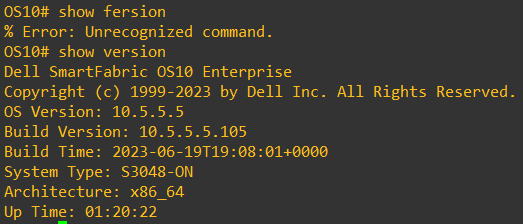

# Widget and listener

## 위젯과 리스너


### 코드에서 View를 참조하는 법

```kotlin
class MainActivity : AppCompatActivity() {
    override fun onCreate(savedInstanceState: Bundle?) {
        super.onCreate(savedInstanceState)
        setContentView(R.layout.activity_main)
    }
}
```

* setContentView 함수 호출 이후 xml에 선언된 View의 객체를 코드에서 참조 가능
* 전통적인 방법
  * findViewById(아이디) 함수로 View의 객체를 얻는 법
* 새로운 방법
  * viewBinding

### findViewById

* 작성 후 실행

```kotlin
package com.example.helloworld

import android.os.Bundle
import android.widget.TextView
import androidx.appcompat.app.AppCompatActivity

class MainActivity : AppCompatActivity() {
    override fun onCreate(savedInstanceState: Bundle?) {
        super.onCreate(savedInstanceState)
        setContentView(R.layout.activity_main)

        val textViewTitle = findViewById<TextView>(R.id.textView)
        textViewTitle.text="Hello"

    }
}
```

* Code에서 제어하고자 하는 모든 View에 대하여 findViewById 함수를 호출해야 한다.
* 객체에 대한 참조를 얻게되면 코드 상에서 적용한 내용들이 앱 화면에 반영된다.


### View Binding

* Module:app 의 build.gradle.kts에 다음과 같은 내용을 추가하면 layout 폴더 안에 있는 파일에 대한 클래스가 자동으로 생성되며 이를 이용해 view 객체를 참조할 수 있다.

<figure><figcaption></figcaption></figure>

(실행사사진진 한개 더)

* 클래스 이름은 파일 이름을 이용해 자동으로 생성된다
  * activity\_main.xml ==> ActivityMainBinding

```kotlin
package com.example.helloworld

import android.os.Bundle
import androidx.appcompat.app.AppCompatActivity
import com.example.helloworld.databinding.ActivityMainBinding

class MainActivity : AppCompatActivity() {
    private val binding by lazy { ActivityMainBinding.inflate(layoutInflater) }
    override fun onCreate(savedInstanceState: Bundle?) {
        super.onCreate(savedInstanceState)
        setContentView(binding.root)

        binding.textView.text="Hello"
    }
}
```

(실행 사진)

### Event and listener

* 사용자의 터치, 키 입력 등을 Event라고 한다.
* Event를 처리하는 방법
  * Polling : 일정 주기마다 Event 발생을 확인하는 방법. Application에서는 적합하지 않으며 Arduino 등의 펌웨어에서 주로 사용하는 방법
  * Callback 또는 Listener : 특정 이벤트에 대한 처리 함수를 지정해두면 해당 이벤트 발생 시 시스템이 지정된 함수를 호출해 주는 방법 이다.
    * 시스템이 호출해 주므로 콜백 함수의 형식이 중요하다. -> 주로 Interface로 정의 되어 있다.

### Listener를 만드는 방법

* Activity가 직접 implement 하는 방법.
  * Event가 특정 View에 속한 것이 아닐 때(키 입력 등)
  * View는 달라도 비슷한 코드를 실행할 때
* 이벤트를 수신할 View에 interface의 구현체 또는 람다식을 전달
  * 추상 함수 하나만 정의된 interface의 경우 SAM 표기법으로도 전달 가능
* Interface를 구현한 별도의 클래스를 구현하고 그 객체를 전달


### 실습

* Hello world 내의 버튼 4가지의 리스너를 다양한 방법으로 작성해본다.
* Add : Activity가 직접 구현
* Sub : 객체를 생성하여 변수로 전달
* Mul : 익명 객체 전달
* Div : 람다식


* 현재 코드는 중복되는 코드가 매우 많은 상태.
* 현재의 기능을 유지하면서 하나의 함수에서 처리하도록 리팩토링 해 본다.
  * 각 리스너에 전달되는 View 객체(it, view 등의 변수)의 id를 이용하면 어떤 버튼이 클릭되었는지 확인 할 수 있다.

<figure><figcaption></figcaption></figure>


