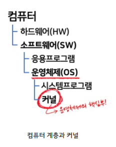

# 운영체제

***

> #### 운영체제(OS)

**운영체제( OS, Operating System) 는 컴퓨터 시스템의 핵심 소프트웨어 입니다.**

**컴퓨터 하드웨어와 응요 프로그램 간의 상호작용을 관리하고 제어하는 역할을 한다.**

**운영체제의 목적은 사용자와 하드웨어 사이의 인터페이스를 제공해 효율적으로 응용 프로그램이 동작하도록 지원한다.**

**시스템 자원을 효율적으로 관리하여 응용 프로그램이 원활하게 동작할 수 있도록 한다.**

**운영체제의 코어(핵심) 부분을 커널(Kernel)이라고 한다.**

**일반적으로는 커널에 여러가지 기능(라이브러리, 시스템 프로그램 등)이 추가된 상태를 통칭해서 운영체제(OS)라고 한다**

<figure><figcaption></figcaption></figure>

> #### 운영체제의 목적과 구성

**운영체제는 크게 4가지의 목적을 수행한다.**

1. **처리능력 : 운영체제는 시스템의 생산성을 나타내는 단위로, 일정 시간 동안 처리하는 일의 양을 의미한다.**
2. **응답시간 : 작업 의뢰 후 시스템에서 결과가 얻어질 때까지의 시간**
3. **신뢰도 : 주어진 문제를 얼마나 정확하는가에 대한 정도**
4. **사용가능도 : 시스템을 얼마나 빠르게 사용할 수 있는가에 대한 정도**

> #### 운영체제의 구조

운영체제는 커널, 인터페이스, 시스템 콜, 드라이버 총 4가지 구성요소로 이루어져있다.

> #### 커널(Kernel)

**커널은 운영체제 중 항상 메모리에 올라가 있는 운영체제의 핵심 부분입니다.**

**하드웨어와 응용 프로그램 사이에서 인터페이스를 제공하는 역할과 컴퓨터 자원들을 관리하는 역할을 한다.**

**커널은 인터페이스로써 응용 프로그램 수행에 필요한 여러가지 서비스를 제공합니다.**

**여러가지 하드웨어(cpu, memory) 등의 리스소를 관리하는 역할을 한다.**

**커널은 항상 컴퓨터 자원들을 바라만 보고 있기에 사용자와의 상호작용은 지원하지 않는다.**

**사용자와의 직접적인 상호작용을 위해 프로그램을 제공하는데 대표적으로 쉘(Shell)이라는 명령어 해석기가 있다.**

<figure><figcaption></figcaption></figure>

> #### 인터페이스(Interface)

**인터페이스는 사용자의 명령을 컴퓨터에 전달하고 결과를 사용자에게 알려주는 소통의 역할을 한다.**

**인터페이스는 대표적으로 GUI(Graphical User Interface)와 CLI(Command Line Interface) 두가지 종류가 있다.**

**GUI는 윈도우 바탕화면처럼 아이콘과 마우스 클릭이 되게끔 만들어져서 사용자 편의성을 가진 인터페이스다.**

**CLI는 터미널로 연결하면, 마우스가 없고 명령어를 키보드로 입력하면 글씨만 나오는 인터페이스다.**

> #### 시스템 콜(System Call)

**시스템 콜은 사용자나 프로그램이 직접적으로 컴퓨터 자원에 접근하는 것을 막고 커널을 보호하기 위해서 만든 코드 집합이다.**

**시스템 콜 함수를 통해 커널에 접근할 수 있다.**

**운영체제는 커널에 아무나 접근을할 수 없게 하기위해 시스템 콜을 통해서만 호출할 수 있게 디자인 되어있다.**

> #### 드라이버(Driver)

**드라이버는 프린터, 키보드 및 디스크 드라이브와 같이 하이뒈어 장치와 운영체제 간의 통신을 가능하게 하는 소프트 웨어이다.**

**드라이버를 설치함으로써 그 디바이스와 소통을 할 수 있게 만들어주는 것이다.**

***

> #### 운영체제의 역할

|        역할       | 설명                                                                                                                                                                             |
| :-------------: | ------------------------------------------------------------------------------------------------------------------------------------------------------------------------------ |
|       자원관리      | 
- 운영체제는 컴퓨터 시스템의 하드웨어 자원을 효율적으로 관리하는 역할을 한다. - CPU(중앙처리장치), 메모리, 저장장치(Storage), 입출력 장치(I/O Device) 등 하드웨어의 자원을 할당하고 관리하여 여러 응용 프로그램이 동시에 실행될 수 있도록 한다.
               |
|      메모리 관리     | 
- 운영체제는 컴퓨터의 메모리를 효율적으로 관리하여 응용 프로그램이 필요로 하는 메모리 공간을 할당한다. - 메모리의 할당과 해제, 가상 메로리 관리 등을 한다.
                                                                           |
|     프로세스 관리     | 
- 운영체제는 실행 중인 응용 프로그램인 프로세스(Process)를 관리한다. - 프로세스의 생성, 실행, 일시 정지, 스스템 중지등의 작업을 제어한다. - 프로세스 간의 자원 공유와 협력을 관리한다.
                                                  |
| 디스크 및 파일 시스템 관리 | 
- 운영체제는 디스크와 파일 시스템을 관리하여 파일의 생성, 삭제, 복사, 이동 등의 작업을 처리한다. - 파일 시스템은 데이터의 영구적인 저장과 접근을 제공하여 사용자 및 응용 프로그램이 데이터를 쉽게 관리할 수 있도록 한다.
                                      |
|      입출력 관리     | 
- 운영체제는 입출력 장치와의 상호작용을 관리한다. - 사용자와 응용 프로그램이 키보드, 마우스, 디스플레이, 프린터 등과의 통신을 할 수 있도록 지원하며, 입출력 장치의 성능을 최적화 한다.
                                                          |
|    사용자 인터페이스    | 
- 운영체제는 사용자와 컴퓨터 간의 상호작용을 지원하는 사용자 인터페이스를 제공한다. - 텍스트 기반의 터미널 환경(CLI, Command Line Interface)과 그래픽 사용자 환경(GUI, Graphical User Interface)을 통해 사용자가 컴퓨터를 조작할 수 있도록 한다.
 |
|       네트워킹      | 
- 운영체제는 컴퓨터 네트워크를 관리하고, 네트워크 프로토콜을 지원하여 컴퓨터 간의 통신을 가능하게 한다. - 인터넷 연결, 데이터 전송, 네트워크 보안 등을 관리한다.
                                                                       |
|       오류처리      | 
- 운영체제는 시스템 내부 또는 외부에서 발생하는 오류와 예외 상황을 처리한다. - 프로세스의 비정상 종료, 메모리 오버플로우, 입출력 오류 등을 감지하고 처리하여 시스템의 안정성과 신뢰성을 유지한다.
                                                     |
|      시스템 보안     | 
- 운영체제는 시스템의 보안을 유지하기 위해 접근 제어, 사용자 인증, 암호화 등의 기능을 제공한다. - 불법적인 접근과 데이터 유출 등으로부터 시스템을 보호하고 안전한 환경을 제공한다.
                                                             |

***

> #### 운영체제의 종류

#### 윈도우 (windows)

* microsoft사에서 개발한 운영체제로, 노트북 및 서버 시스템에서 주로 사용된다.

#### macOS

* Apple사에서 개발한 운영체제로, mac 컴퓨터 및 노트북에서 사용된다.
* 시스템 안정성과 사용자 편의성에 중점을둔 운영체제이다.

#### 리눅스(Linux)

* 오픈 소스 운영체제로, 다양한 배포판이 있다.
* 서버 시스템 및 임베디드 시스템에서 주로 사용된다.
* 안정성과 보안성이 높은 운영체제이다.

#### 유닉스(UNIX)

* 다중 사용자 및 다중 작업을 지원하는 운영체제이다.
* 서버 환경에서 주로 사용된다.
* 안정성과 신뢰성이 높다.

**출처**

Link: \[Google]\[\[[운영체제\] 운영체제(OS)란? (tistory.com)](https://jerryjerryjerry.tistory.com/171)

Link: \[Google]\[\[[OS\] 커널(Kernel)이란 (tistory.com)](https://minkwon4.tistory.com/295)

Link: \[Google]\[[운영체제(OS)란? 개념과 구조(커널, 시스템콜 등) (coduking.com)](https://coduking.com/entry/%EC%9A%B4%EC%98%81%EC%B2%B4%EC%A0%9COS%EB%9E%80-%EA%B0%9C%EB%85%90%EA%B3%BC-%EA%B5%AC%EC%A1%B0%EC%BB%A4%EB%84%90-%EC%8B%9C%EC%8A%A4%ED%85%9C%EC%BD%9C-%EB%93%B1)
