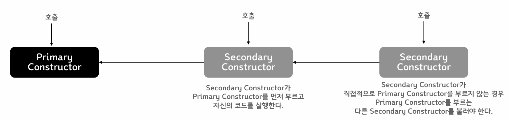
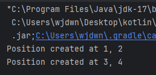
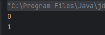
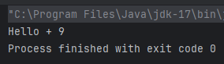
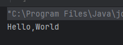
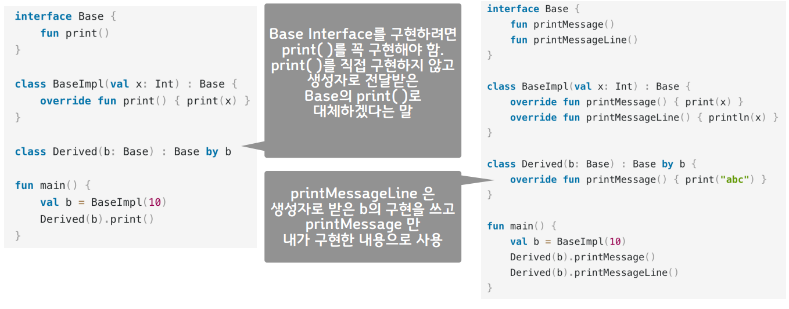

# 클래스

#### Class

* class 키워드로 선언한다
* class의 구성
  * **header** : 클래스 이름 다음부터 { 까지. constructor, 상속 등을 정의
  * **body** : {} 로 정의된 코드 영역
* Java와 다른 점
  * class의 access keyword - public 생략 가능
  * 객체 생성자를 부를 때 **new 를 적지 않는다**
  * header 와 body 가 모두 선택사항이다

#### Constructor

* **하나의 Primary Constructor** 와 \*\*여러 개의 Secondary Constructor \*\*로 구성할 수 있다
* **Primary Constructor는 반드시 호출되어야 한다**

<figure><figcaption></figcaption></figure>

* Primary Constructor는 header 영역에 정의된다

```kotlin
class Person constructor(firstName: String) { /*...*/ }
```

* Primary Constructor에 annotation도 없고 visibility 가 public 일 경우 다음과 같이 constructs 키워드를 생략하고 줄여쓸 수 있다

```kotlin
class Person(firstName: String) { /*...*/ }
```

* Primary Constructor로 전달 된 파라미터는 클래스 Body 내의 변수 초기화에 사용할 수 있다.
* 초기화 코드가 필요할 경우 init { } 블록을 추가하여 작성 할 수 있다.
  * init 블록은 Primary Constructor이다.
  * init 블록이 여러 개 있으면 위에서 아래 순으로 실행된다.

```kotlin
class Student(birthYear:Int) {
    private val age = LocalDateTime.now().year - birthYear
    init {
        println("Student's age is $age")
    }
    init {
        println("Second init block.")
    }
}
```

\


#### 실습

* 인자를 받지 않는 생성자를 가진 Test 클래스를 선언하고 객체를 생성한다

```kotlin
class Test

fun main() {
    val test = Test()
}
```

* 정수형 value property x, y를 가지는 Position class를 정의
* Primary constructor 에서 정수형 숫자 2개를 받아서 property x, y를 초기화
* 객체를 2개 이상 생성

```kotlin
class Position(x: Int, y: Int) {
    val x = x
    val y = y

    init {
        println("Position created at $x, $y")
    }
}

fun main() {
    val p1 = Position(1,2)
    val p2 = Position(3,4)
}
```

<figure><figcaption></figcaption></figure>

* Primary Constructor에서 property 선언과 초기화를 한번에 할 수 있다
* Class property 도 할당 횟수에 따라 val, var로 구분하여 사용한다

```kotlin
class Person(val firstName: String, val lastName: String, var age: Int)
```

\


* 앞에서 작성한 Position 클래스에서 x, y 변수를 생성자에서 바로 선언하고 초기화하도록 코드를 수정하라

```kotlin
class Position(val x: Int, val y:Int) {
    init {
        println("Position created at $x, $y")
    }
}

fun main() {
    val p1 = Position(1,2)
    val p2 = Position(3,4)
}
```

<figure><figcaption></figcaption></figure>

#### Secondary constructor

* constructor 키워드를 이용해 class body에 선언한다
* 직접적 또는 간접적으로 Primary constructor를 호출해야 한다

```kotlin
class Person(val name: String) {
    val children: MutableList<Person> = mutableListOf()
    constructor(name: String, parent: Person) : this(name) {
        parent.children.add(this)
    }
}
```

\


* 앞서 작성한 Position 클래스에 정수형 파라미터 하나만을 받아 x,y 모든 변수에 해당 값을 설정하는 Secondary Constructor를 추가하라

```kotlin
class Position(val x: Int, val y:Int) {
    constructor(value:Int):this(value, value)
    init {
        println("x: $x, y: $y")
    }
}

fun main() {
    val p1 = Position(1,2)
    val p2 = Position(3,4)
    val p3 = Position(3)
}
```

#### Inheritance

* 모든 클래스의 최상위 부모는 Any: 부모가 명시되지 않은 경우 Any의 자식 클래스
* 클래스는 기본적으로 final 처리되어 상속 불가능
* 상속을 허용하려면 open 키워드를 사용해야 한다

```kotlin
open class Base // Class is open for inheritance
```

* 부모 클래스를 지정하려면 header 뒤에 : 부모클래스() 와 같이 적는다
  * 부모 클래스의 Constructor를 호출하는 형태로 적어야 한다

```kotlin
open class Parent

class Child: Parent()

----------------------------
open class Parent(v:Int)

class Child: Parent(0)

----------------------------
open class Parent(v:Int)

class Child(v:Int): Parent(v)
```

* 만약 자식 클래스에 primary constructor가 없다면 각 secondary constructor에서 super 키워드를 이용해 초기화 하거나 다른 secondary constructor를 이용해서 부모 클래스를 초기화한다.

```kotlin
open class Parent { 
    constructor(v:Int){ } 
    constructor(v1:Int, v2:Int){ } 
}
```

```kotlin
open class Parent(v:Int) { 
    constructor(v1:Int, v2:Int):this(v1){ } 
} 
class Child: Parent{ 
    constructor(v:Int):super(v) 
    constructor(v1:Int, v2:Int):super(v1, v2) 
} 
fun main() { 
    // val child = Child() // error 
    val c = Child(1) 
    val c2 = Child(1, 2) 
} 
```

\


**실습**

* Position을 상속 가능하게 변경하고 이를 상속받은 TPosition 클래스를 정의한다
* TPsition클래스는 정수형 z 변수를 추가로 가지며 Primary Constructor는 정수형 숫자 3개를 받는다
* TPosition 클래스의 객체를 생성하라

```kotlin
open class Position(val x:Int, val y:Int) {
    open val dimension = 2
    constructor(value:Int):this(value, value)
    open fun printValue() {
        println("x: $x, y: $y")

    }
}

class TPosition(x:Int, y:Int, val z:Int): Position(x,y){
    override val dimension = 3
    override fun printValue() {
        println("x: $x, y: $y, z: $z")
    }
}

fun main() {
    val p =Position(10, 20)
    p.printValue()
    val p2 = Position(10)
    p2.printValue()
    val tp = TPosition(10, 20, 30)
    tp.printValue()
    val tp2 = TPosition(10, 20, 30)
    tp2.printValue()
}
```

<figure><figcaption></figcaption></figure>

**초기화 순서**

* 부모 클래스의 초기화가 먼저 이루어지고 자식 클래스가 초기화 된다
* 부모 생성자의 할당 실행
* \-> 부모 생성자의 init 실행
* \-> 부모의 나머지 초기화 코드 실행
* \-> 자식 클래스의 초기화 실행

**Abstract classes**

* 일부 멤버 또는 전체 멤버가 abscract 일 때, 클래스가 abstract로 선언 된다
  * abstract 멤버는 open 키워드를 사용하지 않아도 된다

```kotlin
abstract class Polygon{
    abstract fun draw()
}

class Rectangle : Polygon() {
    override fun draw() {
        // draw the rectangle
    }
}
```

* 추상 함수가 아닌 일반 함수를 포함할 수 있으며 일반함수는 필요에 따라 open 할 수 있다

#### Properties

* Read-only, mutable한 경우 맞게 val, var로 선언한다
  * Property들은 모두 constructor에서 할당 되어야 한다
  * 그래서 val의 경우 read-only라 생각해도 된다
  * 초기화를 통해 타입을 추론할 수 있게 하거나 타입을 정해줘야 한다

```kotlin
class Hello{
    val a = 0
    var b:Int? = null
}
```

```kotlin
class Hello {
    val a = 0
    var b:Int?
    init{ b = 1 }
}
```

* Error

```kotlin
class Hello{
    val a = 0
    var b:Int?
}
```

\


**Getter/Setter**

* 각 Property는 getter와 setter를 가질 수 있다

```kotlin
var <propertyName>[: <PropertyType>] [= <property_initializer>]
	[<getter>]
	[<setter>]
```

* 생략할 경우 기본 getter/setter가 제공된다
* val 은 getter 만 제공된다

```kotlin
class Test(var value:Int)
```

\->

```kotlin
public final class Test {
    private int value;
    
    public final int getValue() {
        return this.value;
    }
    public final void setValue(int var1){
        this.value = var1;
    }
    public Test(int value){
        this.value = value;
    }
}
```

* 자바 라이브러리의 호환성 등을 위해 getter/setter 함수를 사용하지 않으려면
  * property에 @JvmField 어노테이션을 추가한다

```kotlin
class Test(@JvmField var value:Int)
```

\->

```kotlin
public final class Test{
    @JvmField
    public int value;
    
    public Test(int value){
        this.value = value;
    }
}
```

* var의 경우 getter, setter를, val은 getter를 별도로 구현할 수 있다

```kotlin
class Rectangle(val width: Int, val height: Int){
	val area: Int
    	get() + THIS>WIDTH * this.height
}
```

```kotlin
val stringRepresentation: String
	get() = this.toString()
	set(value) {
        setDataFromString(value)
    }
```

* getter, setter에서 본래의 값을 부르는 변수는 field 이다
  * 원래의 변수 이름을 사용하면 Stack Overflow 가 발생한다

```kotlin
var counter = 0
	set(value){
        if(value >= 0)
        	field = value
    }
```

**실습**

* 0 이상의 정수만 할당할 수 있는 count 변수를 가진 Test 클래스를 정의하라. 음수로 할당할 경우 무시하면 된다

```kotlin
class Test{
    var count = 0
        set(value) {
            if(value >= 0)
                field = value
        }
}

fun main() {
    val t = Test()
    t.count = -1
    println(t.count)
    t.count = 1
    println(t.count)
}
```

<figure><figcaption></figcaption></figure>

**lateinit**

* null을 허용하지 않는 변수를 생성자가 아닌 함수에서 초기화
* var 에만 사용 가능
  * lateinit var 이름:type 형식으로 사용
* 초기화 되지 않은 변수에 접근할 경우 Exception이 발생
* isInitialized 속성을 통해 초기화가 되었는지 확인 후 사용한다

```kotlin
if(foo::bar.isInitialized) {
    printlb(foo.bar)
}
```

* 클래스/전역 변수/함수 등의 정보에 접근하는 연산자 -> :: 현재 객체의 변수라면 ::bar.isInitialized 로 적을 수 있다.

**lazy : Delegation**

* 람다식을 파라미터로 받아 Lazy객체를 반환. Delegation을 수행한다
* 최초로 사용될 때(get()) 지정원 lambda 코드가 실행되며 해당 값을 저장한다
* 이후 사용될 떄 마다 저장된 값이 반환된다

```kotlin
val p: String by lazy {
	// compute the string
}
```

* 지정된 람다 코드는 동기식으로 동작한다

**Companion objects**

* 클래스 안에서 선언된 객체로 하나의 instance만 생성되며 클래스 이름으로 access 할수 있다
  * class 당 하나만 정의

```kotlin
class MyClass {
    companion object Factory{
        fun create(): MyClass = MyClass()
    }
}
val instance = MyClass.create()
```

* 객체의 이름이 생략된 경우 Companion이라 부를 수 있다

```kotlin
class MyClass{
	companion object { }
}
val x = MyClass.Companion
```

* Static 과 비슷해보이지만 static과 같지는 않다
  * 각 변수는 static 변수로 Outer class에 등록된다
  * companion object의 나머지 함수 등의 내용은 static class 코드로 변환되며 var 변수에 대한 getter, setter 함수가 추가된다
  * Outer class에서 해당 객체를 생성해 static 변수에 등록한다
* Java 기준 함수를 static으로 생성하고 싶으면 annotation을 사용한다
  * @JvmFiled : getter / setter 생성 하지 않음
  * @JvmStatic : static 함수로 생성

```kotlin
interface Foo{
    companion object {
        @JvmField
        val answer: Int = 42
        
        @JvmStatic
        fun sayHello() {
            println("Hello, world!")
        }
    }
}
```

Java ->

```java
interface Foo {
    public static int answer = 42;
   	public static void sayHello() {
        //..
    }
}
```

#### Interfaces

* 가상 함수 또는 함수를 가진 Interface를 선언 할 수 있다
  * 추상 클래스와 달리 데이터를 저장할 수는 없다
  * 함수는 기본 body를 가질 수도 있다

```kotlin
interface MyInterface{
    fun bar()
    fun foo() {
        // optional body
    }
}
```

* 구현하기 : 클래스 이름 : Interface 이름을 적는다
  * Interface 구현이므로 부모 클래스 생성자와 달리
  * () 없이 이름만 적는다

```kotlin
class Child : MyInterface {
    override fun bar() {
        // body
    }
}
```

* properties 는 abstract 로 선언되거나 get() 함수를 제공해야 한다
  * interface의 properties는 상태를 저장하지 못한다

```kotlin
interface MyInterface {
    val prop : Int // abstract
    
    val propertyWithImplemenmtation: String
    	get() = "foo"
    
    fun foo() {
        print(prop)
    }
}

class Child : MyInterface {
    override val prop: Int = 29
}
```

* Interface는 다른 Interface를 상속할 수 있다
  * 이 경우 클래스는 누락된 부분만 implement 하면 된다

```kotlin
interface Named {
    val name: String
}

interface Person : Named {
    val firstName: String
    val lastName: String
    
    override val name: String get() = "$firstName $lastName"
}

data class Employee(
	// implementing 'name' is not required
    override val firstName: String,
    override val lastName: String,
    val Position: Position
) : Person
```

* 여러 Interface를 구현할 때
  * 모든 interface에 default 구현이 있는 경우 명시적으로 override 해 주어야 하며 새로운 코드를 작성하거나 super 로 Interface를 지정해 호출할 수 있다

```kotlin
interface A {
    fun foo() { print("A") }
    fun bar()
}

interface B {
    fun foo() { print("B") }
    fun bar() { print("bar") }
}

class C : A {
    override fun bar() { print("bar") }
}

class D : A, B {
    override fun foo() {
        super<A>.foo()
        super<B>.foo()
    }
    
    override fun bar() {
        super<B>.bar()
    }
}
```

* 다음 interface를 구현한 TestImpl 클래스를 작성하라

```kotlin
interface Test{
	fun message():String
    fun value():Int
}

// TestImpl

fun main() {
    val ti = TestImpl()
    print("${ti.message()} + ${ti.value()}")
}
```

```kotlin
interface Test{
    fun message():String
    fun value():Int
}

class TestImpl : Test {
    override fun message(): String {
        return "Hello"
    }

    override fun value(): Int {
        return 9
    }
}

fun main() {
    val ti = TestImpl()
    print("${ti.message()} + ${ti.value()}")
}
```

<figure><figcaption></figcaption></figure>

#### Functional(SAM) Interfaces

* 하나의 추상 함수 (Single Abstract Method)만을 가진 Interface
  * Functional interface 또는 SAM interface라고 하며
  * 다음과 같이 fun interface 라고 선언한다

```kotlin
fun interface KRunnable {
	fun invoke()
}
```

* SAM conversion 을 사용할 수 있다

일반적인 객체 선언 법

```kotlin
fun interface IntPredicate {
    fun accept(i: Int): Boolean
}
```

```kotlin
val isEven = object : IntPredicate {
    override fun accept(i: Int): Boolean {
        return i % 2 == 0
    }
}
```

람다식으로 대체한 SAM Conversion

```kotlin
fun interface IntPredicate {
    fun accept(i: Int) : Boolean
}

val isEven = IntPredicate { it % 2 == 0 }

fun main() {
    println("Is 7 even? - ${isEven.accept(7)}")
}
```

**실습**

* 다음과 같은 interface를 SAM conversion으로 구현하여 2개 이상의 객체를 생성하라

```kotlin
fun interface Test {
	fun message(): String
}
```

```kotlin
fun interface Test {
    fun message(): String
}

fun main() {
    val t1 = Test { "Hello" }
    print(t1.message())

    val t2 = Test { ",World" }
    println(t2.message())
}
```

<figure><figcaption></figcaption></figure>

#### Visibility modifiers

* Class, object, interface, constructor, function, property, setter에 대하여 다음 네 가지의 visibility modifiers를 제공(getter는 property를 따름)
  * private
  * protected
  * internal
  * public: default

|                                                                               |  private  |           protected          | internal |  public |
| :---------------------------------------------------------------------------: | :-------: | :--------------------------: | :------: | :-----: |
| <p>Top-level<br>functions, properties,<br>classes, objects,<br>interfaces</p> |   같은 파일만  |               -              |   같은 모듈  | default |
|                                 Class members                                 | 클래스 내부에서만 | <p>클래스 내부와 자식<br>클래스 에서만</p> |   같은 모듈  |  모든 곳에서 |

#### Extensions

* 상속 없이 함수를 추가하는 방법
  * Receiver Type. 함수 형태로 정의한다. 아래의 경우 MutableList가 Receiver
  * this 는 Receiver object

```kotlin
fun String.sayHello():String {
    return "$this Hello"
}

fun main() {
    val test = "ABC"
    println(test.sayHello())
}
```

```kotlin
fun MutableList<Int>.swap(index1: Int, index2: Int) {
    val tmp = this[index1]
    this[index1] = this[index2]
    this[index2] = tmp
}
```

```kotlin
val list = mutableListOf(1,2,3)
list.swap(0, 2)
```

* 실제 클래스에 멤버 함수가 추가되는 것은 아니며 해당 타입에서 . 연산자를 통해 불러 쓸수 있는 함수를 추가할 뿐임
  * 같은 이름, 같은 파라미터의 함수가 멤버로 이미 정의 된 경우 멤버 함수가 호출됨
  * Overloading은 허용됨
* 기존 타입을 수정하지 않고 기능을 확장하는 효과가 있음

\


* package 선언 바로 아래 Extension을 선언

```kotlin
package org,example.declarations

fun List<String>.getLongestString() { /*..*/}
```

* 선언된 package 밖에서 해당 extension을 사용하기 위해서는 별도로 import 해얗 함

```kotlin
package org.example.usage

import org.example.declarations.getLongestString

fun main() {
    val list = listOf("red", "green", "blue")
    list.getLongestString()
}
```

**실습**

* Int 타입을 Receiver로 절대값을 반환하는 abs() 함수를 Extension으로 작성하라
  * 다음과 같이 불러쓸 수 있도록 작성하라

```kotlin
fun main() {
	val value = -3
    println(value.abs())
    println(25.abs())
}
```

```kotlin
fun Int.abs(): Int {
    val value = if (this < 0) -this else this
    return value
}

fun main() {
    val value = -3
    println(value.abs())
    println(25.abs())
}
```

#### Data Classes

* 데이터를 전달하기 위한 목적의 클래스. data 로 마크한다

```kotlin
data class User(val name: String, val age: Int)
```

* Primary Constructor에는 하나 이상의 파라미터가 넘어가야 한다
  * Primary constructor의 파라미터에 대해 다음 함수가 자동으로 생성된다.
    * equals(), hashCode(), toString(), componentN(). copy()

```kotlin
data class User(
	val name:String,
	val email:String
)

fun main() {
	val u = User("abc", "a@a.com")
    val u2 = User("abc", "a@a.com")
    println(u)
    println(u==u2)
}
```

* 다른 클래스를 상속 받을 수 있고 body를 가질 수 있다

```kotlin
data class Person(val name:String) {
    var age: Int = 0
}
```

* body에서 별도로 변수를 추가할 수 있지만 이 경우 다음 함수들에 해당 property가 포함되지 않는다
* equals(), hashCode(), toString(), componentN(), copy()
* Destructuring 방법

```kotlin
val jane = User("Jane", 35)
val (name, age) = jane
println("$name, $age years of age")
```

**실습**

* 스트링 타입의 변수 name, id, email를 가지는 Student 클래스를 data 클래스로 작성하라
* name과 id 값이 같다면 == 연산자가 true를 반환하도록 하라
  * email 값은 비교에 사용하지 않는다
  * 아래 코드와 같이 사용할 수 있도록 구현한다

```kotlin
data class Student(var id: String, var name:String){
    var email:String= ""
    constructor(id: String, name: String, email:String): this(id, name){
        this.email = email
    }
}

fun main(){
    val u = Student("1", "ABC")
    u.email = "abc@mail.com"
    val u2 = Student("1", "ABC", "aaabbbccc@mail.com")
    println(u==u2)
}
```

#### Sealed classes

* 상속을 제한하는 클래스, 인터페이스
  * 클래스 : 모든 자식 클래스를 컴파일 타임에 알 수 있어야 한다
  * 인터페이스 : 모든 구현체를 컴파일 타임에 알 수 있어야 한다
* 서브 클래스, 인터페이스들은
  * 같은 패키지에서 선언되어야 한다

```kotlin
sealed interface Error

sealed calss IOError(): Error

class FileReadError(val f: File): IOError()
class DatabaseError(val source: DataSource): IOError()

object RuntimeError : Error
```

#### Generics

* Java에서와 같이 타입 파라미터를 받을 수 있다

```kotlin
class Box<T>(t: T){
	var value = t
}
val box: Box<Int> = Box<Int>(1)
val box = Box(1)
```

* 함수를 선언할 떄는 다음의 문법을 따른다
  * fun name(param:T): T

```kotlin
fun <T> params(obj:T){
    println("Hello ${obj.toString()}")
}

fun <T> returns(obj:T):T {
    return obj
}
```

* 특정 타입 및 그 자식 클래스만을 사용하도록 upper bound를 지정할 수도 있다
  * \<T:UpperBound> 와 같이 표기한다

```kotlin
fun <T:Number> params(obj:T) {
	println("Hello $obj")
}

fun main() {
    val intValue = 1
    params(intValue)
    
    val doubleValue = 1.1
    params(doubleValue)
    
    val str = "123"
    // params(str)
}
```

#### Nested and inner classes

* class, Interface는 Nest 될 수 있음
  * Outer 객체 생성 여부와 상관 없이
  * Nested 객체 생성 가능

```kotlin
class Outer {
    private val bar: Int = 1
    class Nested {
        fun foo() = 2
    }
}

val demo = Outer.Nested().foo() // == 2
```

```kotlin
interface OuterInterface {
    class InnerClass
    interface InnerInterface
}

class OuterClass {
    class InnerClass
    interface InnerInterface
}
```

* inner 마크가 붙은 Nested class는 outer 클래스의 멤버에 접근 가능
  * Outer 객체가 생성된 이후 Inner 객체 생성 가능

```kotlin
class Outer {
    private val bar: Int = 1
    inner class Inner {
        fun foo() = bar
    }
}

val demo = Outer().Inner().foo() // == 1
```

* 내부 클래스에서 외부 클래스의 부모 함수를 호출하려면 super@외부 클래스 를 사용한다

```kotlin
class FilledRectangle: Rectangle() {
    override fun draw() {
        val filler = Filler()
        filler.drawAndFill()
    }
    
    inner class Filler {
        fun fill() { println("Filling") }
        fun drawAndFill() {
            super@FilledRectangle.draw()
            fill()
            println("Drawn a filled rectangle with color ${super@FilledRectangle}")
        }
    }
}
```

#### Enum classes

* 다음과 같이 enum 클래스를 정의 할 수 있다

```kotlin
enum class Direction{
	NORTH, SOUTH, WEST, EAST
}
```

* 각 항목들은 Enum class의 instance 이므로 다음과 같이 초기화도 가능하다

```kotlin
enum class Color(val rgb: Int) {
	RED(0xFF0000),
    GREEN(0x00FF00),
    BLUE(0x0000FF)
}
```

#### Inline value classes

* 하나의 값을 가지는 Wrapper 역할을 할 수 있는 클래스
* value 키워드를 class 앞에 붙인다

```kotlin
value class Password(rpivate val s: String)
```

```kotlin
@JvmInline
value class Password(private val s: String)
```

* primary constructor에는 단 하나의 val property만이 초기화 되어야 한다
* secondary constructor를 가질 수 있으며 getter만을 가진 가상의 val 을 가질 수 있다

#### Object expressions

* 익명 클래스의 객체를 생성해주는 expression
* 싱글톤 객체로 생성되며 한 번만 사용하는 경우 유용하다
* Super type이 생략된 경우 Any를 상속한다

```kotlin
val helloWorld = object {
    val hello = "Hello"
    val world = "World"
    
    override fun toString() = "$hello $world"
}
```

```kotlin
window.addMouseListener(object : MouseAdapter() {
    override fun mouseClicked(e: MouseEvent) { /*...*/ }
    override fun mouseEntered(e: MouseEvent) { /*...*/ }
})
```

#### Delegation

* Delegation Pattern - 상속 없이 코드를 재활용 하는 방법
* 클래스 단위에서 by 키워드로 Delegation을 지원한다

<figure><figcaption></figcaption></figure>
