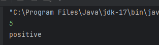
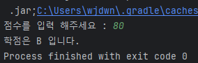

# 제어문

### if

* if( 조건문 ) { statements }
* if( 조건문 ) { statements } else { statements }
* if( 조건문 ) { statements } else if ( 조건문 ) { statements }
* if( 조건문 ) { statements } else if ( 조건문 ) { statements } else { statements }

```kotlin
val a = 2
val b = 3

var max = a
if(a < b) max = b

// With else
if(a > b){
    max = a
} else {
    max = b
}
```

**실습**

* 사용자로부터 정수를 입력 받아 음수면 "negative", 양수는 "positive", 0 은 "zero" 로 출력하는 프로그램을 작성하라

```kotlin
fun condition(number: Int): String{
    if(number < 0)
        return "negative"
    else if(number == 0)
        return "zero"
    else
        return "positive"
}

fun main() {
    val number = readln().toInt()
    println(condition(number))
}
```

\


* 1부터 20사이의 임의의 정수를 생성하여 10 이상이면 "숫자-big" 그 외는 "숫자-small" 이라 출력하라
* Range의 Random은 다음 코드 참조

```kotlin
val value = (1..20).random()
```

```kotlin
fun condition(number: Int): String {
    return if (number >= 10) {
        "${number}-big"
    } else {
        "${number}-small"

    }
}

fun main() {
    val number = (1..20).random()
    println(condition(number))
}
```

\


* kotlin에서 if 문은 expression 이다
* expression으로 사용할 때는 반드시 if-else 구조를 사용한다

```kotlin
// As expression
val max = if (a > b) a else b
```

```kotlin
val max = if (a > b) {
	print("Choose a")
    a // 블록의 마지막 expression의 값이 if의 값
} else {
    print("Choose b")
    b // 블록의 마지막 expression의 값이 else의 값
}
```

\


* 사용자로부터 정수를 입력받아 절대값을 출력하라

```kotlin
fun main() {
    var number = readln().toInt()
    if(number < 0) number = -number
    print("절대값 : $number")
}
```

\


* 사용자로부터 정수(value)를 입력받는다
* if 문을 expression으로 사용하여 다른 변수(abs)에 value의 절대값을 할당한다
* abs 의 값을 출력하라

```kotlin
fun main() {
    var value = readln().toInt()
    var abs = if (value < 0) -value else value
    print(abs)
}
```

.png>)\


* 파라미터로 받은 정수의 절대값을 반환하는 함수 abs를 정의하라. 단, 함수 Body 대신 expression을 사용하라
* 사용자로부터 정수를 입력받아 abs 함수를 사용한 결과를 출력하라

```kotlin
fun abs(value: Int) = if (value < 0) -value else value

fun main() {
    val value = readln().toInt()
    println(abs(value))
}
```

<figure><figcaption></figcaption></figure>

#### when

* 여러 조건을 처리하는 조건문. expression 으로 사용 가능
* C / Java에서의 switch 와 유사하지만 더 많은 기능을 제공한다

```kotlin
when(x) {
	1(조건) -> print("x == 1")
    2(조건) -> print("x == 2")
    else -> {
        print("x is neither 1 nor 2")
    }
}
```

* expression으로 사용할 때는 모든 경우의 수를 다루어야 한다
  * enum의 경우 모든 경우를 다루면 else 생략 가능
  * 그 외 모든 경우를 다 다루거나 else 조건 사용
* 두 가지 이상의 조건을 한번에 처리 가능

```kotlin
when(x) {
    0, 1 -> print("x == 0 or x == 1")
    else -> print("otherwise")
}
```

* in 연산자를 이용해 Collection 타입 내에 포함 여부 확인 가능

```kotlin
when(x) {
    in 1..10 -> print("x is in the range")
    in validNumbers -> print("x is valid")
    !in 10..20 -> print("x is outside the range")
    else -> print("none of the above")
}
```

* is 연산자를 이용해 타입 체크 가능

```kotlin
fun hasPrefix(x: Any) = when(x) {
    is String -> x.startsWith("prefix") // prefix로 시작하는 문자열
    else -> false
}
```

\


**실습**

* 사용자로부터 정수를 입력받아 다음과 같이 출력하라
  * 점수 - 학점
* 단, 사용자는 0부터 100 사이의 정수만을 입력한다고 가정한다
  * 90 이상 100이하 : "A"
  * 80 이상 90미만 : "B"
  * 70 이상 80미만 : "C"
  * 60 이상 70미만 : "D"
  * 0 이상 60 미만: "F"

```kotlin
fun main() {
    print("점수를 입력 해주세요 : ")
    val score = readln().toInt()
    val grade = when(score) {
        in 90..100 -> "A"
        in 80..89 -> "B"
        in 70..79 -> "C"
        in 60..69 -> "D"
        else -> "F"
    }

    print("학점은 $grade 입니다.")
}
```

<figure><figcaption></figcaption></figure>

### loops

**for**

* Iterator를 제공하는 데이터(주로 배열이나 리스트)에 대한 iteration 제공한다
* foreach 의 동작과 유사하다

```kotlin
for (item in collection ) print(item)
```

```kotlin
for(item: Int in ints) {
	// ...
}
```

* iteration된 아이템 말고 Index 도 사용하려면 다음 두 방법 중 하나를 사용

```kotlin
for (i in array.indices) { // 배열의 index 만을 대상으로 loop
    println(array[i])
}
```

```kotlin
for ((index, value) in array.withIndex()) { // 배열의 index, value를 이용해 loop
    println("the element at $index is $value")
}
```

* 숫자를 이용한 반복을 위해서는 정수형 Range 를 사용한다

```kotlin
for (i in 1..3) {
    print(i) // 123
}
for(i in 6 downTo 0 step 2){
    print(i) // 6420
}
```

```kotlin
for(i in (1..4).reversed()) print(i) // 4321
```

\


**while**

* while과 do-while을 사용할수 있다

```kotlin
while(x > 0) {
    x--
} 

do {
    val y = retrieveData()
}while(y != null) // y is visible here!
```

* do 블록에서 선언한 변수를 while에서 사용 가능

\


### Returns and jumps

**Jump expressions**

* 3개의 jump expressions
  * return : 가장 가깝게 감싸고 있는 함수 (또는 익명 함수)를 반환
  * break : 가장 가깝게 감싸고 있는 loop를 종료
  * continue : 가장 가깝게 감싸고 있는 loop의 다음 단계로 진행.
* Nothing Type
  * jump expressions, throw의 타입

**break and continue**

* kotlin의 모든 expression은 라벨과 함께 표기될 수 있다
  * 라벨은 이름@ 형태로 사용하며 문구 앞에 라벨을 먼저 적는다
  * break와 continue는 적용될 위치를 라벨로 지정할 수 있다
    * 단,이 경우 loop 문에 붙은 라벨만을 지정할 수 있다

```kotlin
loop@ for (i in 1..100) {
    // ...
}
```

```kotlin
loop@ for(i in 1..100){
    for(j in 1..100) {
        if (...) break@loop
    }
}
```

**return to label**

* 람다식의 경우 return 을 사용할 경우 람다식 외부의 함수가 반환된다

```kotlin
fun foo() {
    listOf(1,2,3,4,5).forEach{
        if(it == 3) return
        print(it)
    }
    println("this point is unreachable")
}
```

* 람다식만 return 하고 싶을 때는 라벨을 사용한다

```kotlin
fun foo() {
    listOf(1,2,3,4,5).forEach lit@{
        if(it == 3) return@lit
        print(it)
    }
    print("done with explicit label")
} // 명시적 라벨을 붙인 경우
```

```kotlin
fun foo() {
    listOf(1,2,3,4,5).forEach {
        if(it == 3) return@forEach
        print(it)
    }
    print("done with implicit label")
} // 묵시적 라벨을 붙인 경우
```

* 라벨 없이 내부만 return 하고 싶다면 람다식 대신 익명 함수를 사용한다

```kotlin
fun foo() {
    listOf(1,2,3,4,5).forEach(fun(value: Int) {
        if(value == 3) return
        print(value)
    })
    print("done with anonymous function")
}
```

* 람다식의 중첩된 경우 라벨을 사용해 원하는 람다식을 return 할 수 있다

```kotlin
fun foo() {
	run loop@{
        listOf(1,2,3,4,5).forEach {
            if(it == 3) return@loop
            print(it)
        }
    }
    print("done with nested loop")
}
```

\


**예외**

* Throwable 클래스를 상속받은 Exception 클래스를 사용한다
*   발생 시키기

    ```kotlin
    throw Exception("Hi There!")
    ```
* 처리하기

```kotlin
try{
    // some code
} catch(e: SomeException) {
    // handler
} finally {
    // optional finally block
}
```

* try 문은 expression 으로 값을 반환한다

```kotlin
val a: Int? = try{ input.toInt() } catch(e: NumberFormatException){ null }
```
