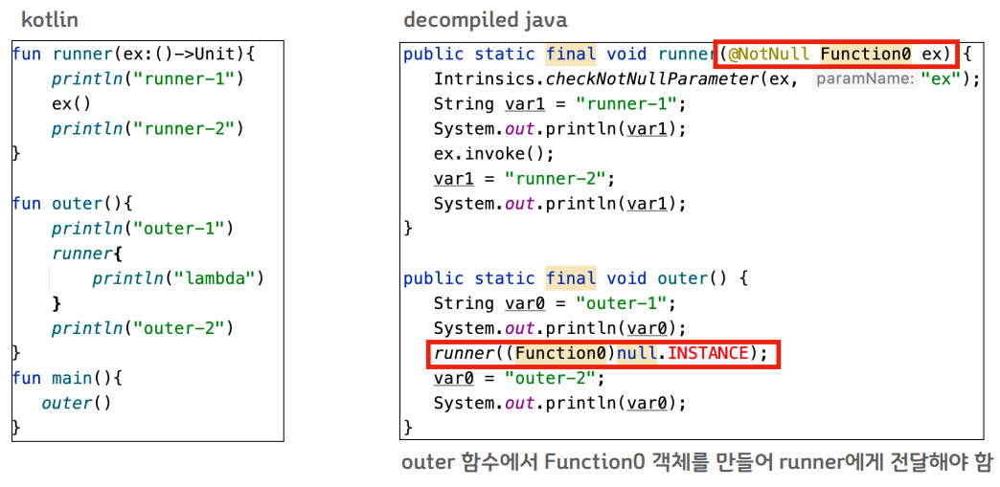
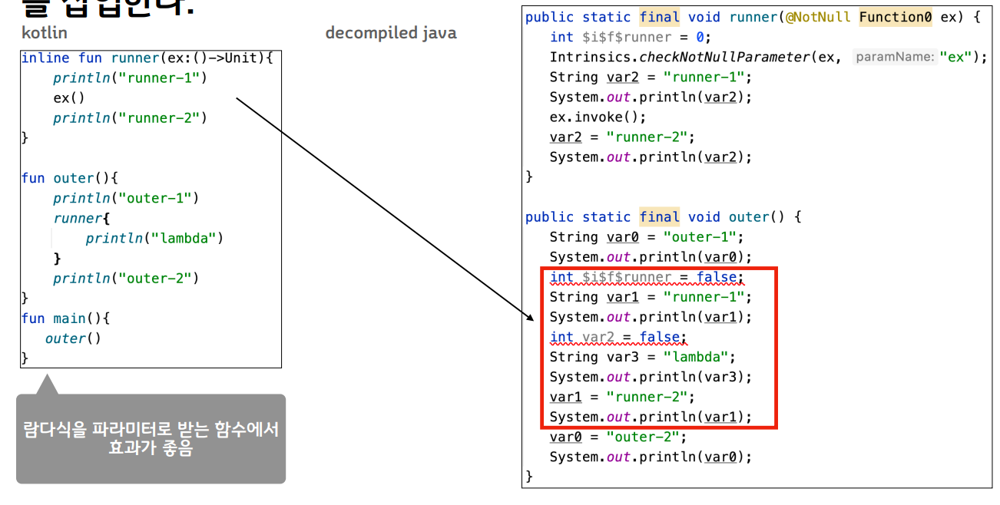
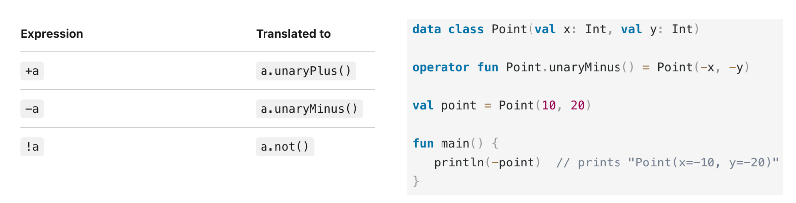
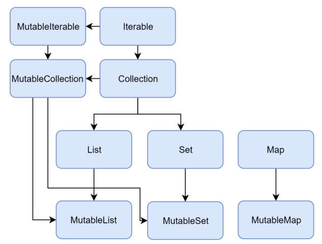
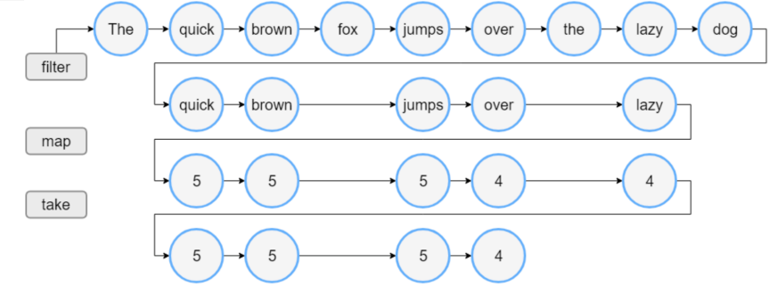
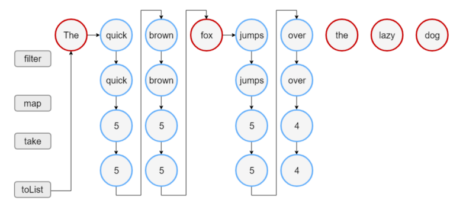

# 함수

## Functions

**Functions**

* fun name(parameters): return Type { body }
* 각 파라미터는 default 값을 가질 수 있으며
* 함수를 호출할 때 파라미터 이름을 명시하면 선언 순서와 상관없이 전달할 수 있다

```kotlin
fun message(name:String, message:String="Hello", age:Int):String {
    return "Age:$age, $message, $name"
}

fun main() {
    println(message(age=22, name"User"))
}
```

* overriding 된 함수는 base 함수의 default 값을 동일하게 사용한다
* default 값이 있는 파라미터와 없는 파라미터를 동시에 사용하는 경우 기본값 보다 뒤쪽에 있는 파라미터는 이름을 지정해야 한다

```kotlin
open class A{
    open fun foo(i:Int = 10){
        println(i)
    }
}

class B:A() {
    override fun foo(i:Int) {
        println(i)
    }
}

fun main(){
    val a = A()
    a.foo()
    val b = B()
    b.foo()
    b.foo(1000)
}
```

```kotlin
fun foo(bar:Int = 0, baz:Int) {
    println("$bar, $baz")
}

fun bar(foo:Int, baz:Int=0){
    println("$foo, $baz")
}

fun main() {
    foo(baz=1)
    bar(1)
    bar(1, 2)
}
```

* 람다식을 파라미터로 받을 수 있으며 람다식이 마지막 파라미터인 경우 괄호 밖에 적을 수 있다

```kotlin
fun foo(name:String, ex:()->Unit){
    println(name)
    ex()
}

fun bar(param:Int=1, ex:()->Unit) {
    println(param)
    ex()
}

fun main() {
    foo("abc") { println("Hello") }
    bar(2) { println("World") }
    bar { println("Kotlin") }
}
```

* varargs 키워드를 이용해 가변 개수의 파라미터를 받을 수 있다

```kotlin
fun foo(vararg items: Int) {
    for(i in items)
    	print("$i ")
}

fun main() {
    foo()
    foo(1)
    foo(1, 2, 3)
}
```

* spread 연산자 (\*)를 이용해 가변 파라미터 함수를 사용할 수 있다

```kotlin
fun foo(vararg items:Int){
	for(i in items)
    	print("$i ")
}

fun main() {
    val arr = intArrayOf(1, 2, 3)
    foo(*arr)
}
```

\


**infix 함수 만들기**

* Member 함수 또는 Extension은 Infix 형태로 정의 가능
* 파라미터는 하나만 받아야 하고 기본값이 없어야 함

```kotlin
infix fun Int.diff(other:Int) = if(this > other) this-other else other-this

fun main() {
    var diff = 3 diff 1
    println(diff)
    diff = 1 diff 3
    println(diff)
}
```

* Local functions : 다른 함수 내부에 선언된 함수
  * local 함수는 외부 함수의 지역 변수에 접근 가능

```kotlin
fun foo() {
    var count = 0
    fun add() {
        println(count)
        count++
        if(count < 3) add()
    }
    add()
}

fun main() {
    foo()
}
```

* Tail recursive functions
  * Tail call : 함수의 마지막 코드가 함수 호출인 것
  * Tail recursion : 함수의 마지막 코드로 재귀 호출을 하는 것
  * 함수의 마지막 줄이 다른 함수 호출이라는 것은 이전 함수에서 더 이상 실행 할 코드가 없다는 뜻 -> 콜 스택에 모든 정보를 남길 필요가 없다 -> 성능을 높일 수 있다
  * 재귀 호출 함수를 tail racursion 으로 작성했다면 tailrec 키워드를 이용해 최적화를 할 수 있다

```kotlin
val eps = 1E-10

tailrec fun findFixPoint(x: Double = 1.0): Double =
	if (Math.abs(x - Math.cos(x)) < eps) x else findFixPoint(Math.cos(x))
```

* Tail recursive functions

```kotlin
tailrec fun foo(i:Int) {
    if(i == 0) return
    var next = i
    foo(--next)
}

tailrec fun bar(i:Int) {
    if(i==0) return
    var next = i
    foo(next--)
}

fun main() {
    foo(5)
    bar(5)
}
```

tailrec 최적화 ->

```java
public static final void foo(int i) {
    while(i != 0) {
        int next = -i - 1;
        i = next;
    }
}

public static final void bar(int i) {
    if(i != 0) {
        int var1 = i - 1;
        foo(i);
    }
}
```

\


## 고차원 함수와 람다

* 코틀린의 함수들은 First - class -> 함수를 다른 변수와 동일하게 다룰 수 있다
  * 함수를 파라미터로 받을 수 있다
  * 함수의 실행 결과로 함수를 반환할 수 있다
  * 함수를 변수나 자료구조에 저장할 수 있다
* 고차원 함수
  * 함수를 파라미터로 받을 수 있다
  * 함수의 실행결과로 함수를 반환할 수 있다

**함수의 타입 표기법**

* ( parameter type, parameter type.. ) -> return type
* () -> Unit
* (Int) -> Int 등으로 파라미터 정의 및 함수의 return type 정의 가능

Top level 함수와 확장 함수는 :: 로 참조할 수 있다

* 함수 return

```kotlin
fun getBody(type:Int): () -> Unit {
    return if(type%2==0) {
        fun() {
            println("Hello")
        }
    } else {
        fun() {
            println("World")
        }
    }
}

fun main() {
    val f1 = getBody(1)
    f1()
    val f2 = getBody(2)
    f2()
}
```

* 함수를 변수에 할당하기, 함수를 파라미터로 받기

```kotlin
fun foo(i:Int, f:(Int)->Int):Int{
	return f(i)
}

fun bar(i:Int):Int = -i

fun main() {
    val f1 = ::bar
    val f2: (Int)->Int = ::bar
    f1(1)
    f2(-1)
    
    foo(1, fun(v:Int):Int{ return v*10 })
    foo(1) { it * 100 }
    foo(1, ::bar)
}
```

**람다식**

* 함수로 선언되지는 않지만 함수 파라미터로 전달 가능

```kotlin
max(strings, { a, b -> a.length < b.length })
```

```kotlin
val sum: (Int, Int) -> Int = { x: Int, y: Int -> x + y }
```

```kotlin
val sum = { x: Int, y: Int -> x + y }
```

* 람다식이 함수의 마지막 파라미터인 경우 파라미터 바깥에 선언할 수 있다

```kotlin
val product = items.fold(1) { acc, e -> acc * e }
```

* 람다식이 유일한 파라미터인 경우 ()를 생략할 수 있다

```kotlin
run { println("...") }
```

* 람다식이 사용하는 파라미터가 하나밖에 없을 경우 it을 사용할 수 있다

```kotlin
ints.filter { it > 0 }
```

* 람다식 단독으로는 return을 사용할 수 없다
  * return은 함수 또는 익명 함수 안에서만 사용할 수 있다
* 함수 안의 람다식을 의도대로 return 하기위해서는 Qualified return을 사용할 수 있다

\


* 수신자가 있는 함수의 타입 표기
  * ReceiverType.(parameter types) -> return 의 형태

```kotlin
val foo: String.(Int) -> String = { times -> this.repeat(times) }

fun main() {
    val result = "Hello".foo(3)
    println(result)
}
```

* 해당 수신자는 함수 내에서 this로 접근할 수 있다

\


**Inline functions**

* 함수 파라미터로 넘어가는 람다식은 익명 객체를 만들게 되는 부하가 있다

<figure><figcaption></figcaption></figure>

* inline 함수로 지정할 경우 객체 생성+함수 호출 대신 람다식을 포함한 해당 함수의 코드를 삽입한다

<figure><figcaption></figcaption></figure>

**Operator overloading**

* 기본 연산자를 overloading 해서 사용할 수 있다
* 단항 연산자 예제

<figure><figcaption></figcaption></figure>

## Array & Collections

**Array**

* Array : 기본 타입
  * 하나의 변수에 여러 값을 저장하기위한 연속된 메모리 공간
  * 생성할 떄 크기가 정해진다
* List : Collection
  * 하나의 변수에 여러 값을 저장하기 위한 불연속 메모리 공간
  * List - immutable list. 생성 후 수정할 수 없다
  * MutableList - mutable list. 수정할 수 있다

\


**기본 타입**

* 초기화 방법2 : Array의 생성자 사용

```kotlin
fun main() {
    val arrayOfInt = Array(3) { it }
    println(arrayOfInt[0])
}
```

* size + 초기화 람다식
* 람다식에는 Array의 index가 파라미터로 전달된다

\


* Primitive types : xxxArrayOf()함수를 이용해 값을 초기화
  * 기본 타입들은 Array 생성 함수가 있다
  * charArrayOf, intArrayOf, longArrayof
  * floatArrayOf, doubleArrayOf
  * shortArrayOf, byteArrayOf, booleanArrayOf

```kotlin
val x: IntArray = intArrayOf(1, 2, 3)
x[0] = x[1] + x[2]
```

* ByteArray, CharArray, ShortArray, IntArray, FloatArray, DoubleArray, BooleanArray 사용

```kotlin
val arr = IntArray(5) // [0, 0, 0, 0, 0]

val arr = IntArray(5) { 42 } // [42, 42, 42, 42, 42]

val arr = IntArray(5) { it * 1 }
```

* Array의 속성과 주요 함수
  * size:Int
  * any:Boolean - 항목이 하나라도 있으면 true
  * any(predicate:(T) -> Boolean) : Boolean - 조건을 만족하는 항목이 있는가
  * filter(predicate:(T) -> Boolean):List - 조건을 만족하는 항목만 골라서 반환
  * find(predicate:(T) -> Boolean):T? - 조건을 만족하는 첫번째 항목. 없을 수 있음
  * forEach(action:(T) -> Unit) - 모든 항목에 공통으로 처리할 행동을 지시
  * isEmpty, isNotEmpty, isNullOrEmpty

```kotlin
fun main() {
    val array = Array(5) { it } // 01234
    array.forEach { print("$it") }
    println(array.any { it > 5 }) // false
    println(array.find { it==1 }) // 1
    val filtered = array.filter { it > 3 }
    filtered.forEach { println("$it") } // 4
}
```

\


**Collections**

* 0개 이상의 다양한 수의 아이템들의 집합
  * List : 순서를 가지며 정수형의 index 로 접근할 수 있는 type
  * set : 순서를 가지지 않고 중복을 허용하지 않는 type
  * Map(Dictionary): key-value 쌍을 가지는 타입. key는 중복을 허용하지 않으며 각 키는 하나의 값을 가지고 값은 중복이 가능하다
* read-only interface vs mutable interface
  * 항목에 접근 할 수만 있는가? 항목을 추가/삭제/업데이트 할 수 있는가?
  * val 로 선언된 collection이라도 mutable 이면 항목의 추가/삭제는 가능하다

```kotlin
val numbers = mutableListOf("one", "two", "three", "four")
numbers.add("five")
println(numbers)

```

<figure><figcaption></figcaption></figure>

* List : 정해진 순서에 따라 항목을 저장하고 index를 이용해 접근한다
  * 중복된 값을 저장할 수 있다

```kotlin
val numbers = listOf("one", "two", "three", "four")
println("Number of elements: ${numbers.size}")
println("Third element : ${numbers.get(2)}")
println("Fourth element : ${numbers[3]}")
println("Index of element \"two\" ${numbers.indexOf("two")}")
```

```kotlin
val bob = Person("Bob", 31)
val people = listOf(Person("Adam", 20), bob, bob)
val people2 = listOf(Person("Adam", 20), Person("Bob", 31), bob)
println(people == people2) // true
bob.age = 32
println(people == people2) // false
```

* List(size) { } 와 같이 생성자로 초기화할 수 있다

\


* MutableList : 항목을 추가하거나 삭제할 수 있는 List

```kotlin
val numbers = mutableListOf(1, 2, 3, 4)
numbers.add(5) // [1, 2, 3, 4, 5]
numbers.removeAt(1) // [1, 3, 4, 5]
numbers[0] = 0 [0, 3, 4, 5]
numbers.shuffle()
println(numbers) // random array
```

* MutableList(Size) {} 와 같이 생성자로 초기화할 수 있다

```kotlin
fun main() {
    val list = List(3) { it } // [0, 1, 2]
    val mutableList = MutableList(3) { it } // [0, 1, 2]
}
```

* Set: 순서가 정해지지 않고 중복을 허용하지 않는 데이터들의 집합
  * null을 허용하는 경우, null 도 한 개만 저장 가능

```kotlin
val numbers = setOf(1, 2, 3, 4)
println("Number of elements: ${numbers.size}")
if(numbers.contains(1)) println("1 is in the set")

val numbersBackwards = setOf(4, 3, 2, 1)
println("The sets are equal: ${numbers == numbersBackwards}")
```

* MutableSet: 순서가 정해지지 않고 중복을 허용하지 않는 데이터들의 집합

```kotlin
fun main() {
    val mutableSet = mutableSetOf<Int>(1, 2, 1, 3, 1)
    println(mutableSet) // [1, 2, 3]
    mutableSet.add(5)
    println(mutableSet) // [1, 2, 3, 5]
}
```

* Map< K, V > : 중복되지 않는 Key와 짝지어진 Value를 저장한다

```kotlin
fun main() {
    val map = mapOf("key1" to 1, "Key2" to 2, "Key3" to 3)
    println("All Keys : ${map.keys}")
    println("All Values : ${map.values}")
    if("Key2" in map) println("Key: key2, value: ${map["key2"]}")
    if(1 in map.values) println("value 1 is in the map")
    if(map.containsValue(1)) println("value 1 is in the map")
}
```

**Iterators**

*   Collection의 항목들을 traverse

    * iterator() 함수로 iterator 객체를 얻음

    ```kotlin
    val numbers = listOf("one", "two", "three", "four")
    val numbersIterator = numbers.iterator()
    while (numbersIterator.hasNext()) {
        println(numbersIterator.next())
    }
    ```

    ```kotlin
    fun main() {
        val numbers = mutableListOf("one", "two", "three", "four")
        val mutableIterator = numbers.iterator()

        mutableIterator.next()
        println("Before removal: $numbers")
        mutableIterator.remove()
        println("After removal: $numbers")
    }
    ```
*   for 문 활용

    ```kotlin
    val numbers = listOf("one", "two", "three", "four")
    for(item in numbers) {
        println(item)
    }
    ```
*   forEach 활용

    ```kotlin
    val numbers = listOf("one", "two", "three", "four")
    numbers.forEach(
    	println(it)
    )
    ```

    \


    **Sequences**
* Iterator와 비슷하지만 여러 단계의 동작을 할 떄 동작이 다르다
  * Iterable: 각 단계의 동작을 수행하고 그 결과로 중간 단계의 Collection을 return

```kotlin
val words = "The quick brown fox jumps over the lazy dog".split(" ")
val lengthsList = words.fillter { println("filter: $it"); it.length > 3 }
	.map { println("length: ${it.length}"); it.length }
	.take(4)

println("Lengths of first 4 words longer than 3 chars:")
println(lengthsList)
```

<figure><figcaption></figcaption></figure>

* Sequence

```kotlin
fun main(){ 
 	val words = "The quick brown fox jumps over the lazy dog".split(" ") 
	val sequence = words.asSequence() 
	val selected = sequence.filter { it.length>3 } 
		.map{ it.length } 
		.take(4) 
	println("Length of first 4 words longer than 3chars: ${selected.toList()}") 
}
```

<figure><figcaption></figcaption></figure>

## Scope functions

**scope functions**

* 특정 객체를 대상으로 하는 코드 블록
* 람다식 기반으로 일시적인 Scope를 적용함
* let, run, with, apply, also
* takeIf, takeUnless

| Function | Object reference |  Return value  |             Is extension function            |
| :------: | :--------------: | :------------: | :------------------------------------------: |
|    let   |        it        |  Lambda result |                      Yes                     |
|    run   |       this       |  Lambda result |                      Yes                     |
|    run   |         -        |  Lambda result |    No : called without the context object    |
|   with   |       this       |  Lambda result | No : takes the context object as an argument |
|   apply  |       this       | Context object |                      Yes                     |
|   also   |        it        | Context object |                      Yes                     |

**let**

* 확장 함수로 수신 객체가 암시적으로 제공됨
* 해당 객체는 파라미터로 명시적으로 전달 됨 (default name - it)
* 람다식의 결과를 반환
* 객체를 파라미터로 사용하는 하나 이상의 함수를 연속으로 호출해야 할 때 사용

```kotlin
val number = listOf("one", "two", "three", "four")
val modifiedFirstItem = numbers.first().let { firstItem ->
	println("The first item of the list is '$firstItem'")
	if(firstItem.length >= 5) firstItem else "!" + firstItem + "!"
	}.uppercase()
println("First item after modifications: '$modifiedFirstItem'")
```

**with**

* 확장 함수(Extension function)가 아님
  * 객체를 with 함수의 파라미터로 명시적으로 제공해야 한다
* 해당 객체는 람다식에 this로 암시적으로 제공됨
* 람다식의 결과가 반환된다

```kotlin
val numbers = mutableListOf("one", "two", "three")
with(numbers) {
    println("'with' is called with argument $this")
    println("It contains $size elements")
}
```

```kotlin
val numbers = mutableListOf("one","two","three")
val firstAndLast = with(numbers) {
    "The first element is ${first()}"
    " the last element is ${last()}"
}
println(firstAndLast)
```

**run**

* 확장 함수로 수신 객체가 암시적으로 제공됨
* 해당 객체는 this로 암시적으로 제공됨
* 람다식의 결과가 반환
* 람다식에서 객체 초기화와 계산결과 반환을 동시에 할 때 유용

```kotlin
val service = MultiportService("https://example.kotlinlang.org", 80)

val result = service.run (
	port = 8080
    query(prepareRequest() + " to port $port")
)

val letResult = service.let {
    it.port = 8080
    it.query(it.prepareRequest() + " to port ${it.port}")
}
```

**apply**

* 확장 함수로 수신 객체가 암시적으로 제공됨
* 해당 객체는 this로 암시적으로 제공됨
* **객체 자체가 반환**됨
* 객체의 값 설정 외에 다른 반환값이 필요 없을 때 사용

```kotlin
val adam = Person("Adam").apply{
    age = 32
    city = "London"
}
println(adam)
```

**also**

* 확장 함수로 수신 객체가 암시적으로 제공됨
* 해당 객체는 파라미터로 명시적으로 전달 됨 (default name - it)
* 람다식은 수신 객체를 반환함
* 특정 객체의 속성(properties) 또는 함수 보다는 객체 자체의 참조가 필요할 때 사용

```kotlin
val numbers = mutableListOf("one", "two", "three")
numbers
	.also { println("The list elements before adding new one: $it") }
	.add("four")
```

**takeIf, takeUnless**

* takeIf : 특정 조건을 만족하는 객체를 반환함, 만족하지 않을 경우 null을 반환
* takeUnless : 특정 조건을 만족하지 않는 객체를 반환, 아니면 null을 반환

```kotlin
val number = Random.nextInt(100)

val evenOrNull = number.takeIf { it % 2 == 0 }
val oddOrNull = number.takeUnless { it % 2 == 0 }
print("even $evenOrNull, odd: $oddOrNull")
```

* Call Chain이 있을 경우 null check가 필요함

```kotlin
val str = "Hello"
val caps = str.takeIf { it.isNotEmpty() }?.uppercase()

print(caps)
```

**그외**

**Destructuring declarations**

* 객체를 각각의 변수로 분해 할당 하는 것

```kotlin
val (name, age) = person
```

```kotlin
data class Result(val result: Int, val status: Status)
fun function(...): Result {
    // computations
    
    return Result(result, status)
}

val (result, status) = function(...)
```

```kotlin
map.mapValues { entry -> "${entry.value}!"}
map.mapValues{ (key, value) -> "$value!"}
```
