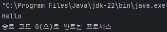
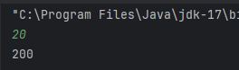

# 기본문법

## 코틀린(Kotlin)

**Statement & Expression**

**표현식(Expression)과 서술문(Statement)**

* Statement - 진술, 서술, 서술문
  * 실행 가능한(Executable) 최소의 독립적인 코드
  * for 문과 같은 제어문 등이 포함된다
* Expression - 식, 수식, 표현식
  * Statement의 부분 집합
  * 평가(Evaluation)을 통해 하나의 '값' 이 되는 코드 - 수학 연산, 함수 호출 등
  * 코드 작성 기준으로 생각하면 결국 값이 되는가? 를 생각해보면 된다
* 언어별로 표현식의 종류가 다르다
  * 할당문의 예
    * C: Expression
    * Java : Expresion
    * Python3 : Statement
    * Kotlin : Statement: print 하거나 if 문에 사용하거나 연속할당 할 수 없다

\


**문법**

**기본 정보**

* 파일의 확장자는 kt 이다
* 파일 이름과 클래스 이름이 같지 않아도 된다
* 한 파일에 두 개 이상의 클래스를 선언할 수 있다
  * 한 파일에 클래스가 하나만 있는 경우 파일과 클래스 이름을 같게 하는 것을 권장한다
* 클래스에 소속되지 않는 함수, 변수가 있다
  * Top level function, vatiable 이라 부른다
* 문장 끝에 ;(세미콜론)을 생략할 수 있다

\


**기본 문법**

* 소스코드 제일 상단에 package 선언, 그 다음 import 구문들을 적는다

```kotlin
package com.example.hellokotlin

import kotlin.text.*
```

* 폴더 구조와 패키지 구조가 같지 않아도 된다
  * 일치 시키는 것을 권장
* Console 앱의 진입점은 main 함수이다

```kotlin
fun main() {
  println("start")
}
```

* 타입은 이름 : Type 의 형식을 따른다
  * 변수

```kotlin
val a: Int = 1
var name: String = "Hello World"
```

* 할당되는 값을 통해 타입을 추론할 수 있는 경우 타입 표기를 생략할 수 있다

```kotlin
val b = 2
```

* 함수의 반환 타입

```kotlin
fun sum(a: Int, b: Int): Int {
  return a + b
}
```

* 특별한 값을 반환하지 않는 함수는 Unit 타입을 사용하거나 생략할 수 있다

\


* 변수
  * 한 번만 할당 할 수 있는지, 여러 번 할당 할 수 있는지에 따라 선언이 다르다
  * val : 한 번만 값 할당 가능

```kotlin
val a: Int = 1 // immediate assignment
val b = 2 // 'Int' type is inferred
val c: Int // Type required when no initializer is provided
c = 3 // deferred assignment
// 즉시 초기화하지 않을 경우 타입 필수!
```

* var : 여러 번 할당 가능

```kotlin
var x = 5 // 'Int' type is inferred
x += 1
```

* 기본 출력 : print, println

```kotlin
print("Hello") // 줄바꿈x
print("world!")
```

```kotlin
println("Hello world!") // 자동 줄바꿈
println(42)
```

* 기본 입력 : readln():String
* Java의 주석(//과 /**/)을 모두 지원하며 /**/ 주석의 경우 중첩할 수 있다

```kotlin
/* The comment starts here
/* contains a nested comment */
and ends here. */
```

\


**실습**

* message 변수에 "Hello" 를 할당하고 print 문을 이용해 출력하세요

```kotlin
fun main() {
    val message:String = "Hello"
    print(message)
}
```

\


**Basic Types**

**Null Safety**

* kotlin 의 모든 타입은 기본적으로 null을 허용하지 않는 타입
* null을 허용하고자 할 떄는 기본 타입 뒤에 ? 를 추가하여 선언한다

```kotlin
var city: String = "Korea"
var state: String? = null
```

* null을 허용하는 타입의 경우 사용할 떄 null 여부를 체크해야 한다

\


* null 대응
  * if를 이용해 null 체크하고 사용

```kotlin
val l = if(b != null) b.length else -1
// b가 null이 아닐 경우 b의 길이를 반환하고 null일 경우 -1 반환
```

* Sage call(?) 연산자를 이용한 안전한 멤버 함수 사용

```kotlin
val b: String? = null
println(b?.length)
// null 을 할당하는 것이 문제가 아니라 null 인데 Property나 함수를 사용하는 것이 문제
```

\


* null 대응하기
  * Elvis 연산자 (?:)를 이용
    * 연산자 앞의 값이 널이 아니면 사용하고 null 이면 연산자 뒤에 값을 사용

```kotlin
val l = if(b != null) b.length else -1

->

val l = b?.length ?: -1
```

* Not null assertion operator(!!)
  * null 허용 타입을 null 이 아닌 타입으로 변환해 반환

```kotlin
var value:String? = "ABC"
val value2 = value!!
// 코드의 동작 순서 상 절대 null 이 아닌 상황에서만 사용 !!를 사용할 당시 null 인 경우 Exception이 발생한다
```

\


**Any, Numbers**

* Kotlin의 최상위 클래스. Java의 Object 클래스에 해당하는 클래스이다
  * Any? : Nullable 한 모든 클래스들의 최상위 객체
  * Any : Null을 허용하지 않는 모든 클래스들의 최상위 객체
* 숫자 : Kotlin에서는 Int, Float 등도 모두 클래스이다
  * Null 이 아닌 숫자는 java의 int, float 등으로 처리 된다
  * Nullable 숫자인 경우 java의 Integer, Double 등의 클래스 객체로 생성된다

\


**기본 타입**

* 정수형 타입

| Type  | Size(bits) | Min value                  | Max value                 |
| ----- | ---------- | -------------------------- | ------------------------- |
| Byte  | 8          | -128                       | 127                       |
| Short | 16         | -32768                     | 32767                     |
| Int   | 32         | -2,147,483,648             | 2,147,483,647             |
| Long  | 64         | -9,223,372,036,854,775,808 | 9,223,372,036,854,775,807 |

* 타입을 생략할 경우 할당하는 값이 정수 범위이면 자동으로 정수로 추론된다

```kotlin
val one = 1 // Int
val threeBillion = 3000000000 // Long
val oneLong = 1L
val oneByte : Byte = 1
```

\


* 실수형 타입

| Type   | Size(bits) | Significant bits | Exponent bits | Decimal digits |
| ------ | ---------- | ---------------- | ------------- | -------------- |
| Float  | 32         | 24               | 8             | 6-7            |
| Double | 64         | 53               | 11            | 15-16          |

* 16진수 0x, 2진수 0b, 가독성을 높이기 위해 \_를 중간에 넣을 수 있다

```kotlin
val oneMillion = 1_000_000
val creditCardNumber = 1234_5678_9012_3456L
val socialSecurityNumber = 999_99_9999L
val hexBytes = 0xFF_EC_DE_5E
val bytes = 0b11010010_01101001_10010100_10010010
```

\


* Unsigned integers
  * UByte : 8-bit, 0\~255
  * UShort : 16-bit, 0\~65535
  * UInt : 32-bit, 0\~2^32-1
  * ULong : 64-bit, 0\~2^64-1

```kotlin
val b: UByte = 1u
val s: UShort = 1u
val l: ULong = 1u
val a1 = 42u
val a2 = 0xFFFF_FFFF_FFFFu
```

\


* 형 변환 함수
  * 숫자 타입 : 자동으로 형 변환 되지 않음. 함수를 통해 명시적으로 변환
    * toByte() : Byte
    * toShort() : Short
    * toInt() : Int
    * toLong() : Long
    * toFloat() : Float
    * toDouble() : Double
* Error

```kotlin
val a = 1 // int
val b:Long = a
```

\->

```kotlin
val a = 1
val b:Long = a.toLong()
```

\


* Boolean
  * true, false 값을 가지는 객체(=null 가능)

```kotlin
val myTrue = Boolean = true
val myFalse: Boolean = false
val boolNull: Boolean? = null

println(myTrue || myFalse) // true
println(myTrue && myFalse) // false
println(!myTrue) // false
```

* Char
  * 한 글자를 저장하는 타입. 작은 따옴표를 사용한다

```kotlin
val aChar: Char = 'a'
```

* String
  * 문장을 저장하는 변수. 큰 따옴표를 선언한다
  * 여러 줄 문장은 큰따옴표를 3개 적어 선언한다

```kotlin
val str = "abcd 123"

val text = """
	for (c in "foo")
		print(c)
"""
```

* String template
  * $ 기호 또는 ${} 를 이용해 변수 값이 포함된 문자열을 만들 수 있다
  * 변수와 템플릿 문자열 사이에 공백이 없다면 {}을 반드시 사용한다
  * {} 에는 expression이 들어갈 수 있다

```kotlin
val i = 10
println("i = $i")

val s = "abc"
println("$s.length is ${s.length}")
```

\


**Range & Progression**

* Range : 숫자의 범위를 의미하는 데이터 타입 1..2 또는 1.rangeTo(2)
  * (1..4) 또는 l.rangeTo(4) -> 1 부터 4까지의 범위, 끝이 닫힌 범위 이다
  * (1..<4) 또는 l.rangeUntil(4) -> 1부터 4미만까지의 범위. 끝이 열린 범위 이다
  * 1.0..4.0 과 같이 Double/Float 타입도 가능하다
* Range : 숫자의 범위를 의미하는 데이터 타입
  *   정수 타입은 반복문에서 iteration 할 수 있다.

      ```kotlin
      for (i in 1..4) print(i)
      ```
  *   downTo 연산자를 사용하면 역순으로 iteration 가능하다

      ```kotlin
      for (i in 4 downTo 1) print(i)
      ```
  *   step 함수를 이용하여 간격을 정해 iteration 할 수 있다

      ```kotlin
      for(i in 0..8 step 2) print(i)
      println() // 02468
      for(i in 0..<8 step 2) print(i)
      println() // 0246
      for(i in 8 downTo 0 step 2) print(i)
      println // 86420
      ```
* Progrssion : sequence of numbers, 정수형 타입(Int, Long, Char)을 대상으로한다
*   first, last, step 속성을 가진다

    * Range 에 대해 iteration을 하는 것은 암시적으로 progression이 생성된 것

    ```kotlin
    for(i in 1..10) print(i)
    // 12345678910
    ```

    * Prograssion은 iterable 하므로 filter, map 등의 Collection 함수들을 사용할 수 있다

    ```kotlin
    println((1..10).filter {it % 2 == 0})
    // [2, 4, 6, 8, 10]
    ```

\


**타입 체크**

* is 또는 !is 연산자를 이용한다

```kotlin
if(obj is String) {
    print(obj.length)
}

if(obj !is String) {
    print("Not a String")
} else {
    print(obj.length)
}
```

* is 연산자를 사용한 경우 smart cast가 이루어진다

```kotlin
fun demo(x: Any) {
    if(x is String) {
        print(x.length)
    }
}
```

**Type cast**

* as 연산자를 사용하며 cast가 불가능 한 경우 exception이 발생하므로 unsage cast 연산자라고 한다

```kotlin
val x: String = y as String
```

* cast 가 불가능할 경우 null을 반환하는 safe cast 연산자는 as? 이다

```kotlin
val x: String? = y as? String
```

## 함수의 기본

**기본 문법**

* 함수는 fun 키워드를 이용해 정의한다
* 함수의 return type은 파라미터 정의 뒤에 : 와 함께 적는다

```kotlin
fun sum(a: Int, b: Int): Int {
	return a + b
}
```

* 함수의 body로 expression을 사용할 수 있다

```kotlin
fun sum(a: Int, b: Int) = a + b
```

* 특별한 값을 반환하지 않는 경우 return type을 Unit로 정의하거나 생략할 수 있다

**터미널 입력과 출력**

* 입력 함수
  * readln():String
* 출력 함수: 파라미터로 String 전달
  * print(), println()

**실습**

* 파라미터로 받은 정수의 부호를 바꾸어 반환하는 함수 inv 를 선언
* main 함수에서는 사용자로부터 정수를 입력받은 다음 위 함수의 결과를 출력하라

```kotlin
fun inv(a: Int) : Int {
    return -a
}

fun main() {
    val a:Int = readln().toInt()
    print(inv(a))
}
```

```kotlin
fun inv(a: Int) = -a

fun main() {
    val a:Int = readln().toInt()
    print(inv(a))
}
```

.png>)\


* 사용자로부터 이름 문자열을 입력받고 "Hello 이름"의 형식으로 출력하라

```kotlin
fun main() {
    val name = readln()
    println("Hello ${name}")
}
```

.png>)\


* 사용자로부터 정수를 입력받아 10을 곱한 뒤 출력하라

```kotlin
fun mul(number:Int) : Int {
    return number * 10
}

fun main() {
    val number = readln().toInt()
    println(mul(number))
}
```

\


**Package and import**

* package 선언은 파일의 가장 위에 한다
* import 구문을 이용해 다른 패키지를 불러 사용할 수 있다

**Java와 다른 점**

* package와 실제 폴더 구조가 달라도 된다
* as 키워드를 이용해 package에 별칭을 부여할 수 있다

```kotlin
import org.example.Message // 메시지에 액세스 가능
import org.test.Message as testMessage // testMessage는 'org.test.Message'의 약자입니다.
```

**Package definition**

* 최상위(Top-level)에 선언된 변수, 함수들은 기본적으로 public
  * private 으로 선언할 경우 같은 파일에서만 access 할 수 있다
  * internal로 선언할 경우 같은 모듈(함께 컴파일되는 파일들)에서 access
  * protected는 사용할 수 없다
* 다른 패키지의 최상위 레벨 변수나 함수를 쓰려면 import 해야 한다
