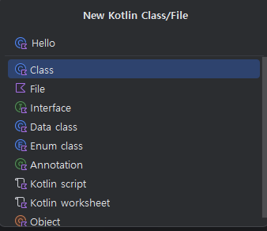
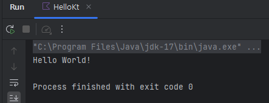

# 코틀린 이란?

**Kotlin**

* JetBrain에서 공개한 언어이다
* Java JVM에서 동작한다
* 2017년 Google에서 Android application 개발용 공식 언어로 채택되었다
* 2019년 이후 많은 Android application들이 개발 언어로 Kotlin을 사용했다
* Spring framework도 Kotlin을 지원하면서 Server side도 개발 가능하다
* 2024년 02월 기준 최신 버전은 1.9.22이다

\


**Java & IDE**

* Kotlin은 JVM에서 동작하므로 javac가 필요함. JDK 1.8 이상에서 컴파일 가능
* Online compiler: [Kotlin Playground](https://kotlinlang.org/)
* IDE:
  * IntelliJ: JVM 별도 설치. Community Edition(2023.2.5) 사용 가능.
  * Android Studio: JVM 내장. Hedgehog(2023.1.1) 버전에서 최신 문법 사용 가능.
  * Vscode (Kotlin Language Extension) + Kotlin compiler
* [Kotlin releases](https://github.com/JetBrains/kotlin/releases)
* Kotlin Visual Studio Code 활용 가이드

\


**실습용 개발 환경 설정**

2024년 2월 기준으로 아래와 같이 개발 환경을 설정할 수 있습니다.

* **JDK 설치**: JDK 1.8 이상을 설치합니다. LTS 버전인 17을 설치하는 것이 권장됩니다.
  * Oracle Java 또는 OpenJDK 중 선택하여 설치할 수 있습니다.
* **IntelliJ Community Edition 설치**: IntelliJ의 Community Edition을 설치합니다.
  * [IntelliJ 다운로드 페이지](https://www.jetbrains.com/ko-kr/idea/download/)
  * 2023.3.3 버전을 설치합니다.
* Project의 src > main > kotlin 에서 우클릭을 한다

<figure><figcaption></figcaption></figure>

* New > New Kotlin Class/File

<figure><figcaption></figcaption></figure>

* 다음 코드 작성 후 오른쪽 상단 또는 main 함수 좌측의 화살표 클릭한다

```kotlin
fun main() {
    println("Hello World!")
}
```

* 아래쪽 화면에서 실행 결과를 확인 가능하다

<figure><figcaption></figcaption></figure>
