# Installing Loki Linux (V9)

ISO 다운로드 사이트 : https://rockylinux.org/download/

<figure><figcaption></figcaption></figure>

* 본 프로젝트는 Rocky-9.3-x86\_64-dvd.ISO를 기준으로 작성한 문서이다.

1. 새로 만들기(N) 버튼을 눌려 가상 머신을 만든다.

<figure>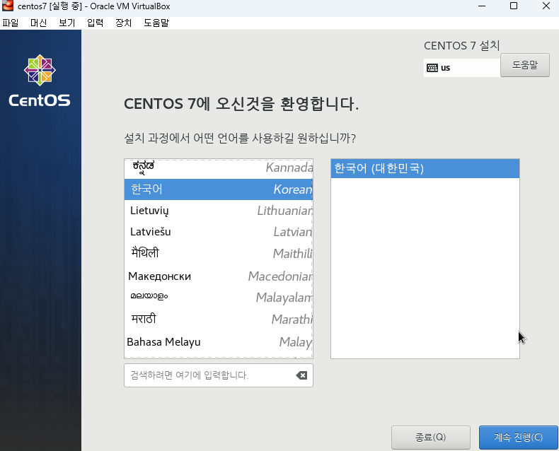<figcaption></figcaption></figure>

* 새로 만들기 : 신규 VM을 설치하고 생성한다.
* 추가 : 기존 만들어진 VM 을 추가한다.

2. 신규 가상머신 설정을 한다.

<figure>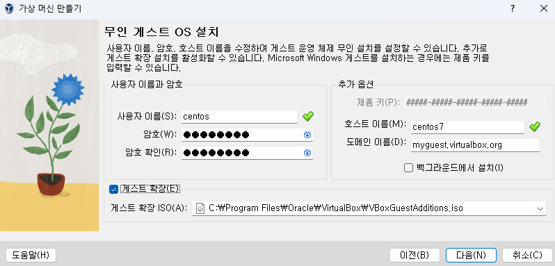<figcaption></figcaption></figure>

* 이름 : 가상머신 이름
* 폴더 : 만들어 가상머신 파일을 저장할 공간
* ISO 이미지 : 설치할 리눅의 ISO 이미지 경로

3. 설치 계정 및 옵션 설정을 한다.

<figure>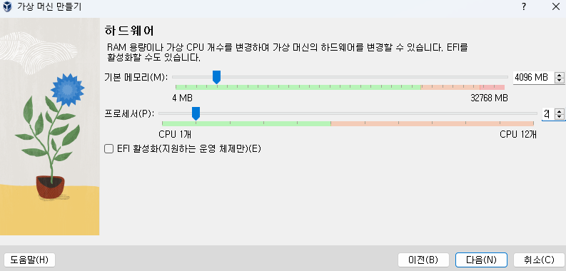<figcaption></figcaption></figure>

* 사용자 이름 및 암호 : 서버에 설정할 초기 계정과 비밀번호
* 게스트 확장 : 네트워크 및 드라이브 마운트를 위한 추가 설정 설치

4. 하드웨어를 설정 한다.

<figure>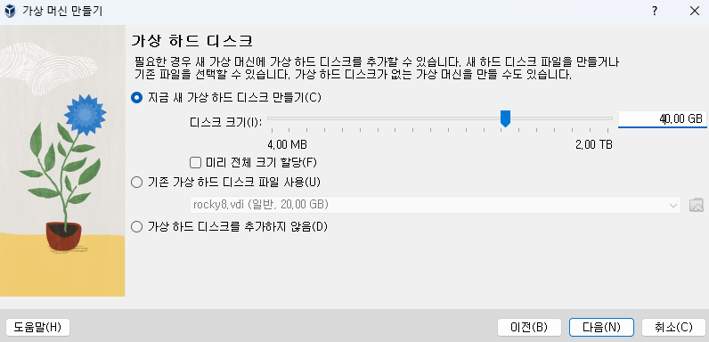<figcaption></figcaption></figure>

* 테스트 및 기본 설정용으로 사용할 예정으로 메모리는 4096MB, Processors 는 2로 설정한다.

5. 하드디스 설정

<figure>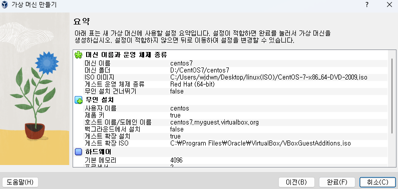<figcaption></figcaption></figure>

* 하드디스크 용량 설정
* 지금 새 가상 하드 디스크 만들기 : 초기 기본 고정 하드 용량 / 설정한 만큼 이미지 파일이 해당 용량으로 잡힌다.
* 기존 가상 하드 디스크 파일 사용 : VDI에 별도로 설정한 디스크 공간을 쉐어한다.
* 기본 OS와 기본응용프로그램들만 설치 후 소스나 기타 파일들을 마운트 잡아 사용할 것이기에 \[Create a Virtual Hard Disk Now] 로 40GB 로 설정할 예정이다.

6. 최종 확인 밑 Finish

<figure>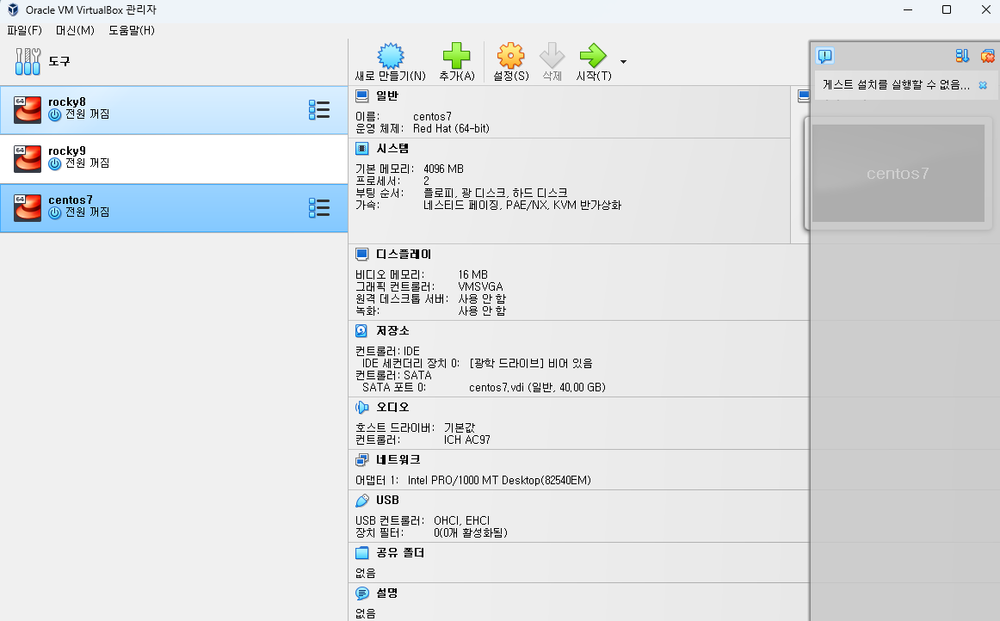<figcaption></figcaption></figure>

* 설정한 정보들 확인 후 이상 없으로 \[완료] 버튼 클릭한다.

7. 완료

<figure>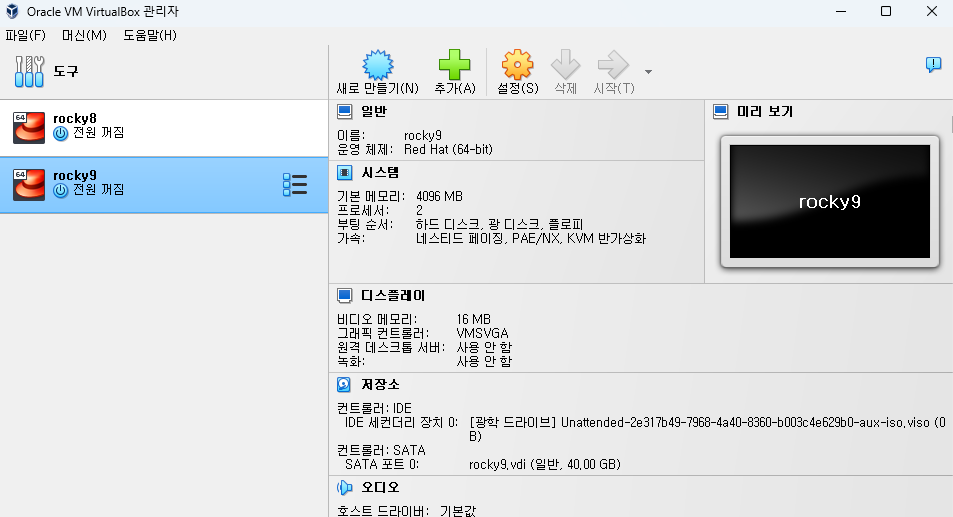<figcaption></figcaption></figure>

* 정상적으로 설치되면 VMimages 리스트에 추가되며 상태가 \[ 종료 ] 에서 잠시후 \[ 실행 중 ]으로 변경된다.

8. 네트워크 설정

<figure>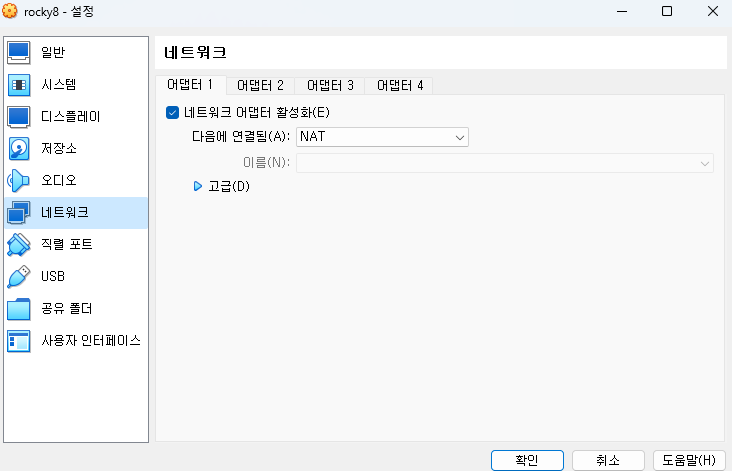<figcaption></figcaption></figure>

* 어댑터 1,2 -> 네트워크 어댑터 사용하기 -> NAT / 호스트 전용 어댑터 -> 무작위 모드 모두 허용

### Rocky Linux(V9) 설치

1. 언어 선택

<figure><figcaption></figcaption></figure>

<figure><figcaption></figcaption></figure>

* 한국어 (101/104키 호환)을 추가한 후 기본값으로 선택 한다.

2. 설치 전 설정

<figure><figcaption></figcaption></figure>

* 주황색 삼각표시된 것들은 미리 사전 설정을 해 주어야 한다.

3. 저장소 장치 선택

<figure><figcaption></figcaption></figure>

* 디스크 파티션 설정 할수있다.
  * **디스크 추가(A):** 사용 가능한 특수 디스크 또는 네트워크 디스크 추가한다.
  * **자동 설정(A):** Rocky Linux 설치 프로그램에서 기본 저장소를 자동으로 설정한다.
  * **사용자 정의(C):** 사용자 지정 저장소를 설정할 수 있다.
* 디스크를 고른 후 완료를 누른다.

4. root 비밀번호 설정

<figure>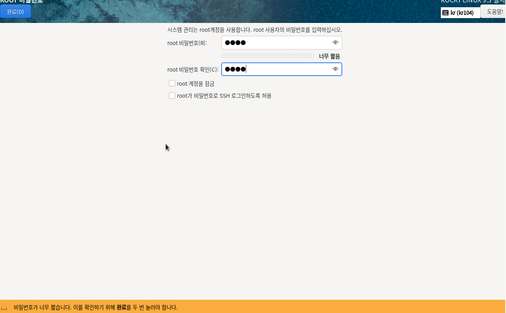<figcaption></figcaption></figure>

* 자신이 원하는 root 비밀번호를 설정한다.

5. 사용자 생성

<figure>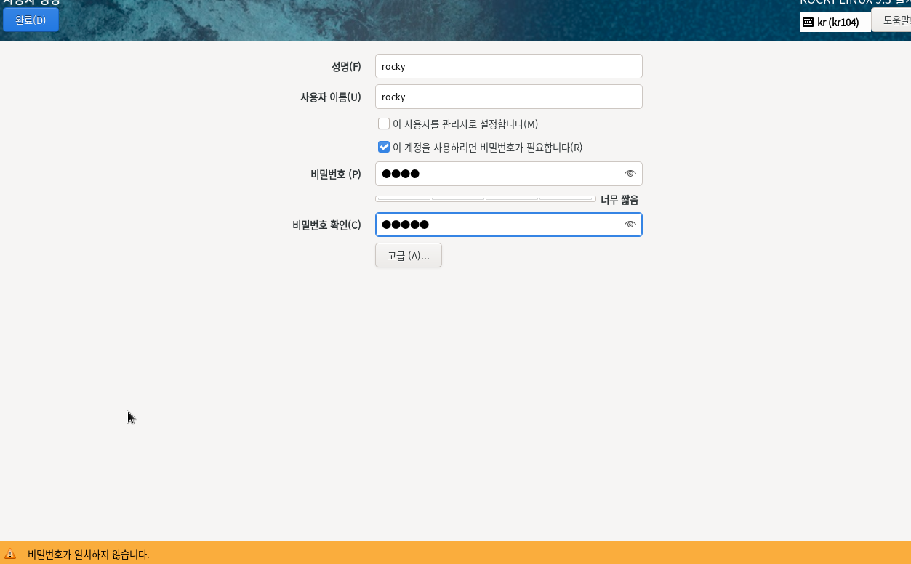<figcaption></figcaption></figure>

* 리눅스에서 쓸 사용자를 생성한다.

6. 네트워크 설정

<figure>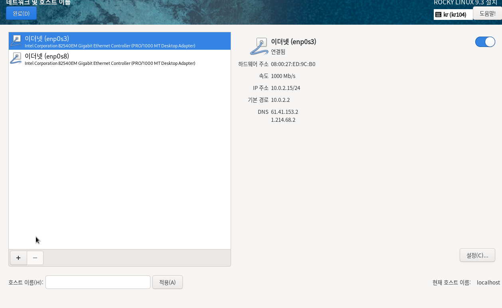<figcaption></figcaption></figure>

* **이더넷(enp0s3)** : 관리용 네트워크로 대시보드와 API에 접속할 수 있다.
* **이더넷(enp0s8)** : 인터넷과 외부에서 접속할 수 있는 유동 IP의 통로 역할을 한다
* 이더넷 두개 다 켬으로 설정 후 완료 버튼을 누른다.
* Rocky 9버전에서는 켜지 않아도 자동으로 켜짐 설정이 되어있다.

<figure>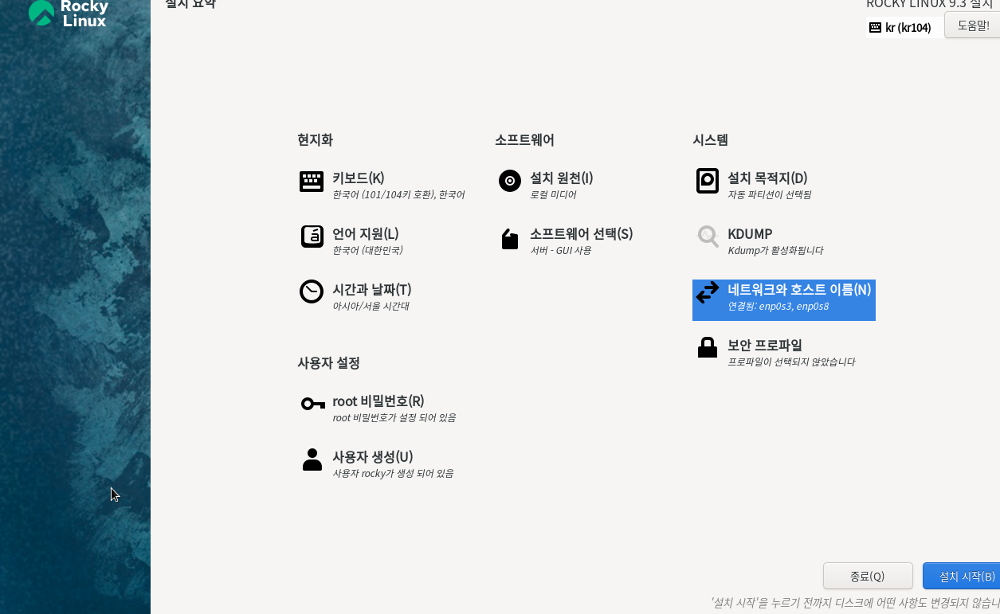<figcaption></figcaption></figure>

* 삼각형 주황색 아이콘이 뜨는것들만 설정을 해주면 설치 시작을 할 수 있다.

<figure><figcaption></figcaption></figure>

* 설치 시작 후 시스템 재시작을 한다.

7. 완료

<figure>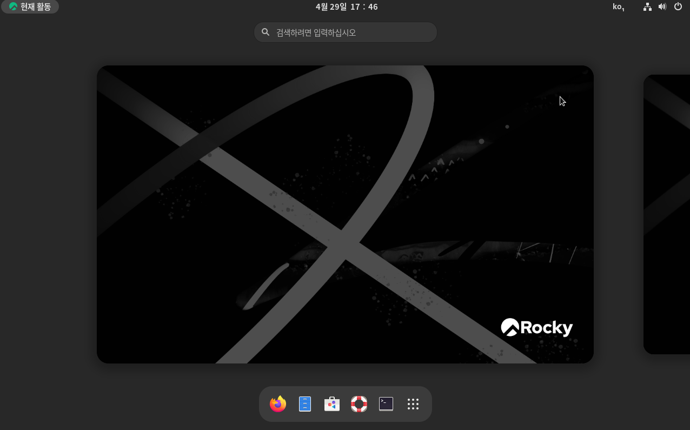<figcaption></figcaption></figure>

* 재시작 후 메인 화면이 뜬다.
