# 인공신경망

## 인공신경망

🤨 **문제에 대한 설명**

럭키백 이벤트를 패션 분야로 확대 → 주 고객층이 20대로 럭키백 확률 정확도 향상 필요

### 패션 MNIST

이 장에서는 패션 MNIST라는 데이터 셋을 이용하여 실습을 진행한다. 패션 MNIST는 10종류의 패션 아이템으로 구성되어 있다.

**텐서플로의 케라스 패키지를 임포트하고 패션 MNIST 데이터를 다운로드하자.**

```python
from tensorflow import keras

(train_input, train_target), (test_input, test_target) = \\
keras.datasets.fashion_mnist.load_data()
print(train_input.shape, train_target.shape)
print(test_input.shape, test_target.shape)

# 결과
(60000, 28, 28) (60000,) # 60000개의 이미지로 이루어짐 이미지는 28 * 28크기에 타겟도 60000개
(10000, 28, 28) (10000,) # 10000개의 이미지러 이루어짐 타겟또한 10000개
```

샘플을 그림으로 출력해보자.

```python
import matplotlib.pyplot as plt

fig, axs = plt.subplots(1, 10, figsize=(10,10))
for i in range(10):
  axs[i].imshow(train_input[i], cmap='gray_r')
  axs[i].axis('off')

plt.show()
```

<figure><figcaption></figcaption></figure>

파이썬의 리스트 내포를 사용해서 처음 10개의 샘플의 타겟 값을 리스트로 만든 후 출력한다.

```python
print([train_target[i] for i in range(10)])

# 결과
[9, 0, 0, 3, 0, 2, 7, 2, 5, 5]
```

<figure><figcaption></figcaption></figure>

### **로지스틱 회귀로 분류**

이미지 각 픽셀 값 0~~255 -> 0~~1 로 정규화하고, reshape()메서드 이용해 2차원 배열을 1차원 배열로 재구성하자.

```python
train_scaled = train_input / 255.0
train_scaled2 =  train_scaled.reshape(-1, 28*28)

print(train_scaled.shape, train_scaled2.shape)

# 결과
(60000, 28, 28) (60000, 784)
```

SGDClassifier 클래스와 **cross\_validate 함수를 사용해 이 데이터에서 교차 검증으로 성능을 확인**해보자. 아래 코드에서 **n\_jobs=-1 : 모든 CPU활용 병렬처리**를 나타낸다.

```python
import numpy as np

from sklearn.model_selection import cross_validate
from sklearn.linear_model import SGDClassifier

sc = SGDClassifier(loss="log", max_iter=5, random_state = 42)
scores = cross_validate(sc, train_scaled2, train_target, n_jobs=-1)
print(np.mean(scores['test_score']))

# 결과
0.8196000000000001
```

반복 횟수를 늘려도 성능에 큰 향상은 거의 없다.

```python
sc = SGDClassifier(loss="log", max_iter=9, random_state = 42)
scores = cross_validate(sc, train_scaled2, train_target, n_jobs=-1)
print(np.mean(scores['test_score']))

# 결과
0.8303666666666667
sc = SGDClassifier(loss="log", max_iter=20, random_state = 42)
scores = cross_validate(sc, train_scaled2, train_target, n_jobs=-1)
print(np.mean(scores['test_score']))

# 결과
0.8436666666666666
```

### 로지스틱 회귀 모델

*   로지스틱 회귀 처리 이해

    * 이미지 픽셀1\~픽셀784와 가중치와 절편으로 z값 계산
    * 10개 클래스별로 계산 후 소프트맥스 함수를 거쳐 확률 출력

    <figure>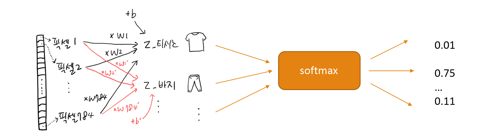<figcaption></figcaption></figure>

### 인공 신경망

> **머신러닝 알고리즘 중 하나로 생물학적 뉴런에서 영감을 얻어 구성**

* 인공 신경망의 구성
  * 입력층(input layer) : x1 \~ x784로 표현된 픽셀 값 자체
  * 출력층(output layer) : 10개 클래스 분류를 위해 계산 된 값인 z1\~z10
  * 뉴런(neuron) : z값을 계산하는 단위, 유닛(unit)으로도 표현
*   매켈러-피츠 뉴런

    * 1943년 워런 매컬러, 월터 피츠 가 제안한 뉴런 모델
    * 생물학적 뉴런 : 수상돌기를 통해 신호를 받고 세포체에 모은 뒤 신호가 임곗값에 도달하면 축삭 돌기를 통해 다른 세포에 신호 전달
    * 인공 뉴런 : 생물학적 뉴런의 모양을 본뜬 수학 델

    <figure>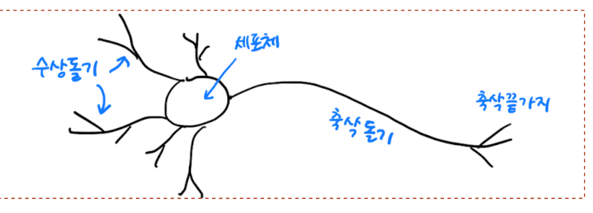<figcaption></figcaption></figure>
*   새로운 머신러닝 알고리즘

    * 인공 신경망은 뇌 속의 생물학적 뉴런과 동일한 것은 아님
    * 기존 머신러닝 알고리즘이 해결 하지 못한 문제에서 높은 성능을 보임
    * 확률적 경사 하강법을 이용한 로지스틱 회귀 모델도 가장 간단한 구조의 인공 신경망 모델

    <figure>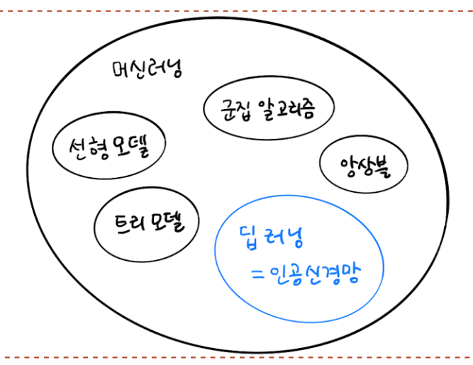<figcaption></figcaption></figure>

### 텐서플로

* 딥러닝 라이브러리
* 2015년 구글에서 오픈소스로 공개
* 2019년 2.0 버전 릴리즈
* 코랩에서는 이미 설치 되어 있으며, 간단히 임포트 해서 사용

### **케라스**

* 텐서플로의 고수준 API
* GPU연산을 수행하는 다른 라이브러리를 백엔드로 사용
* 직관적이고 사용하기 편한 고수준 API 제공
* 텐서플로 라이브러리에 케라스 API가 내장

### 인공 신경망으로 모델을 만들어보자!

모델의 검증 방법은 어떤 것이 있을까?

* 로지스틱 회귀 : 교차 검증 사용
* 인공신경망 : 검증 세트 활용
  * 딥 러닝 분야의 데이터 셋은 충분히 크기 때문에 검증 점수 안정적
  * 교차 검증을 사용하기에는 훈련 시간이 너무 오래 걸림

먼저, 검증 세트를 분리해보자.

```python
from sklearn.model_selection import train_test_split
train_scaled3, val_scaled, train_target, val_target = train_test_split( train_scaled2, train_target, test_size=0.2, random_state=42)
print(train_scaled3.shape, train_target.shape)
print(val_scaled. shape, val_target.shape)

# 결과
(48000, 784) (48000,)
(12000, 784) (12000,)
```

훈련세트로 모델 훈련

* 밀집층(dense layer) : 784 x 10 = 7,840개 선으로 연결
* 완전연결층(fully connected layer)라고도 함

<figure>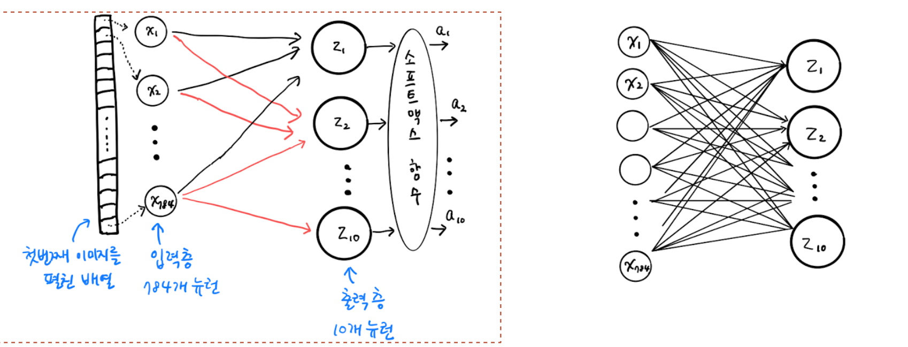<figcaption></figcaption></figure>

이제 케라스 **Dense 클래스 사용 밀집층 구성**하자. **매개변수로는 뉴런 개수, 뉴런 출력 적용 함수, 입력 크기**등이 있다.

```python
dense = keras.layers.Dense(10, activation="softmax", input_shape=(784,))
```

**케라스의 Sequential클래스 사용 모델 구성**하자.

* 밀집층을 가진 신경망 모델 생성
* 활성화함수(activation function) : 뉴런의 선형방정식 계산 결과에 적용하는 함수(ex: softmax)

```python
model = keras.Sequential(dense)
```

<figure>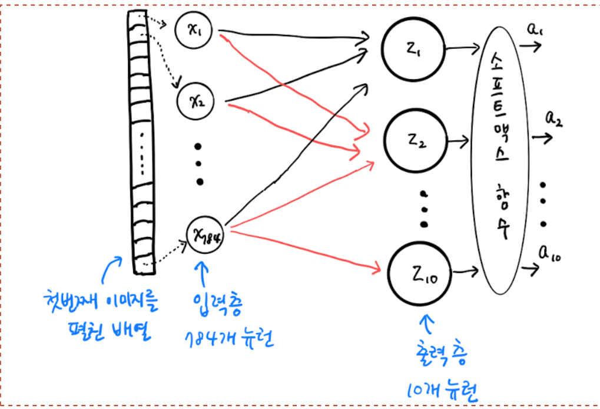<figcaption></figcaption></figure>

**소프트맥스와 같이 뉴런의 선형 방정식 계산 결과에 적용되는 함수를 활성화 함수** 라고한다.

### **인공 신경망으로 패션 아이템 분류하기**

케라스 모델 훈련을 해보자. compile()메서드 수행 해야 하며, 손실 함수 종류 지정, 훈련 과정에서 계산하고자 하는 측정 값 지정을 해주어야 한다.

```python
model.compile(loss="sparse_categorical_crossentropy", metrics="accuracy")
# sparse가 붙은 이유는? 
# 타깃값을 원-핫 인코딩으로 바꾸지 않고 사용
# 타깃값이 원-핫 인코딩 된 값이라면 loss=‘categorical_crossentropy’
print(train_target[:10])
# 결과 
[7 3 5 8 6 9 3 3 9 9]
```

<figure>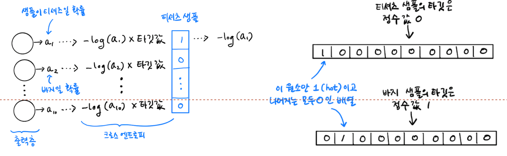<figcaption></figcaption></figure>

이제 모델을 훈련 해보자.

```python
model.fit(train_scaled3, train_target, epochs=5)

# 결과
Epoch 1/5
1500/1500 [==============================] - 3s 2ms/step - loss: 0.6058 - accuracy: 0.7972
Epoch 2/5
1500/1500 [==============================] - 2s 1ms/step - loss: 0.4748 - accuracy: 0.8394
Epoch 3/5
1500/1500 [==============================] - 2s 2ms/step - loss: 0.4506 - accuracy: 0.8493
Epoch 4/5
1500/1500 [==============================] - 5s 3ms/step - loss: 0.4379 - accuracy: 0.8515
Epoch 5/5
1500/1500 [==============================] - 3s 2ms/step - loss: 0.4301 - accuracy: 0.8540
```

그럼 앞서 따로 떼어 놓은 검증 세트에서 모델의 성능을 확인 해보자. \*\*케라스에서 모델의 성능을 평가하는 메서드는 evaluate()\*\*이다.

```python
model.evaluate(val_scaled, val_target)

# 결과 
375/375 [==============================] - 1s 3ms/step - loss: 0.4429 - accuracy: 0.8507
[0.4428718388080597, 0.8506666421890259]
```

## 6주차 2번째 수업

🤨 **문제에 대한 설명**

특별한 문제 x 실습 위주

### 실습을 진행하자!

```python
from tensorflow import keras
(train_input, train_target), (test_input, test_target) =\\
keras.datasets.fashion_mnist.load_data()
```

이미지의 픽셀 값을 0~~255 범위에서 0~~1 사이로 변환하고, 28 \* 28 크기의 2차원 배열을 784 크기의 1차원 배열로 펼친다. 그 후 사이킷런의 train\_test\_split() 함수로 훈련 세트와 검증 세트로 나눈다.

```python
from sklearn.model_selection import train_test_split

train_scaled = train_input / 255.0
train_scaled = train_scaled.reshape(-1, 28*28)

train_scaled, val_scaled, train_target, val_target = train_test_split(
    train_scaled, train_target, test_size = 0.2, random_state = 42
)

print(train_scaled.shape, train_target.shape, val_scaled.shape, val_target.shape)

# 결과 
(48000, 784) (48000,) (12000, 784) (12000,)
```

### 2개의 층

인공신경망 모델 구성

* 은닉층(hidden layer) : 입력층과 출력층 사이에 있는 모든층
* 2개 층 추가 – 은닉층 1개, 출력층 1개
* **keras.layers.Dense()함수 사용**

```python
dense1 = keras.layers.Dense(100, activation="sigmoid", input_shape=(784,))
dense2 = keras.layers.Dense(10, activation="softmax")
```

**dense1 : 은닉층 -> 100개 뉴런, dense2 : 출력층 -> 10개 뉴런 은닉층 뉴런 개수가 출력층 뉴런 개수보다 많아야 한다.**

출력층에 적용하는 활성화 함수는 이진 분류일 경우 시그모이드 함수, 다중 분류일 경우 소프트 맥스 함수로 정해져 있지만 **은닉층의 활성화 함수는 비교적 자유롭게 선택이 가능**하다. ex) 시그모이드 함수, 렐루 함수 등

그렇다면, 은닉층에 활성화 함수를 사용하는 이유는 무엇일까?

* 은닉층의 계산 결과에 의미를 줄 수 있어야 함
* 의미를 부여하기 위해 선형 계산을 비선형적으로 비틀어 주어야 함

### 심층 신경망 만들기

이제 앞에서 만든 dense1과 dense2 객체를 Sequential 클래스에 추가하여 **심층 신경망**을 구성해보자.

```python
model = keras.Sequential([dense1, dense2])
```

**Sequential 클래스**의 객체를 만들 때 **여러 개의 층을 추가하려면 이와 같이 dense1과 dense2를 리스트로 만들어야 한다.**

여기서 주의 할 점은 출력층을 가장 마지막에 두어야 한다는 것이다.

**심층 신경망**

* 1개 이상의 은닉층을 두어 여러 개의 layer로 신경망 구성
* 출력층은 가장 마지막에 두어야 한다.
* 인공 신경망의 강력한 성능 : 층을 추가하여 입력 데이터에 대해 연속적인 학습을 진행하는 능력에서 나옴

**summary() 메서드**

* 층마다 층 이름, 클래스, 출력 크기, 모델 파라미터 개수 출력
* 층에 대한 유용한 정보를 얻을 수 있음
* 총 모델 파라미터 : 은닉층 파라미터 + 출력층 파라미터
* 간혹 경사하강법으로 훈련 되지 않은 파라미터를 가진 층이 있다.

summary() 메서드를 이용해 층에 대한 정보를 알아보자

```python
model.summary()

# 결과
Model: "sequential_1"
_________________________________________________________________
 Layer (type)                Output Shape              Param #   
=================================================================
 dense_4 (Dense)             (None, 100)               78500     
                                                                 
 dense_5 (Dense)             (None, 10)                1010      
                                                                 
=================================================================
Total params: 79510 (310.59 KB)
Trainable params: 79510 (310.59 KB)
Non-trainable params: 0 (0.00 Byte)
_________________________________________________________________
```

### 층을 추가하는 다른 방법

**Sequential 클래스에 층 추가 방법**

* **Sequential클래스** 생성자 안에서 **Dense 클래스 객체 생성**

```python
model = keras.Sequential ([
    keras.layers.Dense(100, activation='sigmoid', input_shape=(784,), name='hidden'),
    keras.layers.Dense(10, activation='softmax', name='output'),
], name='Fashion_MNIST_DNN_Model')

model.summary()

# 결과 
Model: "Fashion_MNIST_DNN_Model"
_________________________________________________________________
 Layer (type)                Output Shape              Param #   
=================================================================
 hidden (Dense)              (None, 100)               78500     
                                                                 
 output (Dense)              (None, 10)                1010      
                                                                 
=================================================================
Total params: 79510 (310.59 KB)
Trainable params: 79510 (310.59 KB)
Non-trainable params: 0 (0.00 Byte)
_________________________________________________________________
```

이 방법은 편리하긴 하지만, 아주 많은 층을 추가하려면 Sequential 클래스 생성자가 매우 길어진다. 또 조건에 따라 층을 추가할 수도 없다. **Sequential 클래스에서 층을 추가할 때 가장 널리 사용하는 방법은 모델의 add() 메서드**이다.

```python
model = keras.Sequential (name='Fashion_MNIST_DNN_Model2')
model.add(keras. layers. Dense(100, activation='sigmoid', input_shape=(784,), name='hidden'))
model.add(keras. layers. Dense (10, activation='softmax', name='output'))

model.summary()

# 결과
Model: "Fashion_MNIST_DNN_Model2"
_________________________________________________________________
 Layer (type)                Output Shape              Param #   
=================================================================
 hidden (Dense)              (None, 100)               78500     
                                                                 
 output (Dense)              (None, 10)                1010      
                                                                 
=================================================================
Total params: 79510 (310.59 KB)
Trainable params: 79510 (310.59 KB)
Non-trainable params: 0 (0.00 Byte)
_________________________________________________________________
```

이제 모델을 훈련 해보자.

```python
model.compile(loss='sparse_categorical_crossentropy', metrics='accuracy')
model.fit(train_scaled, train_target, epochs=5)

# 결과
Epoch 1/5
1500/1500 [==============================] - 5s 3ms/step - loss: 0.5698 - accuracy: 0.8058
Epoch 2/5
1500/1500 [==============================] - 4s 3ms/step - loss: 0.4110 - accuracy: 0.8522
Epoch 3/5
1500/1500 [==============================] - 4s 3ms/step - loss: 0.3757 - accuracy: 0.8649
Epoch 4/5
1500/1500 [==============================] - 5s 3ms/step - loss: 0.3543 - accuracy: 0.8713
Epoch 5/5
1500/1500 [==============================] - 3s 2ms/step - loss: 0.3364 - accuracy: 0.8779
<keras.src.callbacks.History at 0x7814e03256c0>
```

성능을 보면 층이 성능을 향상 시킨 것을 볼 수 있다. 다음으로는 이미지 분류 문제에서 높은 성능을 낼 수 있는 활성화 함수에 대해 알아보자.

### 렐루 함수

초창기 인공 신경망의 은닉층에서 많이 사용된 활성화 함수는 시그모이드 함수였다. 하지만 이는 단점이 존재하는데, **오른쪽과 왼쪽 끝으로 갈수록 그래프가 누워있기 때문에 올바른 출력을 만드는데 신속한 대응을 하지 못한다.** 특히 층이 많은 심층 신경망일수록 그 효과가 누적되어 학습을 더 어렵게 만들었다. 이를 개선하기 위해 다른 종류의 활성화 함수가 제안 되었다. 바로 **렐루** 이다. **렐루 함수는 입력이 양수일 경우 마치 활성화 함수가 없는 것처럼 그냥 입력을 통과 시키고, 음수일 경우에는 0으로 만든다.**

렐루 함수는 max(0, z)와 같이 쓸 수 있다. z가 0보다 크면 z를 출력하고 z가 0보다 작으면 0을 출력한다.

### 렐루 함수와 Flatten층

* Flatten Layer
  * 2차원 -> 1차원 변환을 위한 reshape()메서드 대신 사용
  * 입력 차원을 모두 일렬로 펼치는 역할 수행
  * 입력층과 은닉층 사이에 추가

```python
model = keras.Sequential()
model.add(keras.layers.Flatten(input_shape=(28, 28)))
model.add(keras.layers.Dense(100, activation='relu'))
model.add(keras.layers.Dense(10, activation='softmax'))
model.summary()

# 결과
Model: "sequential_2"
_________________________________________________________________
 Layer (type)                Output Shape              Param #   
=================================================================
 flatten (Flatten)           (None, 784)               0         
                                                                 
 dense_6 (Dense)             (None, 100)               78500     
                                                                 
 dense_7 (Dense)             (None, 10)                1010      
                                                                 
=================================================================
Total params: 79510 (310.59 KB)
Trainable params: 79510 (310.59 KB)
Non-trainable params: 0 (0.00 Byte)
_________________________________________________________________

# Flatten 클래스에 포함된 모델 파라미터는 0개이다. 앞의 출력에서 784개의 입력이 첫 번째 은닉층으로 
# 전달된다는 것을 알 수 있다.
```

위와 같이 Flatten 클래스를 사용하면 입력 값의 차원을 짐작할 수 있다.

그렇다면 이제 훈련 데이터를 다시 준비해서 모델을 훈련 해보자. 여기서는 **reshape 메서드**를 사용하지 않는다.

```python
(train_input, train_target), (test_input, test_target) = keras.datasets.fashion_mnist.load_data()

train_scaled = train_input / 255.0

train_scaled, val_scaled, train_target, val_target = train_test_split(
    train_scaled, train_target, test_size=0.2, random_state=42)

print(train_scaled.shape, train_target.shape, val_scaled.shape, val_target.shape)

# 결과
(48000, 28, 28) (48000,) (12000, 28, 28) (12000,)
```

그 다음으로 모델을 컴파일하고 훈련하자

```python
model.compile(loss='sparse_categorical_crossentropy', metrics='accuracy')

model.fit(train_scaled, train_target, epochs=5)

# 결과
Epoch 1/5
1500/1500 [==============================] - 4s 3ms/step - loss: 0.5329 - accuracy: 0.8112
Epoch 2/5
1500/1500 [==============================] - 6s 4ms/step - loss: 0.3897 - accuracy: 0.8603
Epoch 3/5
1500/1500 [==============================] - 4s 3ms/step - loss: 0.3519 - accuracy: 0.8724
Epoch 4/5
1500/1500 [==============================] - 4s 3ms/step - loss: 0.3325 - accuracy: 0.8807
Epoch 5/5
1500/1500 [==============================] - 4s 3ms/step - loss: 0.3167 - accuracy: 0.8853
<keras.src.callbacks.History at 0x7814cd2c68f0>
```

시그모이드 함수를 사용했을 때 보다 크지는 않지만 성능이 조금 향상되었다. 그렇다면 검증 세트에서도 성능을 확인해보자

```python
model.evaluate(val_scaled, val_target)

# 결과
375/375 [==============================] - 1s 3ms/step - loss: 0.3683 - accuracy: 0.8748
[0.36833277344703674, 0.874750018119812]
```

### 옵티마이저

**하이퍼 파라미터**

* 모델이 학습하지 않아 사람이 지정해 줘야 하는 파라미터
  * 은닉층 개수, 은닉층 뉴런 개수
  * 활성화 함수
  * 층의 종류
  * fit()메서드의 batch\_size 매개변수, epochs 매개변수
  * 옵티마이저

옵티마이저(optimizer)

* compile()메서드에서 지정하는 경사 하강법 알고리즘 종류
  * 케라스 기본 경사 하강법 알고리즘 : RMSprop
  * 기본 경사 하강법 옵티마이저 : SGD, 모멘텀, 네스테로프 모멘텀
  * 적응적 학습률 옵티마이저 : RMSprop, Adagrad
  * 모멘텀 최적화와 RMSprop의 장점 접목 : Adam
  * learning\_rate : 학습률 조정 하이퍼 파라미터

다양한 옵티마이저를 실습 해보자

1. SGD 옵티마이저 실습

```python
from tensorflow import keras
from sklearn.model_selection import train_test_split

(train_input, train_target), (test_input, test_target) = \\
keras.datasets. fashion_mnist. load_data()

train_scaled = train_input / 255.0
train_scaled, val_scaled, train_target, val_target = train_test_split( train_scaled, train_target, test_size=0.2, random_state=42)
print(train_scaled. shape, train_target.shape, val_scaled. shape, val_target.shape)
model = keras. Sequential()
model.add(keras. layers. Flatten (input_shape=(28,28)))
model.add(keras. layers. Dense(100, activation='relu'))
model.add(keras. layers. Dense (10, activation='softmax'))
#model.compile(optimizer='sad', loss='sparse_categorical_crossentropy', metrics='accuracy' )
sgd = keras.optimizers.SGD()
model.compile(optimizer=sgd, loss='sparse_categorical_crossentropy', metrics='accuracy' )
model.fit(train_scaled, train_target, epochs=5)

# 결과
(48000, 28, 28) (48000,) (12000, 28, 28) (12000,)
Epoch 1/5
1500/1500 [==============================] - 4s 2ms/step - loss: 0.8075 - accuracy: 0.7366
Epoch 2/5
1500/1500 [==============================] - 5s 3ms/step - loss: 0.5416 - accuracy: 0.8185
Epoch 3/5
1500/1500 [==============================] - 3s 2ms/step - loss: 0.4906 - accuracy: 0.8325
Epoch 4/5
1500/1500 [==============================] - 3s 2ms/step - loss: 0.4621 - accuracy: 0.8415
Epoch 5/5
1500/1500 [==============================] - 4s 3ms/step - loss: 0.4437 - accuracy: 0.8474
<keras.src.callbacks.History at 0x79f19da7f490>
```

1. SGD 옵티마이저 실습 – 학습률

```python
from tensorflow import keras
from sklearn.model_selection import train_test_split
(train_input, train_target), (test_input, test_target)  = \\
keras.datasets. fashion_mnist. load_data()
train_scaled = train_input / 255.0

train_scaled, val_scaled, train_target, val_target = train_test_split( train_scaled, train_target, test_size=0.2, random_state=42)

print(train_scaled. shape, train_target.shape, val_scaled. shape, val_target.shape)

model = keras. Sequential()
model.add(keras. layers. Flatten (input_shape=(28,28)))
model.add(keras. layers. Dense(100, activation='relu'))
model.add(keras. layers. Dense (10, activation='softmax'))

sgd = keras.optimizers.SGD(learning_rate=0.1)
model.compile(optimizer=sgd, loss='sparse_categorical_crossentropy', metrics='accuracy' )
model.fit(train_scaled, train_target, epochs=5)

# 결과
(48000, 28, 28) (48000,) (12000, 28, 28) (12000,)
Epoch 1/5
1500/1500 [==============================] - 6s 4ms/step - loss: 0.5598 - accuracy: 0.8009
Epoch 2/5
1500/1500 [==============================] - 4s 3ms/step - loss: 0.4162 - accuracy: 0.8494
Epoch 3/5
1500/1500 [==============================] - 3s 2ms/step - loss: 0.3763 - accuracy: 0.8623
Epoch 4/5
1500/1500 [==============================] - 5s 3ms/step - loss: 0.3507 - accuracy: 0.8711
Epoch 5/5
1500/1500 [==============================] - 3s 2ms/step - loss: 0.3332 - accuracy: 0.8774
<keras.src.callbacks.History at 0x7814e6dfa770>
```

1. SGD 옵티마이저 - 모멘텀

```python
from tensorflow import keras
from sklearn.model_selection import train_test_split
(train_input, train_target), (test_input, test_target)  = \\
keras.datasets. fashion_mnist. load_data()
train_scaled = train_input / 255.0

train_scaled, val_scaled, train_target, val_target = train_test_split( train_scaled, train_target, test_size=0.2, random_state=42)

print(train_scaled. shape, train_target.shape, val_scaled. shape, val_target.shape)

model = keras. Sequential()
model.add(keras. layers. Flatten (input_shape=(28,28)))
model.add(keras. layers. Dense(100, activation='relu'))
model.add(keras. layers. Dense (10, activation='softmax'))

sgd = keras.optimizers.SGD(momentum=0.9)
model.compile(optimizer=sgd, loss='sparse_categorical_crossentropy', metrics='accuracy' )
model.fit(train_scaled, train_target, epochs=5)

# 결과
(48000, 28, 28) (48000,) (12000, 28, 28) (12000,)
Epoch 1/5
1500/1500 [==============================] - 7s 4ms/step - loss: 0.5641 - accuracy: 0.7992
Epoch 2/5
1500/1500 [==============================] - 4s 2ms/step - loss: 0.4154 - accuracy: 0.8501
Epoch 3/5
1500/1500 [==============================] - 4s 3ms/step - loss: 0.3771 - accuracy: 0.8639
Epoch 4/5
1500/1500 [==============================] - 4s 3ms/step - loss: 0.3531 - accuracy: 0.8715
Epoch 5/5
1500/1500 [==============================] - 4s 3ms/step - loss: 0.3342 - accuracy: 0.8773
<keras.src.callbacks.History at 0x79f19d63f820>
```

1. SGD 옵티마이저 – 네스테로프 모멘트

```python
from tensorflow import keras
from sklearn.model_selection import train_test_split
(train_input, train_target), (test_input, test_target)  = \\
keras.datasets. fashion_mnist. load_data()
train_scaled = train_input / 255.0

train_scaled, val_scaled, train_target, val_target = train_test_split( train_scaled, train_target, test_size=0.2, random_state=42)

print(train_scaled. shape, train_target.shape, val_scaled. shape, val_target.shape)

model = keras. Sequential()
model.add(keras. layers. Flatten (input_shape=(28,28)))
model.add(keras. layers. Dense(100, activation='relu'))
model.add(keras. layers. Dense (10, activation='softmax'))

sgd = keras.optimizers.SGD(momentum=0.9, nesterov=True)
model.compile(optimizer=sgd, loss='sparse_categorical_crossentropy', metrics='accuracy' )
model.fit(train_scaled, train_target, epochs=5)

# 결과
(48000, 28, 28) (48000,) (12000, 28, 28) (12000,)
Epoch 1/5
1500/1500 [==============================] - 4s 3ms/step - loss: 0.5376 - accuracy: 0.8133
Epoch 2/5
1500/1500 [==============================] - 4s 3ms/step - loss: 0.4095 - accuracy: 0.8543
Epoch 3/5
1500/1500 [==============================] - 5s 3ms/step - loss: 0.3733 - accuracy: 0.8649
Epoch 4/5
1500/1500 [==============================] - 4s 3ms/step - loss: 0.3485 - accuracy: 0.8734
Epoch 5/5
1500/1500 [==============================] - 5s 3ms/step - loss: 0.3304 - accuracy: 0.8795
<keras.src.callbacks.History at 0x79f1a0cf11b0>
```

1. RMSprop 옵티마이저

```python
from tensorflow import keras
from sklearn.model_selection import train_test_split
(train_input, train_target), (test_input, test_target)  = \\
keras.datasets. fashion_mnist. load_data()
train_scaled = train_input / 255.0

train_scaled, val_scaled, train_target, val_target = train_test_split( train_scaled, train_target, test_size=0.2, random_state=42)

print(train_scaled. shape, train_target.shape, val_scaled. shape, val_target.shape)

model = keras. Sequential()
model.add(keras. layers. Flatten (input_shape=(28,28)))
model.add(keras. layers. Dense(100, activation='relu'))
model.add(keras. layers. Dense (10, activation='softmax'))

rmsprop = keras.optimizers.RMSprop()
model.compile(optimizer=rmsprop, loss='sparse_categorical_crossentropy', metrics='accuracy' )
model.fit(train_scaled, train_target, epochs=5)

# 결과
(48000, 28, 28) (48000,) (12000, 28, 28) (12000,)
Epoch 1/5
1500/1500 [==============================] - 4s 3ms/step - loss: 0.5338 - accuracy: 0.8123
Epoch 2/5
1500/1500 [==============================] - 5s 3ms/step - loss: 0.3908 - accuracy: 0.8587
Epoch 3/5
1500/1500 [==============================] - 4s 3ms/step - loss: 0.3520 - accuracy: 0.8717
Epoch 4/5
1500/1500 [==============================] - 4s 3ms/step - loss: 0.3303 - accuracy: 0.8809
Epoch 5/5
1500/1500 [==============================] - 5s 4ms/step - loss: 0.3150 - accuracy: 0.8873
<keras.src.callbacks.History at 0x7814e6abf640>
```

1. Adagrad 옵티마이저

```python
from tensorflow import keras
from sklearn.model_selection import train_test_split
(train_input, train_target), (test_input, test_target)  = \\
keras.datasets. fashion_mnist. load_data()
train_scaled = train_input / 255.0

train_scaled, val_scaled, train_target, val_target = train_test_split( train_scaled, train_target, test_size=0.2, random_state=42)

print(train_scaled. shape, train_target.shape, val_scaled. shape, val_target.shape)

model = keras. Sequential()
model.add(keras. layers. Flatten (input_shape=(28,28)))
model.add(keras. layers. Dense(100, activation='relu'))
model.add(keras. layers. Dense (10, activation='softmax'))

adagrad = keras.optimizers.Adagrad()
model.compile(optimizer=adagrad, loss='sparse_categorical_crossentropy', metrics='accuracy' )
model.fit(train_scaled, train_target, epochs=5)

# 결과
(48000, 28, 28) (48000,) (12000, 28, 28) (12000,)
Epoch 1/5
1500/1500 [==============================] - 4s 2ms/step - loss: 1.1727 - accuracy: 0.6498
Epoch 2/5
1500/1500 [==============================] - 4s 3ms/step - loss: 0.7684 - accuracy: 0.7537
Epoch 3/5
1500/1500 [==============================] - 4s 3ms/step - loss: 0.6838 - accuracy: 0.7800
Epoch 4/5
1500/1500 [==============================] - 4s 2ms/step - loss: 0.6389 - accuracy: 0.7954
Epoch 5/5
1500/1500 [==============================] - 3s 2ms/step - loss: 0.6094 - accuracy: 0.8033
<keras.src.callbacks.History at 0x79f1a0b975b0>
```

1. Adam 옵티마이저

```python
from tensorflow import keras
from sklearn.model_selection import train_test_split
(train_input, train_target), (test_input, test_target)  = \\
keras.datasets. fashion_mnist. load_data()
train_scaled = train_input / 255.0

train_scaled, val_scaled, train_target, val_target = train_test_split( train_scaled, train_target, test_size=0.2, random_state=42)

print(train_scaled. shape, train_target.shape, val_scaled. shape, val_target.shape)

model = keras. Sequential()
model.add(keras. layers. Flatten (input_shape=(28,28)))
model.add(keras. layers. Dense(100, activation='relu'))
model.add(keras. layers. Dense (10, activation='softmax'))

adam = keras.optimizers.Adam()
model.compile(optimizer=adam, loss='sparse_categorical_crossentropy', metrics='accuracy' )
model.fit(train_scaled, train_target, epochs=5)

# 결과
(48000, 28, 28) (48000,) (12000, 28, 28) (12000,)
Epoch 1/5
1500/1500 [==============================] - 5s 3ms/step - loss: 0.5320 - accuracy: 0.8146
Epoch 2/5
1500/1500 [==============================] - 5s 4ms/step - loss: 0.4005 - accuracy: 0.8558
Epoch 3/5
1500/1500 [==============================] - 4s 3ms/step - loss: 0.3567 - accuracy: 0.8708
Epoch 4/5
1500/1500 [==============================] - 4s 3ms/step - loss: 0.3293 - accuracy: 0.8798
Epoch 5/5
1500/1500 [==============================] - 5s 3ms/step - loss: 0.3106 - accuracy: 0.8852
<keras.src.callbacks.History at 0x7814e697e200>
```

마지막으로 검증 세트에서의 성능 확인

```python
model.evaluate(val_scaled, val_target)

# 결과
375/375 [==============================] - 1s 2ms/step - loss: 0.3511 - accuracy: 0.8737
[0.35108476877212524, 0.8736666440963745]
```

### 6주차 3번째 수업

🤨 **문제에 대한 설명**

신경망 모델 훈련

### 머신러닝과 딥러닝

* 머신러닝
  * 일반적으로 사이킷런에서 제공하는 알고리즘 사용
  * 매개변수 조정하고 훈련하는 과정 반복
  * 모델 구조가 일정 부분 고정된 느낌
* 딥러닝
  * 모델의 구조를 직접 만든다는 느낌이 강함
  * 층을 추가하고 층에 있는 뉴런의 개수와 활성화 함수 결정
  * 프로그래머는 딥러닝 라이브러리가 좀 더 친숙한 느낌

### 손실 곡선

* History()클래스 객체
  * 케라스 fit()메서드는 History()클래스 객체 반환
  * History 객체는 훈련 과정에서 계산한 지표 포함(손실, 정확도 값 등)
  * 그래프 출력에 활용 할 수 있다.

실습을 위해 이전 절에서 사용했던 것과 같이 패션 MNIST 데이터 셋을 적재하고 훈련 세트와 검증 세트로 나누자.

```python
from tensorflow import keras
from sklearn.model_selection import train_test_split

(train_input, train_target), (test_input, test_target) = \\
    keras.datasets.fashion_mnist.load_data()

train_scaled = train_input / 255.0

train_scaled, val_scaled, train_target, val_target = train_test_split(
    train_scaled, train_target, test_size=0.2, random_state=42)
```

그런 다음 모델을 만들자. 이전 절과 차이를 두어 모델을 만드는 간단한 함수를 정의한다.

```python
def model_fn(a_layer=None):
    model = keras.Sequential()
    model.add(keras.layers.Flatten(input_shape=(28, 28)))
    model.add(keras.layers.Dense(100, activation='relu'))
    if a_layer:
        model.add(a_layer)
    model.add(keras.layers.Dense(10, activation='softmax'))
    return model
model = model_fn()

model.summary()

# 결과
Model: "sequential_3"
_________________________________________________________________
 Layer (type)                Output Shape              Param #   
=================================================================
 flatten_3 (Flatten)         (None, 784)               0         
                                                                 
 dense_6 (Dense)             (None, 100)               78500     
                                                                 
 dense_7 (Dense)             (None, 10)                1010      
                                                                 
=================================================================
Total params: 79510 (310.59 KB)
Trainable params: 79510 (310.59 KB)
Non-trainable params: 0 (0.00 Byte)
_________________________________________________________________
```

이전과 동일하게 모델을 훈련하지만 이번에는 fit() 메서드의 결과를 history 변수에 담아 보자

```python
model.compile(loss='sparse_categorical_crossentropy', metrics='accuracy')

history = model.fit(train_scaled, train_target, epochs=5, verbose=0)
```

history 객체에는 훈련 측정 값이 담겨 있는 history 딕셔너리가 들어 있다. 어떤 값이 들어 있는지 확인 해보자.

```python
print(history.history.keys())

# 결과
dict_keys(['loss', 'accuracy'])
```

손실과 정확도가 포함되어있다. 케라스는 기본적으로 **에포크마다 손실을 계산**하며, **정확도는 compile 메서드에서 metrics 매개변수에 accuracy를 추가 했기 때문에 history 속성에 포함**되어있다.

**history 속성에 포함된 손실과 정확도는 에포크마다 계산된 값이 순서대로 나열된 단순한 리스트**이다. 그러므로 맷플로립을 이용해 그래프로 그릴 수 있다.

```python
import matplotlib.pyplot as plt

plt.plot(history.history['loss'])
plt.xlabel('epoch')
plt.ylabel('loss')
plt.show()
```

<figure><figcaption></figcaption></figure>

```python
plt.plot(history.history['accuracy'])
plt.xlabel('epoch')
plt.ylabel('accuracy')
plt.show()
```

<figure>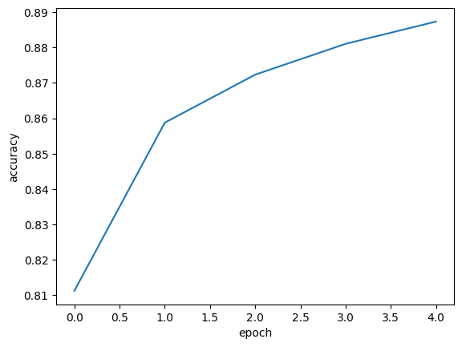<figcaption></figcaption></figure>

에포크 횟수를 20으로 늘려서 모델 훈련 후 그래프 출력

```python
model = model_fn()
model.compile(loss='sparse_categorical_crossentropy', metrics='accuracy')

history = model.fit(train_scaled, train_target, epochs=20, verbose=0)
plt.plot(history.history['loss'])
plt.xlabel('epoch')
plt.ylabel('loss')
plt.show()
```

<figure>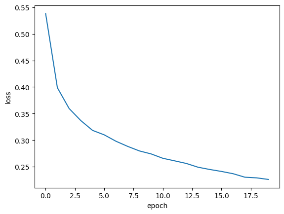<figcaption></figcaption></figure>

### 검증 손실

**인공 신경망은 모두 일종의 경사 하강법을 사용**하기 때문에 동일한 개념이 여기에도 적용된다. **에포크에 따른 과대 적합과 과소 적합을 파악하려면 훈련 세트에 대한 점수 뿐만 아니라 검증 세트에 대한 점수도 필요**하다.

```python
model = model_fn()
model.compile(loss='sparse_categorical_crossentropy', metrics='accuracy')

history = model.fit(train_scaled, train_target, epochs=20, verbose=0,
                    validation_data=(val_scaled, val_target))
```

반환된 history.history 딕셔너리에 어떤 값이 들어있는지 키를 확인해보자.

```python
print(history.history.keys())

# 결과
dict_keys(['loss', 'accuracy', 'val_loss', 'val_accuracy'])
```

검증 세트에 대한 손실은 ‘val\_loss’에 있으며, 정확도는 ‘val\_accuracy’에 들어 있을 것이다. 과대/과소적합 문제를 조사하기위해 훈련 손실과 검증 손실을 한 그래프를 그려보자.

```python
plt.plot(history.history['loss'])
plt.plot(history.history['val_loss'])
plt.xlabel('epoch')
plt.ylabel('loss')
plt.legend(['train', 'val'])
plt.show()
```

<figure>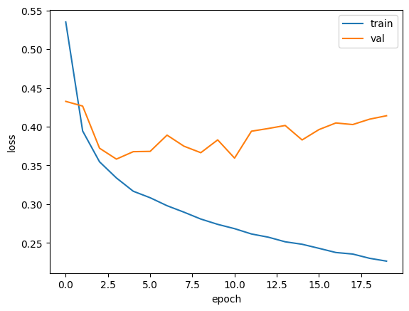<figcaption></figcaption></figure>

초기에 검증 손실이 감소하다가 점차 상승하는 모습이다. 훈련 손실은 꾸준히 감소하기에 전형적인 과대 적합 모델이다.

### 옵티마이저를 활용해 손실률을 확인해보자!

Adam 옵티마이저를 활용해 그래프 출력

```python
model = model_fn()
model.compile(optimizer='adam', loss='sparse_categorical_crossentropy',
              metrics='accuracy')

history = model.fit(train_scaled, train_target, epochs=20, verbose=0,
                    validation_data=(val_scaled, val_target))

plt.plot(history.history['loss'])
plt.plot(history.history['val_loss'])
plt.xlabel('epoch')
plt.ylabel('loss')
plt.legend(['train', 'val'])
plt.show()
```

<figure>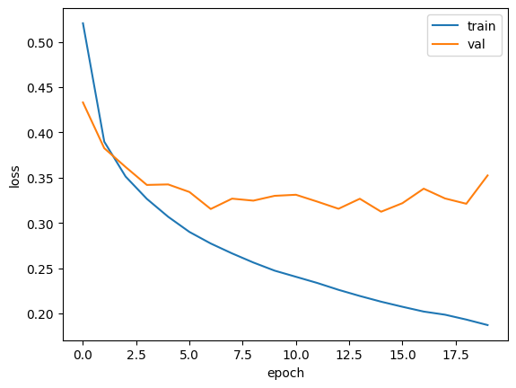<figcaption></figcaption></figure>

과대 적합이 줄어들었으며, 에포크가 10\~11정도 까지 감소하는 추세로 이어진다.

### 드롭아웃

*   **드롭아웃이란?**

    * **훈련 과정에서 층에 있는 일부 뉴런을 랜덤하게 끔(출력0)**
    * **과대적합 방지**
    * 드롭아웃 할 뉴런 갯수–하이퍼 파라미터
    * **과대적합을 막는 이유: 이전 층의 일부 뉴런이 랜덤하게 꺼지면 특정 뉴런에 과대하게 의존하는 것을 줄일 수 있고 모든 입력에 대해 주의를 기울여야 한다.**
    * 일부 뉴런의 출력이 없을 수 있다는 것을 감안하면 이 신경망은 더 안정적인 예측을 만들 수 있을 것이다.
    * **keras.layers패키지 Dropout클래스 사용**

    <figure>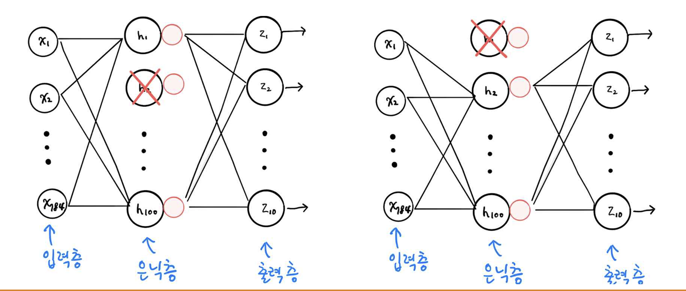<figcaption></figcaption></figure>

    앞서 정의한 model\_fn() 함수에 드롭아웃 객체를 전달하여 층을 추가해 보자.

    ```python
    model = model_fn(keras.layers.Dropout(0.3))

    model.summary()

    # 결과
    # 30% 정도 드롭아웃
    # 드롭아웃 층은 모델 파라미터가 없는데 이는 출력을 0으로 만들지만 배열의 크기를 바꾸지는 않는다.
    Model: "sequential_7"
    _________________________________________________________________
     Layer (type)                Output Shape              Param #   
    =================================================================
     flatten_7 (Flatten)         (None, 784)               0         
                                                                     
     dense_14 (Dense)            (None, 100)               78500     
                                                                     
     dropout (Dropout)           (None, 100)               0         
                                                                     
     dense_15 (Dense)            (None, 10)                1010      
                                                                     
    =================================================================
    Total params: 79510 (310.59 KB)
    Trainable params: 79510 (310.59 KB)
    Non-trainable params: 0 (0.00 Byte)
    _________________________________________________________________
    ```

    훈련 손실과 검증 손실의 그래프를 그려 비교해보자

    ```python
    model.compile(optimizer='adam', loss='sparse_categorical_crossentropy',
                  metrics='accuracy')

    history = model.fit(train_scaled, train_target, epochs=20, verbose=0,
                        validation_data=(val_scaled, val_target))

    plt.plot(history.history['loss'])
    plt.plot(history.history['val_loss'])
    plt.xlabel('epoch')
    plt.ylabel('loss')
    plt.legend(['train', 'val'])
    plt.show()
    ```

<figure>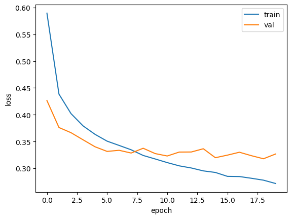<figcaption></figcaption></figure>

7\~8번째 에포크에 검증 손실이 최저가 나왔다. 그 이상의 에포크는 과대적합 발생

### 모델 저장과 복원

모델 저장과 복원에 대한 실습을 진행 해보자

```python
model = model_fn(keras.layers.Dropout(0.3))
model.compile(optimizer='adam', loss='sparse_categorical_crossentropy',
              metrics='accuracy')

history = model.fit(train_scaled, train_target, epochs=10, verbose=0,
                    validation_data=(val_scaled, val_target))
```

케라스 모델은 **훈련된 모델의 파라미터를 저장하는 간편한 save\_weight() 메서드를 제공**한다. 기본적으로 이 **메서드는 텐서플로의 체크포인트 포맷으로 저장하지만 파일의 확장자가 ‘h5’일 경우 HDF5 포맷으로 저장**한다.

```python
model.save_weights('model-weights.h5')
```

또한 **모델의 구조와 모델 파라미터를 함께 저장하는 save() 메서드**도 제공한다. 기본적으로 이 메서드는 텐서플로의 SavedModel 포맷으로 저장하지만 **파일의 확장자가 ‘h5’일 경우 HDF5 포맷으로 저장**합니다.

```python
model.save('model-whole.h5')
```

두 파일이 잘 만들어 졌는지 확인 해보자

```python
!ls -al *.h5

# 결과
-rw-r--r-- 1 root root 333320 Apr 18 02:36 model-weights.h5
-rw-r--r-- 1 root root 981176 Apr 18 02:36 model-whole.h5
```

훈련하지 않은 모델을 만들고 파라미터 로드 – load\_weights() 사용해보자

```python
model = model_fn(keras.layers.Dropout(0.3))

model.load_weights('model-weights.h5')

# 결과
Model: "sequential_6"
_________________________________________________________________
 Layer (type)                Output Shape              Param #   
=================================================================
 flatten_6 (Flatten)         (None, 784)               0         
                                                                 
 dense_12 (Dense)            (None, 100)               78500     
                                                                 
 dropout_2 (Dropout)         (None, 100)               0         
                                                                 
 dense_13 (Dense)            (None, 10)                1010      
                                                                 
=================================================================
Total params: 79510 (310.59 KB)
Trainable params: 79510 (310.59 KB)
Non-trainable params: 0 (0.00 Byte)
_________________________________________________________________
```

이때 load\_weights() 메서드를 사용하기 위해서는 save\_weights() 메서드로 저장했던 모델과 정확히 동일한 구조를 가지고 있어야 함.

검증 정확도를 확인 해보자.

* predict() 메서드 활용, 샘플마다 10개 클래스 확률 반환
* 검증 세트 12,000개 샘플 : predict 결과는 (12000, 10) 크기 배열
* 10개 확률 중 가장 큰 값을 골라 타깃 레이블과 비교

```python
import numpy as np

val_labels = np.argmax(model.predict(val_scaled), axis=-1)
print(np.mean(val_labels == val_target))

# 결과
375/375 [==============================] - 1s 2ms/step
0.8798333333333334
```

**argmax()함수 : 배열에서 가장 큰 값의 인덱스 반환 axis=-1 : 배열의 마지막 차원을 따라 최대 값 선택**

<figure>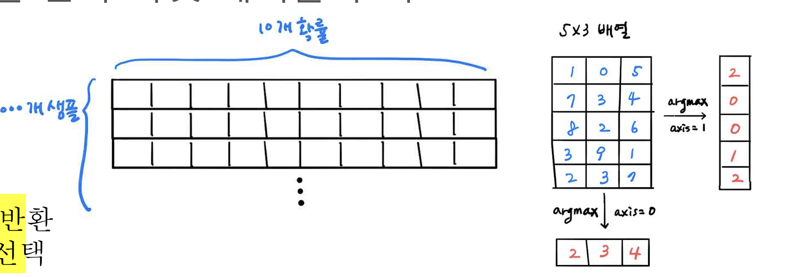<figcaption></figcaption></figure>

저장된 모델 + 파라미터 로드를 해보자

```python
model = keras.models.load_model('model-whole.h5')
model.summary()

model.evaluate(val_scaled, val_target)

# 결과
Model: "sequential_7"
_________________________________________________________________
 Layer (type)                Output Shape              Param #   
=================================================================
 flatten_7 (Flatten)         (None, 784)               0         
                                                                 
 dense_14 (Dense)            (None, 100)               78500     
                                                                 
 dropout_3 (Dropout)         (None, 100)               0         
                                                                 
 dense_15 (Dense)            (None, 10)                1010      
                                                                 
=================================================================
Total params: 79510 (310.59 KB)
Trainable params: 79510 (310.59 KB)
Non-trainable params: 0 (0.00 Byte)
_________________________________________________________________
375/375 [==============================] - 1s 2ms/step - loss: 0.4304 - accuracy: 0.8469
[0.43043649196624756, 0.846916675567627]
```

같은 모델을 저장하고 로드 했기 때문에 동일한 정확도를 가진다.

### 콜백

**콜백이란?**

* 훈련 과정 중간에 타 작업 수행 처리
  * keras.callback 패키지 클래스들
  * fit()메서드 callback 매개변수에 리스트로 전달하여 처리
  * ModelCheckpoint 콜백 : 최상의 검증 점수를 만드는 모델 저장
  * save\_best\_only=True : 가장 낮은 검증 손실을 만드는 모델 지정

아래는 콜백 실습 예제이다.

```python
model = model_fn(keras.layers.Dropout(0.3))
model.compile(optimizer='adam', loss='sparse_categorical_crossentropy',
              metrics='accuracy')

checkpoint_cb = keras.callbacks.ModelCheckpoint('best-model.h5',save_best_only=True)

model.fit(train_scaled, train_target, epochs=20, verbose=0,
          validation_data=(val_scaled, val_target),
          callbacks=[checkpoint_cb])
model = keras.models.load_model('best-model.h5')

model.evaluate(val_scaled, val_target)

# 결과 
375/375 [==============================] - 1s 2ms/step - loss: 0.3210 - accuracy: 0.8885
[0.3210257887840271, 0.8884999752044678]
```

ModelCheckpoint 콜백은 기본적으로 에포크 마다 모델은 저장한다. ModelCheckpoint 클래스의 객체 checkpoint\_cb를 만든후 fit() 메서드의 callbacks 매개변수에 리스트로 감싸 전달한다. 모델이 훈련 된 후 best-model.h5에 최상의 검증 점수를 낸 모델이 저장된다. 결과적으로 **ModelCheckpoint 콜백이 가장 낮은 검증 점수의 모델을 자동으로 저장해주어서 편하다.** 하지만 문제가 있다. 여전히 에포크를 20번 실행한다는 것이다. 사실 **검증 점수가 상승하기 시작하면 그 이후부터는 과대적합이 커지기 때문에 훈련을 계속 할 필요가 없다.** 이때 **훈련을 중지하면 컴퓨터 자원과 시간을 아낄 수 있는데 이러한 역할을 하는 것을 조기종료**라고 부르며, 딥러닝 분야에서 널리 쓰인다.

### 조기종료

* 과대 적합 시작 전 훈련을 미리 중지
* EarlyStopping 콜백 : 조기 종료 콜백
* patience 매개변수 : 검증 점수 미 향상 시 추가 수행 에포크 수
* restore\_best\_weights=True : 가장 낮은 검증 손실 모델 파라미터로 되돌림

조기 종료 콜백 실습을 진행 해보자

```python
model = model_fn(keras.layers.Dropout(0.3))
model.compile(optimizer='adam', loss='sparse_categorical_crossentropy',
              metrics='accuracy')

checkpoint_cb = keras.callbacks.ModelCheckpoint('best-model.h5',
                                                save_best_only=True)
early_stopping_cb = keras.callbacks.EarlyStopping(patience=2,
                                                  restore_best_weights=True)

history = model.fit(train_scaled, train_target, epochs=20, verbose=0,
                    validation_data=(val_scaled, val_target),
                    callbacks=[checkpoint_cb, early_stopping_cb])
print(early_stopping_cb.stopped_epoch)

# 결과
10
```

11번의 에포크 실행 후 종료 되었다.
