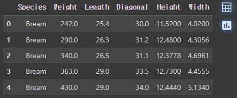
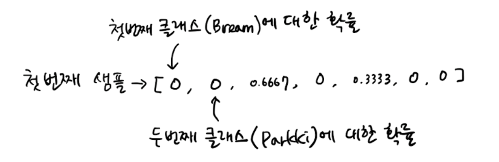
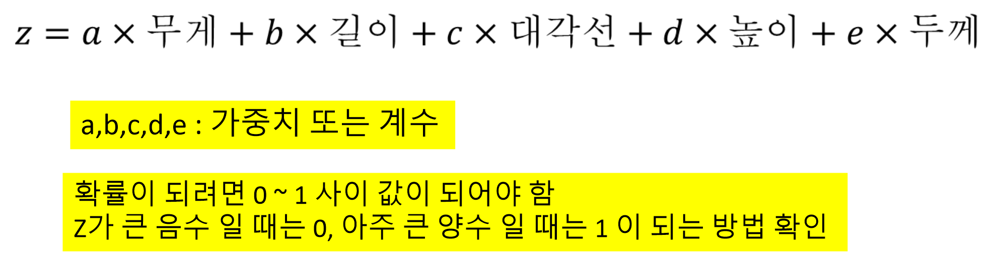
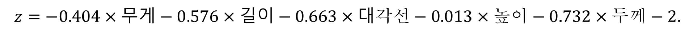
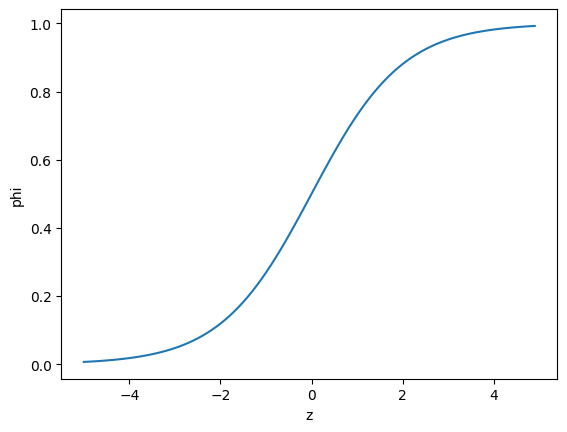
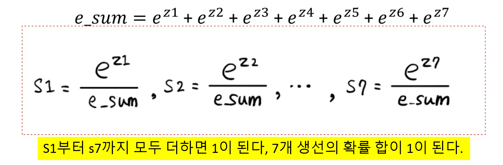
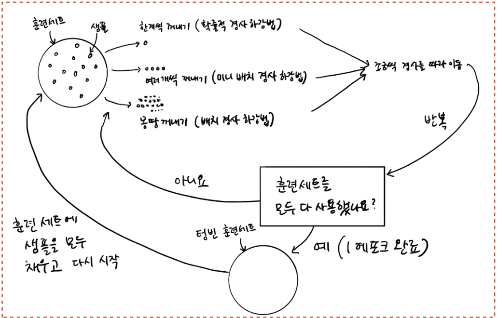
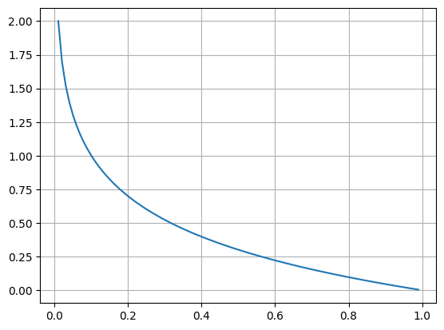
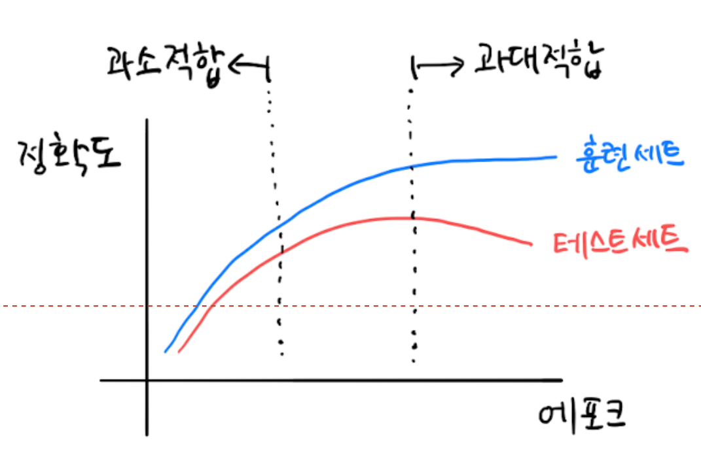
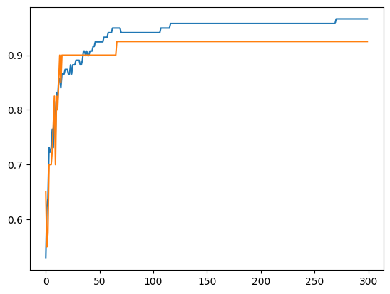

# 로지스틱 회귀

## 로지스틱 회기

🤨 **문제에 대한 설명**

7마리의 생선 랜덤하게 담긴 럭키 백 이벤트 실시(럭키 백에 포함된 생선의 확률 표시)

### 럭키백을 만들어보자!

먼저, 판다스를 활용해 데이터를 준비하자.

```python
import pandas as pd

fish = pd.read_csv('<https://bit.ly/fish_csv_data>')
fish.head()
```

<figure><figcaption></figcaption></figure>

어떤 종류에 생선이 있을까? **판다스의 unique 메서드**를 사용하면 바로 알 수 있다.

```python
print(pd.unique(fish['Species']))

# 결과 
['Bream' 'Roach' 'Whitefish' 'Parkki' 'Perch' 'Pike' 'Smelt']
```

이 책에서는 Species 열을 타겟으로 만들고 나머지 5개 열은 입력 데이터로 사용한다. 원하는 열을 리스트로 나열하고 나머지 5개의 열을 선택 해보자.

```python
fish_input = fish[['Weight', 'Length', 'Diagonal','Height','Width']].to_numpy()

print(fish_input.shape) 
print(fish_input[:5])

# 결과 
(159, 5)
[[242.      25.4     30.      11.52     4.02  ]
 [290.      26.3     31.2     12.48     4.3056]
 [340.      26.5     31.1     12.3778   4.6961]
 [363.      29.      33.5     12.73     4.4555]
 [430.      29.      34.      12.444    5.134 ]]
```

이제 동일한 방식으로 타겟 데이터를 만들어보자.

```python
fish_target = fish['Species'].to_numpy()

print(fish_target.shape)
print(fish_target[:5])

# 결과 
(159,)
['Bream' 'Bream' 'Bream' 'Bream' 'Bream']
```

이제 테스트 세트와 훈련세트를 나누자

```python
from sklearn.model_selection import train_test_split

train_input, test_input, train_target, test_target = train_test_split(
    fish_input, fish_target, random_state=42
)

print(train_input.shape)
print(test_input.shape)
print(train_target.shape)
print(test_target.shape)

# 결과 
(119, 5)
(40, 5)
(119,)
(40,)
```

그 후, **StandardScaler 클래스를 이용해 훈련 세트와 테스트 세트를 표준화 전처리** 한다. 여기에서도 훈련 세트의 통계 값으로 테스트 세트를 변환해야 한다.

```python
from sklearn.preprocessing import StandardScaler
ss = StandardScaler()
ss.fit(train_input)
train_scaled = ss.transform(train_input)
test_scaled = ss.transform(test_input)

print(train_input[:5])
print(train_scaled[:5])

# 결과 
[[720.      35.      40.6     16.3618   6.09  ]
 [500.      45.      48.       6.96     4.896 ]
 [  7.5     10.5     11.6      1.972    1.16  ]
 [110.      22.      23.5      5.5225   3.995 ]
 [140.      20.7     23.2      8.5376   3.2944]]
[[ 0.91965782  0.60943175  0.81041221  1.85194896  1.00075672]
 [ 0.30041219  1.54653445  1.45316551 -0.46981663  0.27291745]
 [-1.0858536  -1.68646987 -1.70848587 -1.70159849 -2.0044758 ]
 [-0.79734143 -0.60880176 -0.67486907 -0.82480589 -0.27631471]
 [-0.71289885 -0.73062511 -0.70092664 -0.0802298  -0.7033869 ]]
```

### K-최근접 이웃 분류기의 확률 예측

앞선 장에서 했던 것처럼 KNeighborsClassifier 클래스 객체를 만들고 훈련 세트로 모델을 훈련한 다음 다음 세트와 테스트 세트의 점수를 확인해 본다.

```python
from sklearn.neighbors import KNeighborsClassifier
# 이웃의 개수를 3으로 지정
kn = KNeighborsClassifier(n_neighbors=3)
kn.fit(train_scaled, train_target)

print(kn.score(train_scaled, train_target))
print(kn.score(test_scaled, test_target))

# 결과 
0.8907563025210085
0.85
```

fish 데이터 프레임에서 7개의 생선이 있었으며, 타겟 데이터를 만들 때 fish\[Species]를 사용해 만들었기 때문에 훈련 세트와 테스트 세트의 타겟 데이터 모두 7개의 생선종류가 들어가 있다. 이렇게 **타겟 데이터에 2개 이상의 클래스가 포함된 문제를 다중 분류**라고 한다.

사이킷런에서는 문자열로 된 타겟값을 그대로 사용할 수 있지만 타겟값을 그대로 사이킷런 모델에 전달하면 알파벳 순으로 매겨진다. 때문에 **KNeighborsClassifier에 정렬된 타겟 값을 가지는 classes\_ 속성을 사용한다.**

```python
print(kn.classes_)

# 결과
['Bream' 'Parkki' 'Perch' 'Pike' 'Roach' 'Smelt' 'Whitefish']
```

predict() 메서드를 사용하여 타겟 값으로 예측 출력

```python
print(kn.predict(test_scaled[:5]))

# 결과
['Perch' 'Smelt' 'Pike' 'Perch' 'Perch']
```

이 5개의 샘플은 어떻게 만들어 졌을까? **사이킷런의 분류 모델은 predict\_proba() 메서드로 클래스별 확률 값을 반환한다.** 테스트 세트에 있는 처음 5개의 샘플에 대한 확률을 출력해보자.

```python
import numpy as np

proba = kn.predict_proba(test_scaled[:5])
print(np.round(proba, decimals=4))

# 결과
[[0.     0.     1.     0.     0.     0.     0.    ]
 [0.     0.     0.     0.     0.     1.     0.    ]
 [0.     0.     0.     1.     0.     0.     0.    ]
 [0.     0.     0.6667 0.     0.3333 0.     0.    ]
 [0.     0.     0.6667 0.     0.3333 0.     0.    ]]
```

predict\_proba() 메서드의 출력 순서는 앞서 보았던 classes\_ 속성과 같다. 즉, 첫 번째 열이 ‘Bream’에 대한 확률, 두 번째 열이 ‘Parkki’에 대한 확률이다.

<figure><figcaption></figcaption></figure>

이 모델이 계산한 확률이 가장 가까운 이웃의 비율이 맞는지 확인하자.

```python
distance, indexes = kn.kneighbors(test_scaled[3:4])
print(indexes)
print(train_target[indexes])

# 결과
# 네 번째 샘플의 최근접 이웃 클래스 
[[104 115 106]]
[['Roach' 'Perch' 'Perch']]
```

이 샘플의 이웃은 다섯 번째 클래스인 ‘Roach’가 1개이고 세 번째 클래스인 ‘Perch’가 2개이다 .따라서 다섯 번째 클래스에 대한 확률은 1/3 = 0.3333이고 세 번째 클래스에 대한 확률은 2/3 = 0.6667이 된다. 앞서 출력한 네 번째 샘플의 클래스 확률과 같다.

그런데 뭔가 좀 이상하다. 3개의 최근접 이웃만 사용하기 때문에 확률이 너무 단조롭게 흘러간다. ex) 0/3, 1/3, 2/3, 3/3이 전부이다. 어색한 부분을 수정해보자.

### 로지스틱 회귀

* 로지스틱 회귀는 이름은 회귀이지만 분류 모델이다.
* 선형 회귀와 동일하게 선형 방정식을 학습한다.

<figure><figcaption></figcaption></figure>

**z 값이 아주 큰 음수 일 때는 0 아주 큰 양수 일 때는 1이 되려면 시그모이드 함수**를 사용해야 한다.

시그모이드 함수는 z가 무한하게 큰 음수일 경우 0에 가까워지고, z가 무한하게 큰 양수가 될 때는 1에 가까워 진다. z가 0이 될 때는 0.5가 된다. z가 어떤 값이 되더라도 절대로 0\~1사이를 벗어날 수 없다. 시그모이드 함수를 사용해보자.

```python
import numpy as np
import matplotlib.pyplot as plt

z = np.arange(-5, 5, 0.1)
phi = 1 / (1+np.exp(-z))
plt.plot(z, phi)
plt.xlabel('z')
plt.ylabel('phi')
plt.show()
```

<figure><figcaption></figcaption></figure>

이제 로지스틱 회귀 모델을 훈련하기 전에 간단한 이진 분류를 수행해보자. 이진 분류에 경우 시그모이드 함수의 출력이 0.5보다 크면 양성 클래스, 0.5 보다 작으면 음성 클래스로 판단한다. 그럼 먼저 도미와 빙어 2개를 사용해 이진 분류를 해보자.

```python
char_arr = np.array(['A','B','C','D','E'])
print(char_arr[[True,False,True,False,False]])

# 결과
['A' 'C']
```

이와 같은 방식을 사용해 훈련 세트에서 도미와 빙어의 행만 골라냈다. 비교 연산자를 사용하면 도미와 빙어의 행을 모두 True로 만들 수 있다. 예를 들어 **도미인 행을 골라내려면 train\_target == ‘Bream’과 같이 사용한다. 이 비교식으로 Bream인 것은 True 나머지는 False인 배열을 반환한다. 도미와 빙어에 대한 비교 결과를 비트 or 연산자를 사용해 합치면 도미와 빙어에 대한 행만 골라낼 수 있다.**

```python
bream_smelt_indexes = (train_target == 'Bream') | (train_target == 'Smelt')

train_bream_smelt = train_scaled[bream_smelt_indexes]
target_bream_smelt = train_target[bream_smelt_indexes]

print(train_bream_smelt.shape)
print(target_bream_smelt.shape)
print(target_bream_smelt)

# 결과
(33, 5)
(33,)
['Bream' 'Smelt' 'Bream' 'Bream' 'Bream' 'Smelt' 'Bream' 'Bream' 'Bream'
 'Bream' 'Bream' 'Bream' 'Bream' 'Smelt' 'Bream' 'Smelt' 'Smelt' 'Bream'
 'Bream' 'Bream' 'Bream' 'Bream' 'Bream' 'Bream' 'Bream' 'Smelt' 'Bream'
 'Smelt' 'Smelt' 'Bream' 'Smelt' 'Bream' 'Bream']
```

이제 이 데이터로 로지스틱 회귀 모델을 훈련 해보자. **LogisticRegression 클래스는 선형 모델이므로 sklearn.linear\_model 패키지 아래**있다.

```python
from sklearn.linear_model import LogisticRegression

lr = LogisticRegression()
lr.fit(train_bream_smelt, target_bream_smelt)

print(lr.predict(train_bream_smelt[:5]))

# 결과 
['Bream' 'Smelt' 'Bream' 'Bream' 'Bream']
```

두 번째 샘플을 제외하고는 모두 도미로 예측했다. **KNeighborsClassifier와 마찬가지로 예측 확률은 predict\_proba() 메서드를 제공**한다. train\_bream\_smelt에서 처음 5개 샘플의 예측 확률을 출력 해보자.

```python
print(lr.predict_proba(train_bream_smelt[:5]))

# 결과
[[0.99759855 0.00240145]
 [0.02735183 0.97264817]
 [0.99486072 0.00513928]
 [0.98584202 0.01415798]
 [0.99767269 0.00232731]]
```

샘플마다 2개의 확률이 출력되었다. 첫 번째 열이 음성 클래스(0), 두 번째 열이 양성 클래스(1)의 확률이다. 도미와 빙어 중 어떤 것이 양성 클래스 일까? 앞에 k-최근접 이웃 분류기에서 보았듯이 사이킷런은 타겟값을 알파벳 순으로 정렬한다. classes\_속성으로 확인해보자.

```python
print(lr.classes_)

# 결과
['Bream' 'Smelt']
```

빙어가 양성클래스 이다. predict\_proba() 메서드가 반환한 배열 값을 보면 두 번째 샘플만 양성 클래스인 빙어의 확률이 높다. 나머지는 모두 도미로 예측할 것이다.

그렇다면 선형 회귀에서 했던 것처럼 로지스틱 회귀가 학습한 계수를 확인 해보자.

```python
print(lr.coef_, lr.intercept_)

# 결과
[[-0.4037798  -0.57620209 -0.66280298 -1.01290277 -0.73168947]] [-2.16155132]
```

따라서, 이 로지스틱 회귀 모델이 학습한 방정식은 다음과 같다.

<figure><figcaption></figcaption></figure>

그렇다면 LogisticRegression 모델로 z 값을 계산 해볼 수 있을까? LogisticRegression 클래스는 decision\_function() 메서드로 z 값을 출력할 수 있다. train\_bream\_smelt의 처음 5개 샘플의 z값을 출력 해보자.

```python
decisions = lr.decision_function(train_bream_smelt[:5])
print(decisions)

# 결과 
[-6.02927744  3.57123907 -5.26568906 -4.24321775 -6.0607117 ]
```

이제 이 z값을 시그모이드 함수에 통과시키면 확률을 얻을 수 있다. 파이썬 사이파이 라이브러리에있는 expit()를 이용해 np.exp()함수를 사용하여 decisions 배열의 값을 확률로 변환 해보자.

```python
from scipy.special import expit
print(expit(decisions))

# 결과
[0.00240145 0.97264817 0.00513928 0.01415798 0.00232731]
```

출력된 값을 보면 predict\_proba() 메서드 출력의 두 번째 열의 값과 동일하다 따라서 decision\_function() 메서드는 양성 클래스에 대한 z 값을 반환한다.

이제 이진 분류의 경험을 바탕으로 7개의 생선을 분류하는 다중 분류 문제로 넘어가 보자.

다음 코드는 LogisticRegression 클래스로 다중 분류 모델을 훈련하는 코드이다.

```python
lr2 = LogisticRegression (C=20, max_iter=1000)

lr2.fit(train_scaled, train_target)
print(lr2.score(train_scaled, train_target))
print(lr2.score(test_scaled, test_target))

# 결과 
0.9327731092436975
0.925

# 반복적인 알고리즘 사용, max_iter 매개변수 조정  100 -> 1000
# L2 규제(계수의 제곱을 규제) 사용, 매개변수 C 조정 1 -> 20 (규제 완화)
```

훈련 세트와 테스트 세트에 대한 점수가 높고 과대 적합이나 과소 적합이 아닌 것 같다. 그렇다면 이제 테스트 세트에 처음 5개 샘플에 대한 예측을 출력해보자.

```python
print(lr2.predict(test_scaled[:5]))

# 결과 
['Perch' 'Smelt' 'Pike' 'Roach' 'Perch']
```

이번에는 테스트 세트의 처음 5개 샘플에 대한 예측 확률을 출력해 보자.

```python
proba = lr2.predict_proba(test_scaled[:5])
print(np.round(proba, decimals=3))

# 결과
[[0.    0.014 0.841 0.    0.136 0.007 0.003]
 [0.    0.003 0.044 0.    0.007 0.946 0.   ]
 [0.    0.    0.034 0.935 0.015 0.016 0.   ]
 [0.011 0.034 0.306 0.007 0.567 0.    0.076]
 [0.    0.    0.904 0.002 0.089 0.002 0.001]]
```

5개 샘플에 대한 예측이므로 5개의 행, 또 7개의 생선에 대한 확률 이므로 7개의 열이 출력 되었다.

위 결과에 첫 번째 샘플을 보면 세 번째 열 확률이 가장 높다. classes\_속성을 사용해 어떤 물고기인지 알아보자.

```python
print(lr2.classes_)

# 결과 
['Bream' 'Parkki' 'Perch' 'Pike' 'Roach' 'Smelt' 'Whitefish']
```

첫 번째 샘플에서 나올 물고기의 가장 높은 확률은 농어(Perch)였다. 다중 분류에 경우 선형 방정식은 어떤 모습일까? coef\_와 intercept\_의 크기를 출력해보자.

```python
print(lr2.coef_.shape, lr2.intercept_.shape)

# 결과
(7, 5) (7,)
```

이 데이터는 5개의 특성을 사용하므로 coef\_ 배열의 열은 5개이다. 그런데 행이 7으로 나왔다. intercept또한 마찬가지이다. **이 말은 이진 분류에서 보았던 z를 7개나 계산한다는 의미**이다. 다중 분류는 클래스마다 z 값을 하나씩 계산하며, **가장 높은 z 값을 출력하는 클래스가 예측 클래스**가 된다. 그렇다면 확률은 어떻게 계산한 것일까? **이진 분류에서는 시그모이드 함수를 사용해 z를 0과 1 사이의 값으로 변환했다. 다중 분류는 이와 달리 소프트맥스 함수를 사용하여 7개의 z 값을 확률로 변환한다.**

### 소프트맥스 함수란?

> **여러 개의 선형 방정식 출력 값을 0\~1로 압축하고, 전체 합을 1로 조정**

<figure><figcaption></figcaption></figure>

그렇다면 이진 분류에서처럼 **decision\_function() 메서드로 z1\~z7까지의 값을 구한 다음 소프트맥스 함수를 사용해 확률로 바꾸어 보자.**

```python
decision = lr2.decision_function(test_scaled[:5])
print(np.round(decision, decimals=2))

# 결과
[[ -6.5    1.03   5.16  -2.73   3.34   0.33  -0.63]
 [-10.86   1.93   4.77  -2.4    2.98   7.84  -4.26]
 [ -4.34  -6.23   3.17   6.49   2.36   2.42  -3.87]
 [ -0.68   0.45   2.65  -1.19   3.26  -5.75   1.26]
 [ -6.4   -1.99   5.82  -0.11   3.5   -0.11  -0.71]]
```

사이파이의 소프트맥수 함수를 이용해 결과를 보자. **scipy.special 아래에 softmax() 함수를 임포트**하여 사용한다.

```python
from scipy.special import softmax
proba = softmax(decision, axis=1)
print(np.round(proba, decimals=3))

# 결과
[[0.    0.014 0.841 0.    0.136 0.007 0.003]
 [0.    0.003 0.044 0.    0.007 0.946 0.   ]
 [0.    0.    0.034 0.935 0.015 0.016 0.   ]
 [0.011 0.034 0.306 0.007 0.567 0.    0.076]
 [0.    0.    0.904 0.002 0.089 0.002 0.001]]
```

출력 결과를 앞서 구한 proba 배열과 비교해보자. 정확히 일치하는 모습이다.

## 5주차 2번째 수업

🤨 **문제에 대한 설명**

수산물 공급처 확대, 추가된 수산물에 대한 샘플 추가 학습 필요

훈련 데이터가 조금씩 전달되는 상황 해결

* 기존 데이터에 새로운 데이터를 추가하여 매일 재훈련 ← 시간이 지날수록 데이터 늘어남
* 새로운 데이터 추가 시 기존 데이터 일부 제거(데이터 크기 유지) ← 중요 데이터 삭제 위험
* 기존 훈련 모델을 유지하고, 새로운 데이터에 대해 추가 훈련(점진적 학습)

**대표적인 점진적 학습 알고리즘은 확률적 경사 하강법**이 있다.

### 확률적 경사 하강법이란?

> 기계 학습에서 최적화 알고리즘 중 하나로, **모델의 파라미터를 조정하여 손실 함수를 최소화하는 방법**

* 대표적인 점진적 학습 알고리즘
* 확률적 : ‘무작위 하게’, ‘랜덤 하게’ 의미
* 경사 하강법 : 경사(기울기)를 따라 내려가는 방법
* 가장 가파른 경사를 따라 원하는 지점에 도달하는 것이 목표
* 가장 가파른 길을 찾아 내려오지만 조금씩 내려 오는 것이 중요

### **에포크(epoch)란?**

> **확률적 경사 하강법에서 훈련 세트를 한 번 모두 사용하는 과정을 에포크 라고 한다.**

### 다양한 확률적 경사 하강법

* 확률적 경사 하강법 : 무작위로 1개씩 샘플 선택
* 미니배치 경사 하강법 : 무작위로 몇개씩 샘플 선택(실전에서 많이 사용)
* 배치 경사 하강법 : 전체 샘플 선택

<figure><figcaption></figcaption></figure>

**신경망 알고리즘에선 경사 하강법을 필수적으로 사용한다.**

### 손실 함수란?

> **적용 머신러닝 알고리즘이 얼마나 엉터리인지를 측정하는 기준**

* 값이 작을 수록 우수
* 비용 함수(cost function) 라고도 함
* 분류에서 손실 : 정답을 맞추지 못하는 것
* 경사 하강법을 적용하기 위해서는 손실 함수 값이 연속적 이어야 함
* 손실 함수는 미분 가능해야 함
* 로지스틱 회귀 모델의 확률 출력을 통해 연속적인 손실 함수 구성

### 로지스틱 손실 함수

* 양성 클래스\*\*(타깃=1)일 때 : -log(예측확률)확률이 1에서 멀어질수록 손실은 아주 큰 양수\*\*가 된다.
* 음성 클래스\*\*(타깃=0)일 때 : -log(1-예측확률)확률이 0에서 멀어질수록 손실은 아주 큰 양수\*\*가 된다.

### 그렇다면 로지스틱 손실 함수를 그려보자!

```python
import numpy as np
import matplotlib.pyplot as plt

y = 1
p = np.arange(0,1,0.01)
z = -(y*np.log10(p) + (1-y)*np.log10(1-p))

plt.grid(True)
plt.plot(p,z)
plt.show()
```

<figure><figcaption></figcaption></figure>

```python
import numpy as np
import matplotlib.pyplot as plt

import numpy as np
import matplotlib.pyplot as plt

y = 0
p = np.arange(0,1,0.01)
z = -(y*np.log10(p) + (1-y)*np.log10(1-p))

plt.grid(True)
plt.plot(p,z)
plt.show()
```

<figure><figcaption></figcaption></figure>

이러한 손실함수를 **로지스틱 손실함수** 또는 **이진 크로스엔트로피 손실 함수** 라고 부른다.

**손실 함수의 분류**

* 크로스 엔트로피 손실 함수
* Binary cross-entropy, categorical cross-entropy

**손실 함수의 회귀**

* 평균 절대 오차
* 평균 제곱 오차
* 평균 제곱근 오차

### 확률적 경사 하강법을 사용한 분류 모델을 만들어보자!

먼저, **fish\_csv\_data 파일에서 판다스 데이터프레임을 만든다.**

```python
import pandas as pd

fish = pd.read_csv("<https://bit.ly/fish_csv_data>")
print(fish.shape)
print(fish.head)

# 결과
(159, 6)
<bound method NDFrame.head of     Species  Weight  Length  Diagonal   Height   Width
0     Bream   242.0    25.4      30.0  11.5200  4.0200
1     Bream   290.0    26.3      31.2  12.4800  4.3056
2     Bream   340.0    26.5      31.1  12.3778  4.6961
3     Bream   363.0    29.0      33.5  12.7300  4.4555
4     Bream   430.0    29.0      34.0  12.4440  5.1340
..      ...     ...     ...       ...      ...     ...
154   Smelt    12.2    12.2      13.4   2.0904  1.3936
155   Smelt    13.4    12.4      13.5   2.4300  1.2690
156   Smelt    12.2    13.0      13.8   2.2770  1.2558
157   Smelt    19.7    14.3      15.2   2.8728  2.0672
158   Smelt    19.9    15.0      16.2   2.9322  1.8792

[159 rows x 6 columns]>
```

그 다음, Species 열을 제외한 나머지 5개는 입력 데이터로 사용한다. Species 열은 타겟 데이터이다.

```python
fish_input = fish[['Weight', 'Length','Diagonal','Height','Width']].to_numpy()

print(fish_input.shape)
print(fish_input[:5])

# 결과
(159, 5)
[[242.      25.4     30.      11.52     4.02  ]
 [290.      26.3     31.2     12.48     4.3056]
 [340.      26.5     31.1     12.3778   4.6961]
 [363.      29.      33.5     12.73     4.4555]
 [430.      29.      34.      12.444    5.134 ]]
fish_input = fish[['Weight', 'Length','Diagonal','Height','Width']].to_numpy()

print(fish_input.shape)
print(fish_input[:5])

# 결과
(159,)
['Bream' 'Bream' 'Bream' 'Bream' 'Bream']
```

사이킷런의 train\_test\_split() 함수를 사용해 이 데이터를 훈련 세트와 테스트 세트로 나눈다.

```python
from sklearn.model_selection import train_test_split

train_input, test_input, train_target, test_target = train_test_split(fish_input, fish_target, random_state=42)

print(train_input.shape)
print(test_input.shape)
print(train_target[:5])
print(test_target[:5])

# 결과
(119, 5)
(40, 5)
['Bream' 'Pike' 'Smelt' 'Perch' 'Parkki']
['Perch' 'Smelt' 'Pike' 'Whitefish' 'Perch']
```

이제, 훈련 세트와 테스트 세트의 특성을 표준화 전처리한다. 다시 한번 강조하지만 꼭 **훈련 세트에서 학습한 통계 값으로 테스트 세트도 변환해야 한다.**

```python
from sklearn.preprocessing import StandardScaler

ss = StandardScaler()
ss.fit(train_input)
train_scaled = ss.transform(train_input)
test_scaled = ss.transform(test_input)

print(train_input[:5])
print(train_scaled[:5])

# 결과
[[720.      35.      40.6     16.3618   6.09  ]
 [500.      45.      48.       6.96     4.896 ]
 [  7.5     10.5     11.6      1.972    1.16  ]
 [110.      22.      23.5      5.5225   3.995 ]
 [140.      20.7     23.2      8.5376   3.2944]]
[[ 0.91965782  0.60943175  0.81041221  1.85194896  1.00075672]
 [ 0.30041219  1.54653445  1.45316551 -0.46981663  0.27291745]
 [-1.0858536  -1.68646987 -1.70848587 -1.70159849 -2.0044758 ]
 [-0.79734143 -0.60880176 -0.67486907 -0.82480589 -0.27631471]
 [-0.71289885 -0.73062511 -0.70092664 -0.0802298  -0.7033869 ]]
```

사이킷런에서 **확률적 경사 하강법을 제공하는 대표적인 분류용 클래스는 SGDClassifier이다.** **SGDClassifier의 객체를 만들 때 2개의 매개변수를 지정**한다. **loss는 손실 함수의 종류를 지정**한다. 여기에서는 loss=’log\_loss’로 지정하여 로지스틱 손실 함수를 지정했다. **max\_iter는 수행할 에포크 횟수를 지정**한다. 10으로 지정하여 전체 훈련 세트를 10회 반복하고, 그 후 훈련 세트와 테스트 세트에서 정확도 점수를 출력하자.

```python
from sklearn.linear_model import SGDClassifier

sc = SGDClassifier(loss="log", max_iter=10, random_state=42)
sc.fit(train_scaled, train_target)
print(sc.score(train_scaled, train_target))
print(sc.score(test_scaled, test_target))

# 결과
0.773109243697479
0.775
```

출력된 훈련 세트와 테스트 세트의 정확도가 낮다 → 아마도 **에포크의 횟수 부족이 원인일 것이다.**

앞서 말한 것처럼 **확률적 경사 하강법은 점진적 학습이 가능**하다. SGDClassifier 객체를 다시 만들지 않고, 훈련한 모델 sc를 추가로 더 훈련 해보자. **모델을 이어서 훈련할 때는 partial\_fit() 메서드를 사용한다. 이 메서드는 fit() 메서드와 사용법이 같지만 호출할 때 마다 1 에포크씩 이어서 훈련할 수 있다.**

```python
sc.partial_fit(train_scaled, train_target)
print(sc.score(train_scaled, train_target))
print(sc.score(test_scaled, test_target))

# 결과
0.8151260504201681
0.85
```

아직 점수가 낮지만 에포크를 한 번 더 실행하니 정확도가 향상되었다. 이 모델을 여러 에포크에서 더 훈련해 볼 필요가 있을 것 같다. 또한 무작정 반복할 수는 없으니 어떤 기준이 필요할 것이다.

### 에포크의 과대 적합/과소적합

**확률적 경사 하강법 사용 모델**

* 에포크 횟수에 따라 과소적합 또는 과대적합 나타날 수 있다.
* 적절한 에포크 횟수를 찾아야 한다.
* 과대적합이 되기 전에 훈련을 멈추는 것을 **조기 종료**라고 한다.

<figure><figcaption></figcaption></figure>

300번의 에포크 동안 기록한 훈련 세트와 테스트 세트의 점수를 그래프로 그려보자.

```python
import numpy as np

sc2 = SGDClassifier(loss="log_loss", random_state=42)
train_score = []
test_score = []
classes = np.unique(train_target)

for _ in range(0, 300) :
  sc2.partial_fit(train_scaled, train_target, classes=classes)
  train_score.append(sc2.score(train_scaled, train_target))
  test_score.append(sc2.score(test_scaled, test_target))

import matplotlib.pyplot as plt
plt.plot(train_score, label="train set")
plt.plot(test_score, label="test set")
plt.legend
plt.show()
# 100번째 에포크 적정
```

<figure><figcaption></figcaption></figure>

그렇다면 SGDClassifier의 반복 횟수를 100에 맞추고 모델을 다시 훈련해 보겠습니다. 그리고 최종적으로 훈련 세트와 테스트 세트에서 점수를 출력합니다.

```python
sc3 = SGDClassifier(loss="log_loss", max_iter=100, tol=None, random_state=42)
sc3.fit(train_scaled, train_target)
print(sc3.score(train_scaled, train_target))
print(sc3.score(test_scaled, test_target))

# 결과 
0.957983193277311
0.925
```
