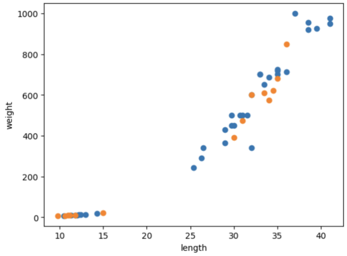

# 지도학습

## 머신러닝(2주차)

🤨 **문제에 대한 설명**

머신러닝을 이용해 도미와 빙어를 구분하는 예제이다.\


#### 생선 분류 문제를 통해 머신 러닝을 이해 해보자!

🤨 중요한 코드만을 위주로 다룹니다.


이 예제에서는 먼저 도미 데이터(length, weight)와 빙어 데이터(length, weight)를 하나의 리스트로 만듭니다.

```python
# 도미의 길이(cm)와 무게(g)를 리스트로 나타냄
bream_length = [25.4, 26.3, 26.5, 29.0, 29.0, 29.7, 29.7, 30.0, 30.0, 30.7, 31.0, 31.0,
                31.5, 32.0, 32.0, 32.0, 33.0, 33.0, 33.5, 33.5, 34.0, 34.0, 34.5, 35.0,
                35.0, 35.0, 35.0, 36.0, 36.0, 37.0, 38.5, 38.5, 39.5, 41.0, 41.0]
bream_weight = [242.0, 290.0, 340.0, 363.0, 430.0, 450.0, 500.0, 390.0, 450.0, 500.0, 475.0, 500.0,
                500.0, 340.0, 600.0, 600.0, 700.0, 700.0, 610.0, 650.0, 575.0, 685.0, 620.0, 680.0,
                700.0, 725.0, 720.0, 714.0, 850.0, 1000.0, 920.0, 955.0, 925.0, 975.0, 950.0]
```

```python
# 빙어의 길이(cm)와 무게(g)를 리스트로 나타냄
smelt_length = [9.8, 10.5, 10.6, 11.0, 11.2, 11.3, 11.8, 11.8, 12.0, 12.2, 12.4, 13.0, 14.3, 15.0]
smelt_weight = [6.7, 7.5, 7.0, 9.7, 9.8, 8.7, 10.0, 9.9, 9.8, 12.2, 13.4, 12.2, 19.7, 19.9]
```

```python
# 빙어와 도미의 데이터 리스트를 합친다.
length = bream_length + smelt_length
weight = bream_weight + smelt_weight
```

위 코드에서는 도미와 빙어의 데이터를 하나의 리스트 형태로 합쳐서 각각을 length와 weight라는 변수에 지정하였습니다. 이 책에서 사용하는 머신러닝 패키지인 사이킷런을 사용하려면, 각 특성의 리스트를 세로 방향으로 늘어뜨린 2차원 리스트를 만들어야 합니다.


#### 그렇다면 2차원 리스트를 만드는 방법은 무엇이 있을까?


## zip() 메소드 이해하기

* 파이썬의 내장 함수 zip()은 iterable, 즉 순회 가능한 객체를 인자로 받고 각 자료형의 각각의 요소를 나눈 후 인덱스끼리 잘라서 리스트로 반환해줍니다.
* 여기서 말하는 iterable 자료형은 파이썬에서 리스트, 튜플 같은 반복 가능한 자료형을 의미 합니다.

😜 **이해를 돕기 위해 예시를 살펴 보겠습니다.**

```python
list1 = [1, 2, 3, 4]
list2 = ['가슴', '팔', '어깨', '등']

for x, y in zip(list1, list2) :
  print(x,y)
```

위와 같은 형식으로 코드를 생성 시 아래와 같은 결과가 나오게 됩니다.

```python
1 가슴
2 팔
3 어깨
4 등
```

즉, 이런 식으로 리스트에서 원소를 하나씩 꺼내서 반환하는 것이 zip()메소드 입니다.

```python
# zip함수를 이용하여 2차원 리스트 만들기
fish_data = [[l,w] for l,w in zip(length, weight)]
```

\


위와 같은 방식으로 생선의 길이와 무게를 하나씩 꺼내 2차원 리스트를 만들었습니다.

그 후 정답 데이터를 만들어 줍니다. 컴퓨터 프로그램은 문자를 직접 이해하지 못하기 때문에 0과 1로 표현해주었습니다. **도미와 빙어가 순서대로 나열 되므로 1이 35번 등장하고, 0이 14번 등장하는 리스트**를 만들어 주면 됩니다.

```python
fish_target = [1] * 35 + [0] * 14
print(fish_target)
```

\
이제 사이킷런 패키지에서 k-최근접 알고리즘을 활용하기 위해서 KNeighborsClassifier를 임포트합니다. 또한 fit() 메소드를 사용하여 주어진 데이터로 알고리즘을 훈련하고, score() 메소드를 사용하여 얼마나 잘 훈련되었는지 평가를 해봅니다.

```python
# 사이킷런 임포트 -> k-최근접 알고리즘 사용
from sklearn.neighbors import KNeighborsClassifier
# 객체 생성
kn = KNeighborsClassifier()
# fit 알고리즘을 사용하여 주어진 데이터로 알고리즘 훈련
kn.fit(fish_data, fish_target)

# 스코어 메소드는 k 최근접 알고리즘에서 정확도를 측정하기위한 메소드이다.
kn.score(fish_data,fish_target)
```

\


이제 만든 프로그램을 사용해 봅시다. 여기에서 사용한 알고리즘은 **k-최근접 알고리즘으로 어떤 데이터에 대한 답을 구할 때 주위의 다른 데이터를 보고 다수를 차지하는 것을 정답으로 사용합니다.**

그렇다면 **길이가 30, 무게가 600 인 생선을 프로그램에 넣고 predict()메소드를 사용하여 예측**해봅시다.

```python
# 임의의 값을 넣어 해당 길이와 크기를 가진 물고기가 도미인지 판단
# 즉, predict() 메소드는 새로운데이터의 정답을 예측합니다.
kn.predict([[30,600]])
# predict 또한 2차원 리스트 형태로 값을 전달해야 하기 때문에 괄호를 두번 감싼 형태이다.
```

```python
# 결과
array([1])
```

결과로 보았을 때 길이 30, 무게 600인 생선은 도미라고 판단하였습니다.

\


## 2주차 2번째 수업

* 위 실습의 문제점
  * **문제와 정답을 전부 알려주고 시험**을 치는 방법
  * 평가를 제대로 하려면 **훈련 데이터**와 **평가에 사용할 데이터**가 각각 **달라야 함**

\


이렇게 하는 가장 간단한 방법은 평가를 위해 **또 다른 데이터를 준비하거나** 이미 **준비된 데이터 중 일부를 떼어 내어 활용하는 방법**입니다.

\


먼저, 저번과 같이 도미와 빙어 데이터를 하나로 합친 리스트를 만든다.

```jsx
fish_length = [25.4, 26.3, 26.5, 29.0, 29.0, 29.7, 29.7, 30.0, 30.0, 30.7, 31.0, 31.0, 
                31.5, 32.0, 32.0, 32.0, 33.0, 33.0, 33.5, 33.5, 34.0, 34.0, 34.5, 35.0, 
                35.0, 35.0, 35.0, 36.0, 36.0, 37.0, 38.5, 38.5, 39.5, 41.0, 41.0, 9.8, 
                10.5, 10.6, 11.0, 11.2, 11.3, 11.8, 11.8, 12.0, 12.2, 12.4, 13.0, 14.3, 15.0]
fish_weight = [242.0, 290.0, 340.0, 363.0, 430.0, 450.0, 500.0, 390.0, 450.0, 500.0, 475.0, 500.0, 
                500.0, 340.0, 600.0, 600.0, 700.0, 700.0, 610.0, 650.0, 575.0, 685.0, 620.0, 680.0, 
                700.0, 725.0, 720.0, 714.0, 850.0, 1000.0, 920.0, 955.0, 925.0, 975.0, 950.0, 6.7, 
                7.5, 7.0, 9.7, 9.8, 8.7, 10.0, 9.9, 9.8, 12.2, 13.4, 12.2, 19.7, 19.9]
```

```jsx
fish_data = [[l, w] for l,w in zip(fish_length, fish_weight)] # zip을 사용해 2차원 리스트 만들기 
fish_target = [1]*35 + [0] * 14 #이 데이터의 처음 5개는 훈련 세트로, 나머지 14개는 테스트 세트로 사용 
```

그 후, 훈련 데이터 세트와 테스트 데이터 세트를 분류해준다.

```jsx
train_input = fish_data[:35]

train_target = fish_target[:35]

test_input = fish_data[35:]

test_target = fish_target[35:]
```

그 후, 결과를 테스트 하였는데, 0이 나왔다 왜 그럴까?

```jsx
kn.fit(train_input, train_target)
kn.score(test_input, test_target) # 문제점 -> 마지막 14개를 테스트로 떼어 놓으면 훈련세트에는 빙어가 한 마리도 없으므로 빙어를 분류할 수 없음 이러한 현상을 샘플링 편향이라고 한다.
# 문제 해결을 위해 훈련세트와 테스트 세트의 도미와 빙어를 골고루 섞어야함 
```

```jsx
# 결과
0.0
```

그 이유는 마지막 14개를 테스트 세트로 떼어 놓으면, 훈련 세트에는 빙어가 한 마리도 없으므로, 만들어진 프로그램은 빙어를 분류할 수 없기 때문에 훈련 세트와 테스트 세트를 골고루 섞어 주어야 한다. 위와 같은 문제를 샘플링 편향이라고 부른다.

\


#### 샘플링 편향이란?

> **모델이 학습하는 데이터가 전체 데이터의 대표성을 잘 반영하지 못하고 특정 부분에 치우쳐져 있는 것**

\


이 책에선, **넘파이를 사용하여 샘플링 편향을 해결**한다.

훈련 데이터와 테스트 데이터를 골고루 섞기 위해서 **넘파이 배열를 사용해 인덱스를 섞는다.**

```jsx
import numpy as np

input_arr = np.array(fish_data)
target_arr = np.array(fish_target)
```

```jsx
np.random.seed(42) # 일정한 결과를 얻으려면 시드 설정 필수
index = np.arange(49) # 테스트 세트와 훈련세트를 섞기 위헤 arange함수 사용 
np.random.shuffle(index) # 인덱스 섞기
print(index)
```

인덱스를 섞은 훈련 데이터와 테스트 데이터로 그래프를 그려보면 잘 섞인 것을 확인 할 수 있다.

```jsx
train_input = input_arr[index[:35]] # 훈련 세트 
train_target = target_arr[index[:35]]
```

```jsx
test_input = input_arr[index[35:]] # 테스트 세트
test_target = target_arr[index[35:]]
```

```jsx
import matplotlib.pyplot as plt
plt.scatter(train_input[:,0], train_input[:,1])
plt.scatter(test_input[:,0], test_input[:,1])
plt.xlabel('length')
plt.ylabel('weight')
plt.show()
```

<figure><figcaption></figcaption></figure>

그 후, 훈련 데이터와 테스트 데이터를 넣어 모델을 테스트 해 보면 정상적인 결과가 나오게 된다.

```jsx
kn.fit(train_input, train_target) # 훈련데이터로 훈련시킴
kn.score(test_input,test_target) # 테스트 데이터를 넣어 모델 테스트
```

```jsx
# 결과
1.0
```

```python
kn.predict(test_input) # 예측데이터
# 결과
# array([0, 0, 1, 0, 1, 1, 1, 0, 1, 1, 0, 1, 1, 0])
```

```python
print(test_target) # 정답데이터
# 결과 
# [0 0 1 0 1 1 1 0 1 1 0 1 1 0]
```

```python
kn.predict([[30, 600]])
# 결과
# array([1])
```
