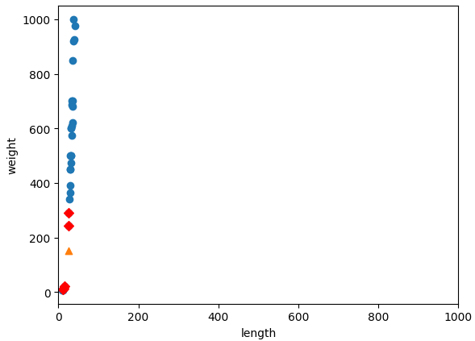
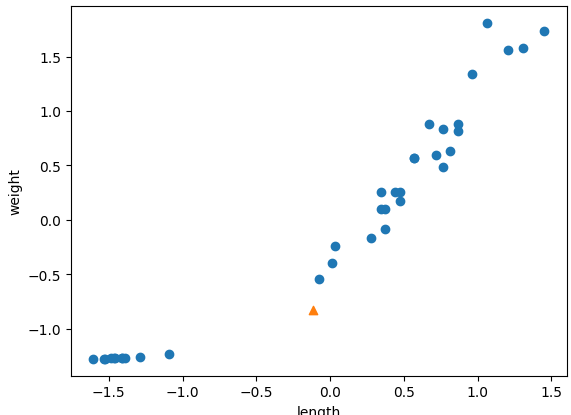

# 분류/회귀

## 머신러닝(3주차)

🤨 **문제에 대한 설명**

길이 25cm, 무게 150g인 생선을 빙어라고 볼 수 있는가?

😄 **사전에 알고 가야 할 내장 함수**

column\_stack()

> numpy.column\_stack() 함수는 NumPy 라이브러리의 함수 중 하나로, 주어진 배열들을 열 방향으로 쌓아서 새로운 배열을 생성한다.

```python
import numpy as np

list01 = [1,2,3]
list02 = [3,4,5]

np.column_stack((list01, list02))

// 결과 array([[1, 3],
              [2, 4],
              [3, 5]])
```

ones()함수, zeros()함수

> numpy.ones() 함수와 numpy.zeros() 함수는 각각 1로 채워진 배열과 0으로 채워진 배열을 생성하는 NumPy 함수이다. 이 함수들은 주어진 모양(shape)의 배열을 만들고, 모든 요소를 특정 값(1 또는 0)으로 초기화한다

```python
one_list = np.ones(5)
zero_list = np.zeros(5)

print(one_list)
print(zero_list)

// 결과 [1. 1. 1. 1. 1.]
				[0. 0. 0. 0. 0.]
```

concatenate함수

> numpy.concatenate() 함수는 NumPy 라이브러리에서 제공되는 배열을 연결(결합)하는 함수이다. 이 함수를 사용하여 여러 배열을 하나의 배열로 결합할 수 있으며. concatenate() 함수는 주어진 축(axis)을 기준으로 배열을 연결할 수 있다.

```python
np.concatenate((one_list,zero_list))

// 결과 array([1., 1., 1., 1., 1., 0., 0., 0., 0., 0.])
```

train\_test\_split()함수

> train\_test\_split() 함수는 사이킷런(Scikit-learn) 라이브러리에서 제공되는 함수로, 데이터셋을 훈련 데이터와 테스트 데이터로 무작위로 분할하는 역할을 하며, 이 함수를 사용하면 기존 데이터를 훈련에 사용할 부분과 모델을 평가하는데 사용할 부분으로 나눌 수 있다.

### 사전 지식을 바탕으로 학습 데이터를 구성해보자!

먼저 생선 데이터를 준비한다.

```python
fish_length = [25.4, 26.3, 26.5, 29.0, 29.0, 29.7, 29.7, 30.0, 30.0, 30.7, 31.0, 31.0,
                31.5, 32.0, 32.0, 32.0, 33.0, 33.0, 33.5, 33.5, 34.0, 34.0, 34.5, 35.0,
                35.0, 35.0, 35.0, 36.0, 36.0, 37.0, 38.5, 38.5, 39.5, 41.0, 41.0, 9.8,
                10.5, 10.6, 11.0, 11.2, 11.3, 11.8, 11.8, 12.0, 12.2, 12.4, 13.0, 14.3, 15.0]
fish_weight = [242.0, 290.0, 340.0, 363.0, 430.0, 450.0, 500.0, 390.0, 450.0, 500.0, 475.0, 500.0,
                500.0, 340.0, 600.0, 600.0, 700.0, 700.0, 610.0, 650.0, 575.0, 685.0, 620.0, 680.0,
                700.0, 725.0, 720.0, 714.0, 850.0, 1000.0, 920.0, 955.0, 925.0, 975.0, 950.0, 6.7,
                7.5, 7.0, 9.7, 9.8, 8.7, 10.0, 9.9, 9.8, 12.2, 13.4, 12.2, 19.7, 19.9]
```

그 후, numpy 내장 함수인 **column\_stack() 함수를 이용해서 전달 받은 리스트를 일렬로 세운 다음 차례대로 나란히 연결**한다.

```python
fish_data = np.column_stack((fish_length, fish_weight))

print(fish_data[:5])

// 결과 
[[ 25.4 242. ]
 [ 26.3 290. ]
 [ 26.5 340. ]
 [ 29.  363. ]
 [ 29.  430. ]] // 앞에서 부터 시작하는 5개의 데이터들의 생선 길이와 무게가 알맞게 연결된 것을 볼 수 있음 
```

그 다음으론, **concatenate 함수를 이용하여 타겟 데이터를 만들어 줍니다.**

```python
fish_target = np.concatenate((np.ones(35), np.zeros(14)))

print(fish_target)

// 결과 
[1. 1. 1. 1. 1. 1. 1. 1. 1. 1. 1. 1. 1. 1. 1. 1. 1. 1. 1. 1. 1. 1. 1. 1.
 1. 1. 1. 1. 1. 1. 1. 1. 1. 1. 1. 0. 0. 0. 0. 0. 0. 0. 0. 0. 0. 0. 0. 0.
 0.] // 타겟 데이터 또한 잘 만들어진 모습 
```

### 사이킷런으로 훈련 세트와 테스트 세트를 나누자!

2주차에서는 넘파이 배열의 인덱스를 직접 섞어서 훈련 세트와 데이터 세트를 나누었다. 이 방법은 번거로운 방법이기 때문에 이번 3주차에서는 **사이킷런의 유틸리티 도구인 train\_test\_split()함수를 이용**할 것이다.

```python
# 샘플링 편향 현상
from sklearn.model_selection import train_test_split
train_input, test_input, train_target, test_target = train_test_split (
    fish_data, fish_target, random_state=42 )
# 이 책과 같은 결과를 위해 seed 42 고정 

print(train_input.shape, test_input.shape)
print(train_target.shape, test_target.shape)

print(test_target)

# 결과 
(36, 2) (13, 2)
(36,) (13,)
[1. 0. 0. 0. 1. 1. 1. 1. 1. 1. 1. 1. 1.]

// 13개의 테스트 세트 중 10개가 도미(1)이고, 3개가 빙어(0)이다. 잘 섞인 것 같지만 빙어의 비울이
모자르다. 원래 도미와 빙어의 개수는 35개와 14개로 2.5:1비율 이였지만 이 테스트 세트의 빙어의 비율은
3.3:1이다. 
```

샘플링 편향 현상을 바로 잡기 위해 **stratify 매개변수에 타깃 데이터를 전달**한다.

```python
# 샘플링 편향현상 조정
train_input, test_input, train_target, test_target = train_test_split (
    fish_data, fish_target, stratify=fish_target, random_state=42 )

print(test_target)

# 결과 
[0. 0. 1. 0. 1. 0. 1. 1. 1. 1. 1. 1. 1.]
빙어 데이터(0)가 하나 더 늘어난 모습
```

### 수상한 도미에 대해 분석해보자

앞에서 준비한 데이터를 바탕으로 **k-최근접 이웃을 훈련**해보자

```python
from sklearn.neighbors import KNeighborsClassifier

kn = KNeighborsClassifier()
kn.fit(train_input, train_target)
kn.score(test_input, test_target)

# 결과
1.0
// 테스트 세트의 도미와 빙어를 모두 올바르게 분류 했습니다.
```

그렇다면 이번 장의 문제였던 길이 25, 무게 150g나가는 생선을 예측해보자.

```python
print(kn.predict([[25,150]]))

# 결과 
[0.] 빙어라고 예측
```

어떻게 된 것일까요? 산점도를 그려 보자.

```python
import matplotlib.pyplot as plt

plt.scatter(train_input[:,0], train_input[:,1])
plt.scatter(25, 150, marker="^")
plt.xlabel('length')
plt.ylabel('weight')
plt.show()
```

<figure><figcaption></figcaption></figure>

산점도로 보았을 땐 다른 도미 데이터와 더 가깝다. 왜 이 모델은 왼쪽 아래 낮게 깔린 빙어 데이터에 가깝다고 판단한 걸까? kneighbor() 메서드를 활용하여 근접 데이터를 다시 확인해보자

```python
distance, indexes = kn.kneighbors([[25,150]])

print(distance)
print(indexes)
# 결과
[[ 92.00086956 130.48375378 130.73859415 138.32150953 138.39320793]]
[[21 33 19 30  1]]
print(train_input[indexes])

# 결과
[[[ 25.4 242. ]
  [ 15.   19.9]
  [ 14.3  19.7]
  [ 13.   12.2]
  [ 12.2  12.2]]]
import matplotlib.pyplot as plt

plt.scatter(train_input[:,0], train_input[:,1])
plt.scatter(25, 150, marker="^")
plt.scatter(train_input[indexes,0], train_input[indexes,1], color="r", marker="D")
plt.xlabel('length')
plt.ylabel('weight')
plt.show()
```

<figure><figcaption></figcaption></figure>

길이가 25cm, 무게가 150g인 생선에 가장 가까운 이웃에는 빙어가 압도적으로 많다. 따라서 이 샘플의 클래스를 빙어로 예측하는 것은 무리가 아니다. 왜 가장 가까운 이웃을 빙어라고 생각할까?

이 문제의 실마리를 찾기 위해 kneighbors() 메서드에서 반환한 distances 배열을 출력해보자.

```
distance, indexes = kn.kneighbors([[25,150]])

print(distance)
print(indexes)

# 결과 
[[ 92.00086956 130.48375378 130.73859415 138.32150953 138.39320793]]
[[21 33 19 30  1]]
```

산점도를 다시 천천히 살펴보면 삼각형 샘플에 가장 가까운 첫 번째 샘플까지의 거리는 92이고, 그 외 가장 가까운 샘플들은 모두 130, 138이다. 그런데 **거리가 92와 130이라고 했을 때 그래프에 나타난 거리 비율**이 이상하다.

어림잡아도 92의 거리보다 130이 몇 배는 되어 보이는데 거리의 비율이 너무 좁다.

**x축 범위가 좁고, y축 범위가 넓어서 일어난 문제였다. 따라서 y축이 조금만 멀어도 거리가 아주 큰 값으로 계산**된다.

이번에는 눈으로 확인하기 위해 x축의 범위를 동일하게 0\~1000으로 맞추어보자.

```
plt.scatter(train_input[:,0],train_input[:,1])
plt.scatter(25, 150, marker='^')
plt.scatter(train_input[indexes,0],train_input[indexes,1],color='r', marker='D')
plt.xlim(0,1000)
plt.xlabel('length')
plt.ylabel('weight')
plt.show()
```

<figure><figcaption></figcaption></figure>

### 기준을 맞춰라!

데이터를 표현하는 기준이 다르면 알고리즘이 올바르게 예측할 수 없다. 알고리즘이 거리 기반일 때 특히 더 그런데, 여기에는 k-최근접 알고리즘도 포함된다. 이런 알고리즘들은 샘플 간의 거리에 특히 영향을 더 많이 받게 되는데 이런 경우 **데이터 전처리**를 해주어야 한다.

**표준 점수**

* 가장 널리 사용하는 전처리 방법 중 하나
* z점수 라고도 한다.
* 각 특성 값이 평균에서 표준편차의 몇 배만큼 떨어져 있는지 나타낸다.
* 계산방법 → 평균을 빼고 표준편차로 나눈다.
* np.mean()함수와 np.std()함수 이용

먼저, 평균과 표준편차 그리고 표준 점수를 계산해보자.

```
mean = np.mean(train_input, axis=0)
std = np.std(train_input, axis=0)

print(mean, std)
# 결과
[ 27.29722222 454.09722222] [  9.98244253 323.29893931]
train_scaled = (train_input - mean)/std

print(train_scaled[:5])
```

무언가 이상하다. 오른쪽 맨 꼭대기에 수상한 샘플 하나만 덩그러니 떨어져 있다. **이러한 이유는 \[25,150] 데이터 또한 동일 비율로 바꾸어 주어야 한다.**

```
plt.scatter(train_scaled[:,0],train_scaled[:,1])
plt.scatter(25, 150, marker='^')
plt.xlabel('length')
plt.ylabel('weight')
plt.show()
```

<figure><figcaption></figcaption></figure>

이 그래프는 표준편차로 변환하기 전 산점도와 거의 동일하다. 달라진 점은 x축과 y축의 범위가 -1.5 \~ 1.5로 바뀌었다는 것이다.

```
new = ([25,150]-mean)/std

plt.scatter(train_scaled[:,0], train_scaled[:,1])
plt.scatter(new[0], new[1], marker='^')
plt.xlabel('length')
plt.ylabel('weight')
plt.show()
```

<figure><figcaption></figcaption></figure>

```
kn.fit(train_scaled, train_target)

test_scaled = (test_input - mean) / std

print(test_scaled)

kn.score(test_scaled, test_target)

# 결과
[[ 0.57047806 -0.24275448]
 [-1.34907044 -1.25805401]
 [-1.16299176 -1.23846923]
 [-1.36865767 -1.26178444]
 [ 0.66841421  0.87637544]
 [ 0.96222266  0.91989716]
 [ 0.86428651  0.93854933]
 [ 0.86428651  0.9540928 ]
 [ 1.20706303  1.66909247]
 [ 0.71738229  0.72094073]
 [ 0.52150999  0.2546366 ]
 [ 0.27666962  0.037028  ]
 [ 1.4519034   1.65354899]]
1.0
```

이제 **앞에서 실패한 샘플 데이터를 넣어 예측**해보자.

```python
print(kn.predict([new]))

# 결과
[1.]
```

마지막으로 산점도를 그려보자.

```python
distance, indexes = kn.kneighbors([new])

plt.scatter(train_scaled[:,0], train_scaled[:,1])
plt.scatter(new[0], new[1], marker='^')
plt.scatter(train_scaled[indexes,0], train_scaled[indexes,1], marker='D')
plt.xlabel('length')
plt.ylabel('weight')
plt.show()
```

<figure><figcaption></figcaption></figure>

```python
train_target[indexes]

# 결과
array([[1., 1., 1., 1., 1.]])
```

샘플 데이터 주변 5 데이터 중 5가 도미 데이터이다. 전처리를 통해 데이터 학습 모델의 정확도 향상

## 3주차 2번째 수업

🤨 **문제에 대한 설명**

농어의 무게(타킷)를 예측해라!

😄 **사전에 알고 가야 할 지식**

* 지도 학습 알고리즘은 크게 **분류와 회귀**로 나뉩니다. 분류는 말 그대로 샘플을 몇 개의 클래스 중 하나로 분류하는 문제입니다. **회귀는 클래스 중 하나로 분류하는 것이 아니라 임의의 어떤 숫자를 예측하는 문제**입니다.
* 또한 2주차에도 사용했던 k-최근접 이웃 알고리즘이 회귀에도 작동한다.

### 사전 지식을 바탕으로 학습 데이터를 구성해보자!

```python
import numpy as np

perch_length = np.array([8.4, 13.7, 15.0, 16.2, 17.4, 18.0, 18.7, 19.0, 19.6, 20.0, 21.0,
       21.0, 21.0, 21.3, 22.0, 22.0, 22.0, 22.0, 22.0, 22.5, 22.5, 22.7,
       23.0, 23.5, 24.0, 24.0, 24.6, 25.0, 25.6, 26.5, 27.3, 27.5, 27.5,
       27.5, 28.0, 28.7, 30.0, 32.8, 34.5, 35.0, 36.5, 36.0, 37.0, 37.0,
       39.0, 39.0, 39.0, 40.0, 40.0, 40.0, 40.0, 42.0, 43.0, 43.0, 43.5,
       44.0])
perch_weight = np.array([5.9, 32.0, 40.0, 51.5, 70.0, 100.0, 78.0, 80.0, 85.0, 85.0, 110.0,
       115.0, 125.0, 130.0, 120.0, 120.0, 130.0, 135.0, 110.0, 130.0,
       150.0, 145.0, 150.0, 170.0, 225.0, 145.0, 188.0, 180.0, 197.0,
       218.0, 300.0, 260.0, 265.0, 250.0, 250.0, 300.0, 320.0, 514.0,
       556.0, 840.0, 685.0, 700.0, 700.0, 690.0, 900.0, 650.0, 820.0,
       850.0, 900.0, 1015.0, 820.0, 1100.0, 1000.0, 1100.0, 1000.0,
       1000.0])
print(perch_length.shape, perch_weight.shape)
```

이 데이터가 어떤 형태를 띠고 있는지 산점도를 그려보자

```python
import matplotlib.pyplot as plt

plt. scatter(perch_length, perch_weight)
plt.xlabel('length')
plt.ylabel('weight')
plt.show()
```

<figure><figcaption></figcaption></figure>

그 후 사이킷런의 train\_test\_split() 함수를 사용해 훈련 세트와 테스트 세트로 나눈다. 여기서 **사이킷런의 훈련세트는 2차원 배열이어야 하므로 1차원 배열을 1개의 열이 있는 2차원 배열로 바꾸어야 한다.**

```python
from sklearn.model_selection import train_test_split

train_input, test_input, train_target, test_target = train_test_split(
    perch_length, perch_weight, random_state=42)

print(train_input.shape, test_input.shape)
print(train_target.shape, test_target.shape)

# 결과
(42,) (14,)
(42,) (14,)
```

여기서는 **reshape라는 메서드**를 사용하여 배열의 크기를 지정한다.

```python
train_input = train_input.reshape(train_input.size, 1)
print(train_input.shape)
test_input = test_input.reshape(-1,1)
print(test_input.shape)

# 결과 
(42, 1)
(14, 1)
```

### 결정계수(R^2)란?

사이킷런에서 k-최근접 이웃 회귀 알고리즘을 구현한 클래스는 **KNeighborsRegressor**다. 이 클래스의 사용법은 KNeighborsClassifier와 매우 비슷하다.

```python
from sklearn.neighbors import KNeighborsRegressor

knr = KNeighborsRegressor()

knr.fit(train_input, train_target)
knr.score(test_input, test_target)

# 결과
0.992809406101064
```

그런데 score로 나온 이 점수는 무엇일까? 분류의 경우는 테스트 세트에 있는 샘플을 정확하게 분류한 개수의 비율을 score로 나타내었다. 회귀에서는 예측 값이나 타깃 모두 임의의 수치이기 때문에 정확한 숫자를 맞춘다는것은 거의 불가능에 가깝다. 그래서 회귀에 경우 조금 다른 값으로 평가하는데 이 점수를 \*\*결정계수(R^2)\*\*라고 한다.

<figure><figcaption></figcaption></figure>

결정 계수의 값은 해당 공식으로 나타나는데, 만약 **타겟의 평균 정도를 예측하는 수준이라면 (즉 분자와 분모가 비슷해져) R^2는 0에 가까워 지고, 예측이 타겟에 아주 가까워지면 (분자가 0에 가까워지기 떄문에) 1에 가까운 값이 된다.** 사이킷런에서 score() 메소드의 값은 높을수록 좋으므로 0.99이면 아주 좋은 결과 값이다. 하지만 정확도처럼 R^2가 직감적으로 얼마나 좋은지 이해하기는 어렵다.

그래서 이 책에서는 **타겟과 예측한 값 사이의 차이를 구해 예측이 어느 정도 벗어났는지 가늠**해 본다. 추가적으로 **타겟과 예측의 절댓값 오차를 평균하여 반환하는 mean\_absolute\_error**를 사용한다.

```python
from sklearn.metrics import mean_absolute_error

test_prediction = knr.predict(test_input)

mae = mean_absolute_error(test_target, test_prediction)
print(mae)

# 결과
19.157142857142862
# 결과 예측에서 평균적으로 19g 정도 타겟 값과 다르다는 것을 알 수 있다. 
```

지금까지는 훈련 세트를 사용해 모델을 훈련하고 테스트 세트로 모델을 평가했다. 그런데 훈련 세트를 사용해 평가 해보면 어떨까?

### **과대적합 vs 과소적합**

```python
print(knr.score(train_input, train_target))

# 훈련 데이터 결과
0.9698823289099254
print(knr.score(test_input, test_target))

# 테스트 데이터 결과
0.992809406101064
```

무언가 이상하지 않은가? 모델을 훈련 세트에 훈련하면 훈련 세트에 알맞는 모델이 만들어진다. **일반적으로 훈련세트로 모델을 훈련 시켜 만들어진 것이 해당 모델이라면 훈련 세트가 테스트 세트보다 더 좋은 점수를 받아야 정상이지 않을까?**

만약 **훈련 세트에서 점수가 굉장이 좋았는데 테스트 세트에서는 점수가 굉장히 나쁘다면 모델이 훈련 세트에 과대 적합** 되었다고 말한다. 즉 이 모델은 훈련 세트에만 잘 동작할 뿐 실전에서 잘 동작하지 않는 모델이다.

반대로 **훈련 세트보다 테스트 세트의 점수가 높거나 두 점수 모두 너무 낮은 경우는 모델이 과소 적합** 되었다고 한다. 즉, 모델이 너무 단순하여 훈련 세트에 적절히 훈련되지 않은 경우이다. 훈련 세트가 전체 데이터를 대표한다고 가정하기 때문에 훈련 세트를 잘 학습하는 것이 중요하다.

위에서 나타난 문제는 **과소 적합**

### **어떻게 하면 과소적합 문제가 해결될까?**

* 모델을 조금 더 복잡하게 만들어서 해결하면 된다.
* k-최근접 알고리즘: 이웃 개수를 줄이면 국지적 패턴에 민감해져서 복잡한 모델이 된다.

```python
# 이웃의 개수를 3으로 설정
knr.n_neighbors = 3

knr.fit(train_input, train_target)
print(knr.score(train_input, train_target))
print(knr.score(test_input, test_target))

# 결과 
0.9804899950518966
0.9746459963987609
```

**다음은 n\_neighbors 값 변경에 따른 모델 튜닝 예제이다.**

```python
knr = KNeighborsRegressor()

x = np.arange(5,45).reshape(-1,1)

for n in (1, 3, 5, 10, 30, 40) :
  knr.n_neighbors = n
  knr.fit(train_input, train_target)

  prediction = knr.predict(x)

  plt.scatter(train_input, train_target)
  plt.plot(x, prediction)
  plt.title('n_neighbors = {}'.format(n))
  plt.xlabel('length')
  plt.ylabel('weight')
  plt.show()

  print(knr.score(train_input, train_target))
  print(knr.score(test_input, test_target))
```

<div>

<figure><figcaption></figcaption></figure>

 

<figure><figcaption></figcaption></figure>

 

<figure><figcaption></figcaption></figure>

 

<figure><figcaption></figcaption></figure>

 

<figure><figcaption></figcaption></figure>

 

<figure><figcaption></figcaption></figure>

</div>
