# 선형/다중회귀

## 머신러닝(4주차)

🤨 **문제에 대한 설명**

길이가 50cm인 농어의 예측 데이터와 실제 무게의 차이가 크다 왜 그럴까?

### 예측 데이터와 실제 무게의 간극의 원인을 찾아보자

먼저, 앞서 사용한 데이터와 모델을 준비한다

```python
import numpy as np

perch_length = np.array([8.4, 13.7, 15.0, 16.2, 17.4, 18.0, 18.7, 19.0, 19.6, 20.0, 21.0,
       21.0, 21.0, 21.3, 22.0, 22.0, 22.0, 22.0, 22.0, 22.5, 22.5, 22.7,
       23.0, 23.5, 24.0, 24.0, 24.6, 25.0, 25.6, 26.5, 27.3, 27.5, 27.5,
       27.5, 28.0, 28.7, 30.0, 32.8, 34.5, 35.0, 36.5, 36.0, 37.0, 37.0,
       39.0, 39.0, 39.0, 40.0, 40.0, 40.0, 40.0, 42.0, 43.0, 43.0, 43.5,
       44.0])
perch_weight = np.array([5.9, 32.0, 40.0, 51.5, 70.0, 100.0, 78.0, 80.0, 85.0, 85.0, 110.0,
       115.0, 125.0, 130.0, 120.0, 120.0, 130.0, 135.0, 110.0, 130.0,
       150.0, 145.0, 150.0, 170.0, 225.0, 145.0, 188.0, 180.0, 197.0,
       218.0, 300.0, 260.0, 265.0, 250.0, 250.0, 300.0, 320.0, 514.0,
       556.0, 840.0, 685.0, 700.0, 700.0, 690.0, 900.0, 650.0, 820.0,
       850.0, 900.0, 1015.0, 820.0, 1100.0, 1000.0, 1100.0, 1000.0,
       1000.0])
from sklearn.model_selection import train_test_split
# 훈련 세트와 테스트 세트로 나눈다.
train_input, test_input, train_target, test_target = train_test_split(
    perch_length, perch_weight, random_state=42)

# 훈련 세트와 테스트 세트를 2차원 배열로 바꾼다.
train_input = train_input.reshape(-1,1)
test_input = test_input.reshape(-1,1)

print(train_input.shape, test_input.shape)
```

위, 코드 까진 이전 장과 동일하다.

이제 이 모델을 사용해 길이가 50cm인 농어의 무게를 **predict함수를 사용하여 예측**해보자.

```python
from sklearn.neighbors import KNeighborsRegressor

knr = KNeighborsRegressor(n_neighbors = 3)

knr.fit(train_input, train_target)
print(knr.score(train_input, train_target))
print(knr.score(test_input, test_target))

# 결과 
0.9804899950518966
0.9746459963987609
print(knr.predict([[50]]))

# 결과 
[1033.33333333]
```

실제 위 결과인 1033.33333333보다 실제 농어는 훨씬 더 많이 나간다고 한다. 어디서 문제가 생긴걸까? 훈련 세트와 50cm 농어 그리고 이 농어의 최근접 이웃을 산점도에 표시해보자. 앞 장에서 보았듯, 사이킷런의 k-최근접 이웃 모델의 kneighbors() 메서드를 이용하면 가장 가까운 이웃까지의 거리와 이웃 샘플의 인덱스를 얻을 수 있다.

```python
import matplotlib.pyplot as plt
# 50cm 농어의 이웃을 구한다.
distance, indexes = knr.kneighbors([[50]])
# 훈련 세트의 산점도를 그린다.
plt.scatter(train_input, train_target)
# 훈련 세트 중에서 이웃 샘플만 다시 그림 
plt.scatter(train_input[indexes], train_target[indexes], marker="D")

# 50cm 농어 데이터 
plt.scatter(50, 1033, marker="^")
plt.xlabel('length')
plt.ylabel('weight')
plt.show()
```

<figure>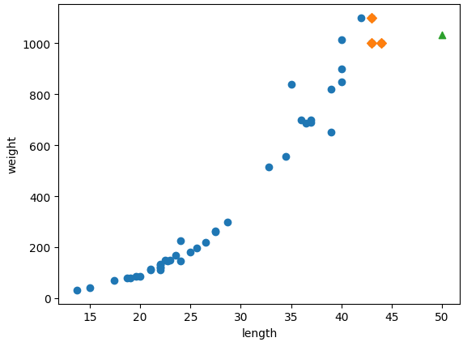<figcaption></figcaption></figure>

길이가 50cm이고 무게가 1033g인 농어는 세모로 표시되는데, 그에 가장 가까운 주변 샘플은 사각형으로 표시된다. 그래프를 잘 살펴보면 문제를 알 수 있다. 어떤 점이 문제인가? **우리는 현재 k-최근접 알고리즘으로 근접한 이웃의 데이터에 기반하여 값을 예측하고 있다. 50cm 농어에서 가장 가까운 것은 45cm 근방이기 때문에 그에 기반하여 무게를 평균해 1033이라는 무게를 도출해 낸 것** 이였다.

이웃 샘플 타겟의 평균을 한번 구해보자.

```python
# 이웃 샘플 타겟의 평균
print(np.mean(train_target[indexes]))
# 결과 
1033.33333333
print(knr.predict([[100]]))
# 결과 
1033.33333333
# 100cm 인 농어를 예측해도 똑같은 결과가 나온다.
# 이유는 k-최근접 알고리즘에 기반하여 값을 예측하기 때문에 더 큰 숫자를 넣더라고 결과는 똑같이 예측 될 것이다.
```

한번 더 그래프를 그려서 확인 해보자

```
distance, indexes = knr.kneighbors([[100]])

plt.scatter(train_input, train_target)
plt.scatter(train_input[indexes], train_target[indexes], marker="D")
plt.scatter(100,1033,marker="^")

plt.xlabel('length')
plt.ylabel('weight')
plt.show()
```

<figure>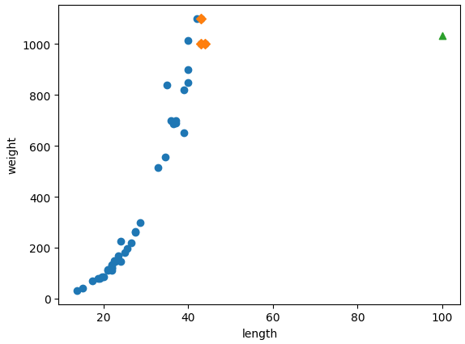<figcaption></figcaption></figure>

```python
# 학습에 사용된 농어 데이터의 최대 값이 44cm
print(np.min(train_input), np.max(train_input))
# 결과 
13.7 44.0
```

학습 데이터보다 큰 데이터를 예측 했을 때 역시 모두 같은 이웃 데이터라 결과가 똑같이 나온다.

```python
distance, indexes = knr.kneighbors([[44]])
print(np.mean(train_target[indexes]), indexes)

distance, indexes = knr.kneighbors([[50]])
print(np.mean(train_target[indexes]), indexes)

distance, indexes = knr.kneighbors([[100]])
print(np.mean(train_target[indexes]), indexes)

# 결과 
# 현재 아래 결과는 길이 별로 예측한 무게를 나타낸 것이다.
1033.3333333333333 [[34  8 14]]
1033.3333333333333 [[34  8 14]]
1033.3333333333333 [[34  8 14]]

# 길이에 따라 무게도 증가하는 그래프 추세이지만 44cm 이상은 항상 동일한 무게로 예측한다.
# k-최근접 이웃 알고리즘의 문제점
```

이런 식이면 농어가 아무리 커도 무게가 더 이상 늘어나지 않는다. 해결책으로는 어떤 것이 있을까?

### 선형회귀란?

> 선형회귀란 **데이터를 가장 잘 대변하는 최적의 선을 찾은 과정**이다.

* 특성이 많을수록 우수한 효과를 내는게 일반적이다.

사이킷런은 sklearn.linear\_model 패키지 아래에 LinearRegression 클래스로 선형 회귀 알고리즘이 구현되어 있다. 이를 이용하여 문제를 해결해 보자.

### LinearRegression를 사용해 문제를 해결해보자

```python
from sklearn.linear_model import LinearRegression

lr = LinearRegression()

lr.fit(train_input, train_target)

print(lr.predict([[50]]))

# 결과
[1241.83860323]
```

k-최근접 알고리즘으로 예측 했을 때 보다 훨씬 더 잘 예측했다. 선형회귀가 학습한 직선을 그려보고 어떻게 이런 값이 나왔는지 알아보자.

일반적으로 하나의 직선을 그리려면 기울기와 절편이 있어야 한다. y = ax + b 처럼 쓰며, 여기에서 x를 농어의 길이, y를 농어의 무게로 바꾸면 다음과 같다.

<figure>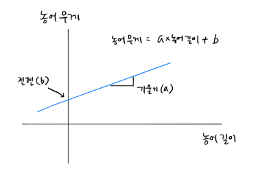<figcaption></figcaption></figure>

여기서 기울기 **a와 절편 b는 LinearRegression 클래스의 lr객체에 coef\_(기울기)와 intercept\_(절편) 속성**에 저장되어 있다.

```python
# 위 문제의 기울기와 절편
print(lr.coef_, lr.intercept_)

# 결과
[39.01714496] -709.0186449535477
```

농어의 길이 15에서 50까지 직선으로 그려보자.

```python
# 훈련 세트의 산점도
plt.scatter(train_input, train_target)
# 15에서 50까지 1차 방정식 그래프 
plt.plot([15.50, 50], [15.50*lr.coef_+lr.intercept_, 50*lr.coef_+lr.intercept_])
# 50cm 농어의 데이터 
plt.scatter(50, 1241.8, marker='^')
plt.xlabel('length')
plt.ylabel('weight')
plt.show()
```

<figure>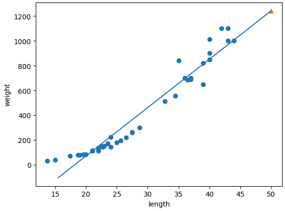<figcaption></figcaption></figure>

바로 **이 직선이 선형 회귀 알고리즘이 이 데이터셋 에서 찾은 최적의 직선이다. 길이가 50cm인 농어 또한 직선에 연장선에 존재하는 것을 확인 할 수 있다.** 이제는 훈련 세트의 범위를 벗어난 농어의 무게 또한 예측이 가능하다. 이제 **훈련 세트와 테스트 세트의 결정 계수**를 확인해 보자

```python
print(lr.score(train_input, train_target))
print(lr.score(test_input, test_target))

# 결과
0.939846333997604
0.8247503123313558
```

훈련 세트와 테스트 세트의 점수가 차이가 난다. 이 모델은 과대적합인가? 아니다 오히려 전체적으로 과소적합 되었다고 볼 수 있다. 그리고 또 다른 문제가 있다 그래프 왼쪽 아래를 다시 한번 살펴 보자.

위 그래프를 기반으로 **왼쪽 아래 부분을 보면 아주 작은 농어의 무게가 0보다 작을 확률이 생긴다. 선형 회귀 직선을 기반으로 예측할 때, 상식에서 벗어난 결과가 나올 수도 있다.**

### **다항회귀란?**

> 두 변수 간의 관계를 선형 관계를 **곡선**으로 설명하는 알고리즘 이며, 이 때 **2차 이상의 다항 함수를 사용**합니다. 다항회귀는 주로 선형 회귀 만으로 설명 하지 못할 때 사용된다.

<figure>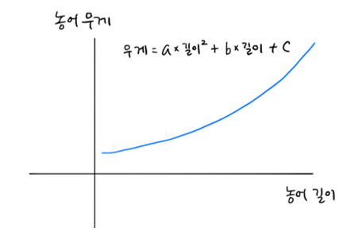<figcaption></figcaption></figure>

다항회귀를 사용해 위 모델을 수정하려면 길이를 제곱한 항이 훈련 세트에 추가 되어야 한다.

<figure>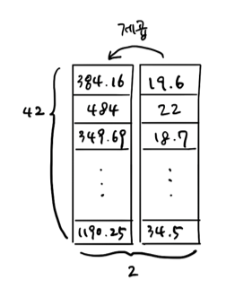<figcaption></figcaption></figure>

앞 장에서 사용한 **column\_stack() 함수**를 사용해 구현해보자

```python
train_poly = np.column_stack((train_input ** 2, train_input))
test_poly = np.column_stack((test_input ** 2, test_input))

print(train_poly.shape, test_poly.shape)

# 결과
(42, 2) (14, 2)
```

원래 **특성인 길이를 제곱하여 왼쪽 열에 추가했기 때문에 훈련 세트와 테스트 세트 모두 열이 2개로 늘어났다.** 이제 **train\_poly를 사용해 선형 회귀 모델을 다시 훈련해보자.**

```python
lr2 = LinearRegression()

lr2.fit(train_poly, train_target)

print(lr2.predict([[50**2, 50]]))

# 결과 
[1573.98423528]
```

앞 선형회귀 모델보다 더 높은 값을 예측헀다. 이번에는 이 모델의 계수와 절편을 출력해보자.

```python
print(lr2.coef_, lr2.intercept_)

# 결과 
[  1.01433211 -21.55792498] 116.0502107827827
```

결과적으로, 이 모델은 다음과 같은 그래프를 학습하였다.

<figure>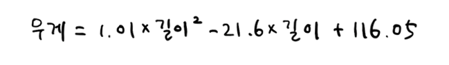<figcaption></figcaption></figure>

이제 산점도를 한번 그려보자.

```python
# 구간별 직선을 그리기 위해 15에서 49까지 정수 배열을 만든다.
point = np.arange(15, 50)
# 훈련 세트의 산점도를 그린다.
plt.scatter(train_input, train_target)
# 15에서 49까지의 2차 방정식을 그린다.
plt.plot(point, 1.01*point**2 - 21.6*point + 116.05)
# 50cm 농어 데이터
plt.scatter(50, 1574, marker='^')
plt.xlabel('length')
plt.ylabel('weight')
plt.show()
```

<figure>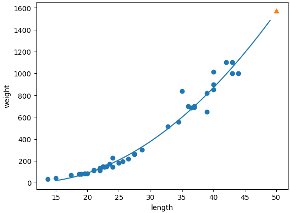<figcaption></figcaption></figure>

훨씬 더 나은 그래프가 그려졌다. 이제 마지막으로 훈련 세트와 테스트 세트의 결정계수를 확인해보자.

```python
print(lr2.score(train_poly, train_target))
print(lr2.score(test_poly, test_target))

# 결과
0.9706807451768623
0.9775935108325122
```

훈련 세트와 테스트 세트의 점수가 크게 높아진 것을 볼 수 있다. 하지만 **아직 과소 적합이 조금 남아있는 것으로 보이므로 조금 더 복잡한 모델로 만들 필요가 있어 보인다.**

## 4주차 2번째 수업

🤨 **문제에 대한 설명**

테스트 데이터와 훈련 데이터를 비교하였을 때 여전히 과소적합이 발생

😄 **사전에 알고 가면 좋은 지식**

* 다중회귀란?

> 일반적으로 다중회귀란 여러 개의 특성을 사용한 선형회귀를 다중회귀라고 한다.

<figure>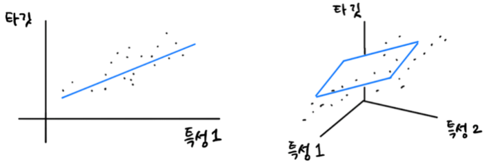<figcaption></figcaption></figure>

* 특성공학이란?

> 머신러닝 모델을 위한 데이터 테이블의 컬럼을 생성하거나 선택하는 작업을 의미한다 즉, 기존의 특성을 사용하여 새로운 특성을 뽑아내는 작업이다.

* 다양한 특성 활용 학습
* 우리 예제에서는 농어 길이, 높이, 두께 특성 사용
* 3개의 특성을 각각 제곱 하여 추가
* 각 특성을 서로 곱해서 또 다른 특성을 생성(예 : 농어길이 X 농어높이)

### 추가적인 특성을 사용해 모델을 다시 구현하자!

먼저, 데이터를 준비하자. **판다스를 사용해 인터넷에서 데이터프레임을 저장한 후 넘파이 배열로 변환하여 선형회귀 모델을 훈련해 보자.**

```python
import pandas as pd
df = pd.read_csv('https://bit.ly/perch_csv')
perch_full = df.to_numpy()
print(perch_full)

# 결과 
[[ 8.4   2.11  1.41]
 [13.7   3.53  2.  ]
 [15.    3.82  2.43]
 [16.2   4.59  2.63]
 [17.4   4.59  2.94]
 ....
```

타겟 데이터는 이전과 같은 방식으로 준비한다.

```python
import numpy as np

perch_weight = np.array([5.9, 32.0, 40.0, 51.5, 70.0, 100.0, 78.0, 80.0, 85.0, 85.0, 110.0,
       115.0, 125.0, 130.0, 120.0, 120.0, 130.0, 135.0, 110.0, 130.0,
       150.0, 145.0, 150.0, 170.0, 225.0, 145.0, 188.0, 180.0, 197.0,
       218.0, 300.0, 260.0, 265.0, 250.0, 250.0, 300.0, 320.0, 514.0,
       556.0, 840.0, 685.0, 700.0, 700.0, 690.0, 900.0, 650.0, 820.0,
       850.0, 900.0, 1015.0, 820.0, 1100.0, 1000.0, 1100.0, 1000.0,
       1000.0])
```

그 후 perch\_full과 perch\_weight를 훈련 세트와 테스트 세트로 나눈다.

```
from sklearn.model_selection import train_test_split

train_input, test_input, train_target, test_target = train_test_split(
    perch_full, perch_weight, random_state=42)

print(train_input.shape)
print(test_input.shape)
print(train_target.shape)
print(test_target.shape)

# 결과
(42, 3)
(14, 3)
(42,)
(14,)
```

이제 이 데이터를 사용해 새로운 특성을 만들어보자.

### 사이킷런 변환기

사이킷런은 특성을 만들거나 전처리하기 위한 다양한 클래스를 제공한다. **사이킷런에서는 이런 클래스를 변환기**라고 한다. 변환기 클래스에서는 fit(), transform() 메서드를 제공한다.

우리가 사용할 변환기는 **PolynomialFeatures 클래스이다. 이 클래스는 sklearn.preprocessing 패키지 안에 포함되어있다.**

간단하게 변환기 실습을 진행해보자.

```python
from sklearn.preprocessing import PolynomialFeatures

# defree=2
poly = PolynomialFeatures()
poly.fit([[2,3]])

# 1(bias), 2, 3, 2**2, 2*3, 3**2
print(poly.transform([[2,3]]))

# 결과
[[1. 2. 3. 4. 6. 9.]]
```

**PolynomialFeatures클래스는 기본적으로 각 특성 제곱값 항과 특성끼리 곱한값 항을 추가. 선형 방정식 절편 값 1 추가한다.**

```python
poly = PolynomialFeatures(include_bias=False)
poly.fit([[2,3]])
print(poly.transform([[2,3]]))
# 결과
[[2. 3. 4. 6. 9.]]
```

또한 위와 같이 **include\_bias = False 옵션**으로 절편 항을 제거 할 수 있다.

자, 이제 변환기 실습을 우리 예제에 적용해보자.

```python
poly = PolynomialFeatures(include_bias=False)
poly.fit(train_input)
train_poly = poly.transform(train_input)
print(train_poly.shape)
train_poly[:3]

# 결과
(42, 9)
array([[ 19.6   ,   5.14  ,   3.04  , 384.16  , 100.744 ,  59.584 ,
         26.4196,  15.6256,   9.2416],
       [ 22.    ,   5.88  ,   3.52  , 484.    , 129.36  ,  77.44  ,
         34.5744,  20.6976,  12.3904],
       [ 18.7   ,   5.2   ,   3.12  , 349.69  ,  97.24  ,  58.344 ,
         27.04  ,  16.224 ,   9.7344]])
         
# 결과로 보아 개별특성 제곱값 항 3개
# 개별특성 간 곱 항 3개 추가
# 총 9개 특성을 가진다.
```

**9개의 특성이 어떻게 만들어졌는지 확인하려면 get\_feature\_names\_out() 메서드**를 사용하면 된다.

```python
poly.get_feature_names_out()

# 결과
array(['x0', 'x1', 'x2', 'x0^2', 'x0 x1', 'x0 x2', 'x1^2', 'x1 x2',
       'x2^2'], dtype=object)
```

이제 테스트 세트를 변환하자.

```python
test_poly = poly.transform(test_input)
print(test_poly.shape)
test_poly[:3]

# 결과
(14, 9)
array([[  8.4   ,   2.11  ,   1.41  ,  70.56  ,  17.724 ,  11.844 ,
          4.4521,   2.9751,   1.9881],
       [ 18.    ,   5.22  ,   3.32  , 324.    ,  93.96  ,  59.76  ,
         27.2484,  17.3304,  11.0224],
       [ 27.5   ,   7.28  ,   4.57  , 756.25  , 200.2   , 125.675 ,
         52.9984,  33.2696,  20.8849]])
```

그 후 이어서 변환된 특성을 사용해 다중 회귀 모델을 만들어보자.

```python
from sklearn.linear_model import LinearRegression

lr = LinearRegression()
lr.fit(train_poly, train_target)
print(lr.score(train_poly, train_target))

# 결과
0.9903183436982125
```

이어서 테스트 세트에 대한 점수도 확인해보자.

```python
print(lr.score(test_poly, test_target))

# 결과
0.9714559911594111
```

테스트 세트의 점수가 높어지지 않았지만 농어의 길이만을 사용했을 때 있던 **과소적합 문제는 해결** 되었다. 특성을 더 많이 추가하면 어떨까? 이 책에서는 5제곱 까지 특성을 만들어 출력해 보았다.

```python
poly = PolynomialFeatures(degree=5, include_bias=False)
poly.fit(train_input)
train_poly = poly.transform(train_input)
test_poly = poly.transform(test_input)
print(train_poly.shape, test_poly.shape)
# train_poly[:1]

# 결과 
(42, 55) (14, 55)
```

여기서 **train\_poly 배열의 열의 개수가 특성의 개수이므로, 만들어진 특성의 개수가 55개**이다. 이제 모델을 다시 훈련시켜보자.

```python
lr.fit(train_poly, train_target)
print(lr.score(train_poly, train_target))
print(lr.score(test_poly, test_target))

# 결과 
0.9999999999996433
-144.40579436844948
```

훈련 세트는 거의 완벽에 가까운 점수이다. 하지만 테스트 세트는 아주 큰 음수가 출력 되었다. 어떻게 된 것일까? **특성의 개수를 크게 늘리면 선형 모델은 강력해지지만 이런 모델은 훈련 세트에 너무 과대 적합되므로 테스트 세트에서는 형편없는 점수를 만든다.**

원인을 알았으므로 문제를 해결하기 위해 특성을 다시 줄여보자.

### 규제

> 규제란 **머신러닝 모델이 훈련 세트를 너무 과도하게 학습하지 못하도록 훼방하는 것을 의미**한다. 즉, **모델이 훈련 세트에 과대적합되지 않도록 만드는 것**이다.

* 선형회귀 모델의 경우 특성에 곱해지는 계수(또는 기울기)의 크기를 작게 만드는 것

<figure><figcaption></figcaption></figure>

이번에는 사이킷런에서 제공하는 **StandardScaler 클래스**를 사용하여서 문제를 해결 해보자. 규제를 적용하기 전 특성 스케일을 정규화하자.

```python
from sklearn.preprocessing import StandardScaler

ss = StandardScaler()
ss.fit(train_poly)
train_scaled = ss.transform(train_poly)
test_scaled = ss.transform(test_poly)

print(train_poly[:1])
print(train_scaled[:1])

# 결과
# 55개의 특성 값을 평균과 표준편차를 이용하여 정규화
[[1.96000000e+01 5.14000000e+00 3.04000000e+00 3.84160000e+02
  1.00744000e+02 5.95840000e+01 2.64196000e+01 1.56256000e+01
  9.24160000e+00 7.52953600e+03 1.97458240e+03 1.16784640e+03
  5.17824160e+02 3.06261760e+02 1.81135360e+02 1.35796744e+02
  8.03155840e+01 4.75018240e+01 2.80944640e+01 1.47578906e+05
  3.87018150e+04 2.28897894e+04 1.01493535e+04 6.00273050e+03
  3.55025306e+03 2.66161618e+03 1.57418545e+03 9.31035750e+02
  5.50651494e+02 6.97995264e+02 4.12822102e+02 2.44159375e+02
  1.44405545e+02 8.54071706e+01 2.89254655e+06 7.58555575e+05
  4.48639873e+05 1.98927329e+05 1.17653518e+05 6.95849599e+04
  5.21676772e+04 3.08540347e+04 1.82483007e+04 1.07927693e+04
  1.36807072e+04 8.09131319e+03 4.78552376e+03 2.83034868e+03
  1.67398054e+03 3.58769566e+03 2.12190560e+03 1.25497919e+03
  7.42244501e+02 4.38992857e+02 2.59637799e+02]]
[[-1.01339619 -1.01007487 -1.01952321 -0.9549757  -0.9496784  -0.95745849
  -0.93942079 -0.94342509 -0.94100107 -0.88757122 -0.88399964 -0.89100599
  -0.87785292 -0.88311456 -0.88430909 -0.8691891  -0.87259422 -0.87147928
  -0.86603533 -0.82233944 -0.82171953 -0.8280588  -0.81928269 -0.82512549
  -0.8278857  -0.81486775 -0.82006923 -0.82177279 -0.82010716 -0.80835934
  -0.81274154 -0.81321125 -0.8098514  -0.80275974 -0.7637909  -0.76597773
  -0.77150714 -0.76668667 -0.77246614 -0.77577893 -0.76571689 -0.77162398
  -0.77472752 -0.77517751 -0.76290623 -0.76877311 -0.77148634 -0.77113383
  -0.767785   -0.75814062 -0.76376113 -0.76586966 -0.76449499 -0.75967179
  -0.75143746]]
```

### 릿지와 라쏘

* 릿지와 라쏘는 선형회귀 모델에 규제를 추가한 것이다.
* 두 모델은 규제를 가하는 방법에서 차이를 보인다.
* 일반적으로는 릿지를 조금 더 선호한다. (두 알고리즘은 **둘 다 계수의 크기를 줄이지만 라쏘는 아예 0으로 만들 수도 있기 때문이다**.)
* 릿지와 라쏘는 모두 sklearn.linear\_model 패키지 안에 존재한다.

릿지의 경우

* 계수를 제곱한 값을 기준으로 규제를 적용
* L2 규제

라쏘의 경우

* 계수의 절댓값을 기준으로 규제를 적용한다.
* L1규제

앞서 준비한 **train\_scaled 데이터로 릿지 모델을 훈련해보자.**

```python
from sklearn.linear_model import Ridge

print(train_scaled.shape, test_scaled.shape)

ridge = Ridge()
ridge.fit(train_scaled, train_target)
print(ridge.score(train_scaled, train_target))

# 결과
(42, 55) (14, 55)
0.9896101671037343
```

선형 회귀에서는 거의 완벽에 가까웠던 점수가 조금은 낮아졌다. 테스트 세트의 점수를 확인해보자.

```python
print(ridge.score(test_scaled, test_target))

# 결과
0.9790693977615387
```

테스트 세트의 점수가 정상으로 돌아왔다. 추가적**으로 릿지와 라쏘 모델을 사용할 때 규제의 양을 임의로 조절할 수도 있다. 모델 객체를 만들 때 alpha 매개변수로 규제의 강도를 조절한다. alpha 값이 크면 규제의 강도가 세지므로 계수 값을 줄이고 , 조금 더 과소적합 되도록 유도한다. alpha 값이 작으면 계수를 줄이는 역할이 줄어들고 선형 회귀 모델과 유사해지므로 과대적합될 가능성이 크다.**

**적절한 alpha 값을 찾는 한 가지 방법은 alpha 값에 대한 R^2(결정계수) 값의 그래프를 그려 보는 것**이다. **훈련 세트와 테스트 세트의 값이 가장 가까운 곳이 최적의 alpha값**이 된다.

```python
import matplotlib.pyplot as plt

train_score = []
test_score = []

alpha_list = [0.001, 0.01, 0.1, 1, 10, 100]
for alpha in alpha_list:
    ridge = Ridge(alpha=alpha)
    ridge.fit(train_scaled, train_target)
    train_score.append(ridge.score(train_scaled, train_target))
    test_score.append(ridge.score(test_scaled, test_target))

plt.plot(np.log10(alpha_list), train_score, label='Train Score')
plt.plot(np.log10(alpha_list), test_score, label='Test Score')
plt.xlabel('log10(alpha)')
plt.ylabel('R^2')
plt.legend()
plt.show()
```

<figure>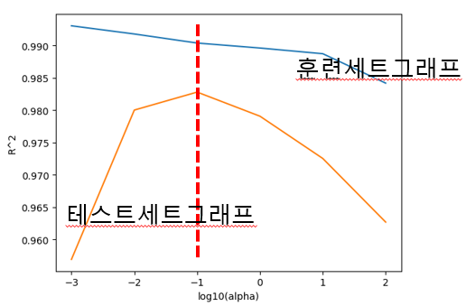<figcaption></figcaption></figure>

**이 그래프에서는 적절한 alpha 값이 -1 즉, 10에 -1승 0.1이 된다.**

이제 alpha값을 0.1로 넣고 훈련해보자.

```python
ridge = Ridge(alpha=0.1)
ridge.fit(train_scaled, train_target)

print(ridge.score(train_scaled, train_target))
print(ridge.score(test_scaled, test_target))

# 결과
0.9903815817570367
0.9827976465386928
```

이제 라쏘 모델로 훈련해보자. 라쏘 모델을 쓰는법은 그냥 Ridge 클래스를 Lasso 클래스로 바꾸는 것이 전부이다.

```python
from sklearn.linear_model import Lasso
lasso = Lasso()
lasso.fit(train_scaled, train_target)
print(lasso.score(train_scaled, train_target))

# 결과
0.989789897208096
```

라쏘 또한 과대적합을 잘 억제한 모습을 보여준다. 테스트 세트 점수도 확인해보자.

```python
print(lasso.score(test_scaled, test_target))

# 결과
0.9800593698421883
```

테스트 세트의 점수도 릿지만큼 아주 좋다. 라쏘 모델도 적절한 alpha 값을 찾아 훈련해보자.

```python
import matplotlib.pyplot as plt

train_score2 = []
test_score2 = []

alpha_list = [0.001, 0.01, 0.1, 1, 10, 100]
for alpha in alpha_list:
    lasso = Lasso(alpha=alpha, max_iter=10000)
    lasso.fit(train_scaled, train_target)
    train_score2.append(lasso.score(train_scaled, train_target))
    test_score2.append(lasso.score(test_scaled, test_target))

plt.plot(np.log10(alpha_list), train_score2, label='Train Score')
plt.plot(np.log10(alpha_list), test_score2, label='Test Score')
plt.xlabel('log10(alpha)')
plt.ylabel('R^2')
plt.legend()
plt.show()
```

<figure>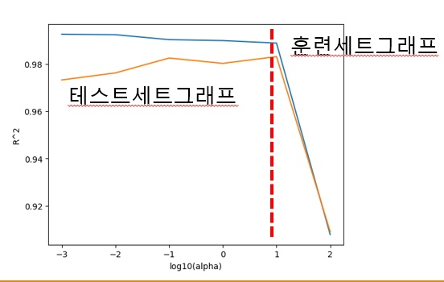<figcaption></figcaption></figure>

**두 그래프가 가장 가깝고,테스트 세트 점수가 가장 높은 곳 이 그래프에서 적절한 alpha 값 : 1, 즉, 10에 1승 = 10 이다.**

이제 이 값으로 모델을 훈련 해보자.

```python
lasso = Lasso(alpha=10)
lasso.fit(train_scaled, train_target)

print(lasso.score(train_scaled, train_target))
print(lasso.score(test_scaled, test_target))

# 결과
0.9888067471131867
0.9824470598706695
```

결과적으로 모델이 잘 훈련된 것 같다.

마지막으로 **라쏘 모델은 계수 값을 아예 0으로 만들 수 있다고 언급**했었다. 라쏘 모델의 계수는 coef\_ 속성에 저장되어 있다. 이 중 0인 것을 잠시 헤아려 보자.

```python
print(np.sum(lasso.coef_ == 0))

# 결과 
40
```

55개의 특성중 40개가 0이다. **이 말은 즉슨, 15개의 특성만 사용 했다는 것이다. 이런 특징 떄문에 라쏘 모델은 유용한 특성을 골라내는 용도로 사용한다.**

```python
print(lasso.coef_, lasso.intercept_)

# 결과
[ 0.          0.          0.         12.14852453 55.44856399 42.23100799
  0.          0.         13.70596191  0.         43.2185952   5.7033775
 47.46254536  7.42309425 11.85823365  0.          0.         13.53038193
 21.22111356  0.          0.          0.          0.          0.
  0.         18.66993032  0.          0.          0.         15.81041778
  0.          0.          0.          0.          0.          0.
  0.          0.          0.          0.          0.          0.
  0.          0.         18.14672268  0.          0.          0.
  0.         15.51272953  0.          0.          0.          0.
  0.        ] 400.8333333333333
```

마지막으로 신규 농어의 특성을 이용한 무게 예측 실습

```python
new_fish = np.array([[44., 12.49, 7.6]])
print(new_fish)

new_fish_poly = poly.transform(new_fish)
new_fish_scaled = ss.transform(new_fish_poly)
print(new_fish_scaled.shape)
# 평균인 0에서 떨어진 표준편차의 값
print(new_fish_scaled)

print(ridge.predict(new_fish_scaled))
print(lasso.predict(new_fish_scaled))

# 결과 
[[44.   12.49  7.6 ]]
(1, 55)
[[1.78210426 1.54784238 1.59159052 2.00213235 1.84083371 1.8909844
  1.67749082 1.72136012 1.73751044 2.21667807 2.07967063 2.13832699
  1.93724544 1.99057995 2.02250988 1.79151358 1.8388309  1.86510712
  1.87017916 2.4256248  2.30167099 2.36893804 2.17068468 2.23426274
  2.27919017 2.03397399 2.09297248 2.13311848 2.1539982  1.89294536
  1.9465971  1.98129197 1.99650826 1.99214678 2.62713913 2.51236267
  2.58740194 2.38948507 2.46257683 2.51859    2.25940693 2.32955303
  2.3822465  2.41711267 2.12322455 2.18944335 2.23789418 2.26798098
  2.27936649 1.98222128 2.0436009  2.08698315 2.11159918 2.11702662
  2.10318333]]
[1082.38188249]
[1065.78722382]
```
