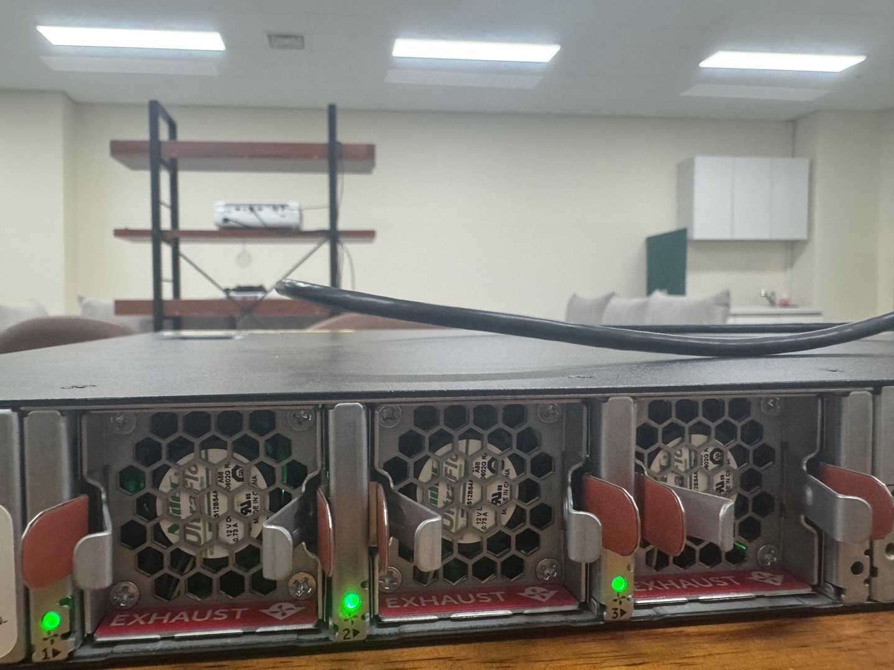

# Check Dell Switch Equipment

본 프로젝트는 S 3048-ON 모델을 기준으로 작성한 문서이다.


## 정비 목록

* 육안점검
  * LED 상태
  * Cable 연결 상태
* 내부점검
  * Console 접속 여부
  * CPU 상태
  * Memory 상태
  * 라우팅 상태 확인
  * 설정 Backup
  * 로그상태


## 육안 점검

### LED 상태 확인

<figure><figcaption></figcaption></figure>

* 육안으로 보고 스위치의 LED 상태 확인한다. (초록불이면 정상)

<figure><figcaption><p>FAN</p></figcaption></figure>

* 스위치의 FAN상태 확인 초록불이 잘 들어오면 정상 작동중이다.


## 내부 점검

### Consoel 접속 여부

<figure><figcaption></figcaption></figure>

<figure><figcaption></figcaption></figure>

* 콘솔 포트에 연결 후 접속이 되는지 확인한다.

### CPU 상태 확인

* 명령어를 통해 CPU 상태 확인한다.

```
show processes cpu
```

<figure><figcaption></figcaption></figure>

* 결과값은 1Min 기준으로 작성한다.


### Memory 상태확인

* 명령어를 통해 Memory 상태 확인한다.

```
show processes memory / show inventory
```

<figure><figcaption></figcaption></figure>

* 사용중인 메모리 / 토탈 메모리 \* 100 = 사용률
* 사용률 : 95.52191624766642%
* 결과값은 96%로 작성한다

### 라우팅 상태 확인

* 명령어를 통해 라우팅 상태 확인한다.

```
show ip route
```

<figure><figcaption></figcaption></figure>

* 현재는 테스트 장비라 라우팅이 없다.


### 설정 Backup

* 명령어를 통해 백업 상태 확인한다.

```
show running-configuration
```

<figure><figcaption></figcaption></figure>

* putty를 통해 자동 로그 저장을 하고 따로 백업을 한다.


### 로그 상태 확인

* 명령어를 통해 백업 상태 확인한다.

```
show logging log-file
```

<figure><figcaption></figcaption></figure>

<figure><figcaption></figcaption></figure>

* 로깅상태를 확인하고 정상 로그인지 확인한다.

