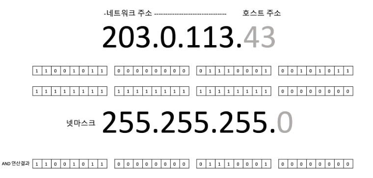

# 네트워크란

> ### 네트워크

### **네트워크란 무엇인가?**

네트워크는 Net + Work 의 합성어로써 컴퓨터들이 통신 기술을 이용하여 연결되어 서로 통신할 수 있는 형태를 말한다. 이는 두 대 이상의 컴퓨터를 연결하고 정보를 공유하는 것을 의미한다. IEEE(Institute of Electrical and Electronics Engineers:국제 전기 전자 공학회) 에서는 네트워크 "독립적인 장치가 빠른 속도의 물리적 통신 채널을 통해 직접 통신할 수 있는 데이터 통신 체계"로 정의하고 있다.

### **네트워크의 장단점**

**장점**

1. **파일 공유**
   * 다른 네트워크에 있는 컴퓨터의 파일에 접근할 수 있어서 정보를 쉽게 공유할 수 있다.
2. **미디어 스트리밍**
   * 네트워크를 통해 사진, 음악, 비디오 등의 디지털 미디어를 스트리밍하여 재생할 수 있다.
3. **인터넷 연결 공유**
   * 광대역 인터넷 연결을 공유하여 각 PC에 별도의 인터넷 계정을 구입할 필요가 없다.
4. **프린터 공유**
   * 한 대의 프린터를 네트워크에 연결하여 모든 사용자가 공유할 수 있어 효율적이다.
5. **네트워크 게임**
   * 인터넷을 통해 다른 사람들과 PC나 게임 콘솔을 통해 네트워크 게임을 즐길 수 있다.
6. **무선 네트워크의 편의성**
   * 유선으로 작업해야 하는 제약 조건에서 벗어나 무선 네트워크를 이용하여 자유롭게 웹 작업을 할 수 있다.

**단점**

네트워크가 보급되면서 보안상의 문제점이 생겼습니다. 바이러스나 악성 코드, 원치 않는 정보를 받는 등의 위협이 있으며 해킹으로 인한 개인 정보 유출도 발생할 수 있습니다. 무엇보다 데이터 변조가 가능하다고 볼 수 있다.

### 네트워크의 종류

* PAN (Personal Area Network): 가장 작은 규모의 네트워크로, 개인 장치들이 서로 통신하는 네트워크를 의미한다.
* LAN (Local Area Network): 근거리 영역 네트워크로, 한정된 지역 내에서 컴퓨터와 장치들이 연결되어 있는 네트워크이다.
* MAN (Metropolitan Area Network): 대도시 영역 네트워크로, 도시나 대도시 지역을 연결하는 네트워크이다.
* WAN (Wide Area Network): 광대역 네트워크로, 지리적으로 넓은 영역을 커버하는 네트워크를 의미한다.
* VAN (Value Added Network): 부가가치 통신망으로, 다양한 정보 서비스가 부가된 네트워크를 나타낸다.
* ISDN (Integrated Services Digital Network): 종합정보 통신망으로, 다양한 통신 서비스를 종합하여 제공하는 디지털 통신망이다.

추가적으로 WLAN, SAN, CAN, GAN, VPN, Intranet, Extranet 등의 네트워크도 있다.

### 네트워크의 회선 구성 방식

회선 구성 방식은 컴퓨터와 여러 대의 단말기를 연결하는 방식을 말한다.

* **포인트 투 포인트 방식**: 중앙 컴퓨터와 단말기를 일대일로 연결하여 데이터 전송이 가능한 방식이다.
* **멀티 드롭 방식**: 다수의 단말기를 한 개의 통신 회선에 연결하여 사용하는 방식으로, 멀티 포인트 방식이라고도 한다.
* **회선 다중 방식**: 여러 대의 단말기를 다중화 장치를 통해 중앙 컴퓨터와 연결하여 사용하는 방식으로, 다중화 방식이라고도 한다.

### 네트워크의 데이터 교환 방식

* **회선 교환 방식:** 통신을 원하는 두 지점을 교환기를 이용하여 물리적으로 접속시키는 방법을 말한다. 이 방식은 음성 전화망에서 사용된다.
* **공간 분할 교환 방식:** 기계식 접점과 전자교환기의 전자식 접점 등을 이용하여 교환을 수행하는 방식으로, 음성 전화용 교환기가 이에 속한다.
* **시분할 교환 방식:** 전자부품이 갖는 고속성과 디지털 교환 기술을 이용하여 다수의 디지털 신호를 시분할적으로 동작시켜 다중화하는 방식을 말한다.

> ### 프로토콜(Protocol)

### 프로토콜

**프로토콜 이란?**

* 통신 프로토콜 또는 통신 규약은 컴퓨터나 원거리 통신 장비 사이에서 메시지를 주고 받는 양식과 규칙의 체계이다, 즉 통신 규약 및 약속이다.

**프로토콜의 기본 요소**

* **구문(Syntax)** : 전송하고자 하는 **데이터의 형식(Format)**, 부호화(Coding), **신호 레벨(Signal Level)** 등의 규정
* **의미(Semantics)** : 두 기기 간의 효율적이고 정확한 정보 전송을 위한 협조 사항과 오류 관리를 위한 제어 정보를 규정
* **시간(Timing)** : 두 기기 간의 통신 속도, 메시지의 순서 제어 등을 규정

**프로토콜 종류**

|         계층        |                  프로토콜                  |
| :---------------: | :------------------------------------: |
|  응용(Application)  |         HTTP, SMTP, FTP, Telnet        |
|  표현(Presentation) |         ASCII, MPEG, JPEG, MIDI        |
|    세션(Session)    |        NetBIOS, SAP, SDP, NWLink       |
|   전송(Transport)   |              TCP, UDP, SPX             |
|   네트워크(Network)   |                 IP, IPX                |
| 데이터 링크(Data Link) | Ethernet, Token Ring, FDDI, Apple Talk |
|    물리(Physical)   |                   없음                   |

**프로토콜의 기능**

* **단편화(Fragmentation)와 재합성(Assembly)** 단편화 : 송신 측에서는 긴 데이터 블록을 손쉽게 전송할 수 있도록 크기가 똑같은 작은 블록으로 나누어 전송한다. 재합성 : 수신 측에서 쪼개진 작은 데이터 블록을 재합성하여 원래의 메시지로 복원하는 기능이다.
* **캡슐화(Encapsulation)** 각 프로토콜에 적합한 데이터 블록을 만들려고 데이터에 정보를 추가하는 것이다. 플래그, 주소, 제어 정보, 오류 검출 부호 등을 부착하는 기능이다.
* **연결 제어(Connection Control)** 비연결 데이터 전송(데이터그램)과 연결 위주 데이터 전송(가상회선)을 위한 통신로를 개설·유지·종결하는 기능이다.
* **흐름 제어(Flow Control)** 데이터양이나 통신속도 등이 수신 측의 처리 능력을 초과하지 않도록 조정하는 기능이다.
* **오류 제어(Error Control)** 데이터 전송 중 발생할 수 있는 오류나 착오 등을 검출하고 정정하는 기능이다.
* **순서 결정(Sequencing)** 연결 위주의 데이터를 전송할 때 송신 측이 보내는 데이터 단위 순서대로 수신 측에 전달하는 기능이다.
* **주소 설정(Addressing)** 발생지, 목적지 등의 주소를 명기하여 데이터를 정확하게 전달하는 기능이다.
* **동기화(Synchronization)** 두 통신 객체의 상태(시작, 종류, 검사 등)를 일치시키는 기능이다.
* **다중화(Multiplexing)** 하나의 통신로를 여러 개로 나누거나 회선 여러 개를 하나의 통신로로 변환시켜 다수의 가입자가 동시에 사할 수 있도록 하는 기능이다.
* **전송 서비스(Transmission Service)** 통신 객체를 사용하기 쉽도록 별도로 추가 서비스(패리티 검사, 보안도, 서비스 등급, 우선순위 등)를 제공하는 기능이다.

### OSI 참조 모델

1. **OSI(Open System Interconnection) 참조 모델의 개요**
   * 다른 시스템 간의 원할한 통신을 위해 ISO(국제표준화기구)에서 제안한 통신 규약(Protocol)이다.
   * 개방형 시스템(Open System) 간의 데이터 통신 시 필요한 장비 및 처리 방법 등을 7단계로 표준화하여 규정했다.
   * OSI 7계층은 1~~3 계층을 하위 계층, 4~~7 계층을 상위 계층이라고 한다.
     * 하위 계층 : 물리 계층 -> 데이터 링크 계층 -> 네트워크 계층
     * 상위 계층 : 전송 계층 -> 세션 계층 -> 표현 계층 -> 응용 계층
2. **물리 계층(Physical Layer)**
   * 전송에 필요한 두 장치 간의 실제 접속과 절단 등 기계적, 전기적, 기능적, 절파적 특성에 대한 규칙을 정의한다.
   * 물리적 전송 매체와 전송 신호 방식을 정의하며, RS-232C, X.21 등의 표준이 있다.
3. **데이터 링크 계층(Data Link Layer)**
   * 데이터 링크 계층은 두 개의 인접한 개방 시스템들 간에 신뢰성 있고 효율적인 정보 전송을 할 수 있도록 시스템 간 연결 설정과 유지 및 종료를 담당한다.
     * 송신 측과 수신 측의 속도 차이를 해결하기 위한 흐름 제어 기능을 한다.
     * 오류의 검출과 회복을 위한 오류 제어 기능을 한다.
     * 프레임의 순서적 전송을 위한 순서 제어 기능을 한다.
     * HDLC, LAPB, LLC, MAC, LAPD, PPP 등의 표준이 있다.
4. **네트워크 계층(Network Layer, 망 계층)**
   * 개방 시스템들 간의 네트워크 연결을 관리하는 기능과 데이터의 교환 및 중계 기능을 한다.
     * 경로 설정(Routing), 데이터 교환 및 중계, 트래픽 제어, 패킷 정보 전송을 수행한다.
     * X.25, IP 등의 표준이 있다.
5. **전송 계층(Transport Layer)**
   * 전송 계층은 논리적 안정과 균일한 데이터 전송 서비스를 제공함으로써 종단 시스템 간에 투명한 데이터 전송을 가능하게 한다.
     * 종단 시스템(End-to-End) 간의 전송 연결 설정, 데이터 전송, 연결 해제 기능을 한다.
     * 주소 설정, 다중화(분할 및 재조립), 오류 제어, 흐름 제어를 수행한다.
     * TCP, UDP 등의 표준이 있다.
6. **세션 계층(Session Layer)**
   * 세션 계층은 송 · 수신 측 간의 관련성을 유지하고 대화 제어를 담당한다.
     * 대화(회화) 구성 및 동기 제어, 데이터 교환 관리 기능을 한다.
     * 송 · 수신 측 간의 데이터 전송, 연결 해제, 동기 처리 등의 대화를 관리하기 위해 토큰이 사용된다.
7. **표현 계층(Presentation Layer)**
   * 표현 계층은 응용 계층으로부터 받은 데이터를 세션 계층에 보내기 전에 통신에 적당한 형태로 변환하고, 세션 계층에서 받은 데이터는 응용 계층에 맞게 변환하는 기능을 한다.
     * 코드 변환, 데이터 암호화, 데이터 압축, 구문 검색, 정보 형식(포맷) 변환, 문맥 관리 기능을 한다.
8. **응용 계층(Application Layer)**
   * 응용 계층은 사용자(응용 프로그램)가 OSI 환경에 접근할 수 있도록 서비스를 제공한다.
     * 응용 프로세스 간의 정보 교환, 전자 사서함, 파일 전송, 가상 터미널 등의 서비스를 제공한다.

### TCP/IP

**TCP/IP(Transmission Control Protocol/Internet Protocol)**

* 인터넷에 연결된 서로 다른 기종의 컴퓨터들 간에 데이터를 주고받을 수 있도록 하는 표준 프로토콜이다.
* TCP/IP는 TCP 프로토콜과 IP 프로토콜이 결합된 것을 의미한다.

| TCP(Transmission Control Protocol) |                     
OSI 7계층의 전송 계층에 해당하고 신뢰성 있는 연결형 서비스를 제공, 패킷의 다중화, 순서 제어, 오류 제어, 흐름 제어 기능을 제공한다.
                     |
| :--------------------------------: | :-------------------------------------------------------------------------------------------------------------------------------: |
|      **IP(Internet Protocol)**     | 
<strong>OSI 7계층의 네트워크 계층에 해당하고 데이터그램을 기반으로 하는 비연결형 서비스를 제공,</strong> <strong>패킷의 분해/조립, 주소 지정, 경로 선택 기능을 제공한다.</strong>
 |

**TCP/IP 계층 구조**

* 응용 계층 : 응용 프로그램 간의 데이터 송 · 수신 제공(TELNET, FTP, SMTP, SNMP, E-MAIL 등)
* 전송 계층 : 호스트들 간의 통신 제공(TCP, UDP)
* 인터넷 계층 : 데이터 전송을 위한 주소 지정, 경로 배정 제공(IP, ICMP, IGMP, ARP, RARP 등)
* 네트워크 액세스 계층 : 실제 데이터(프레임)을 송 · 수신하는 역할(Ethernet, IEEE 802, HDLC, X.25, RS-232C 등)

**주요 프로토콜**

|                    프로토콜                    | 설명                                                                                             |
| :----------------------------------------: | ---------------------------------------------------------------------------------------------- |
|         FTP(File Transfer Protocol)        | 파일 전송 프로토콜                                                                                     |
|     SMTP(Simple Mail Transfer Protocol)    | 전자 우편을 전송하기 위한 프로토콜                                                                            |
|                   TELNET                   | 가상 터미널 프로토콜                                                                                    |
|  SNMP(Simple Network Management Protocol)  | 간이 망 관리 프로토콜                                                                                   |
|   ICMP(Internet Control Message Protocol)  | 인터넷 제어 메시지 프로토콜이라 하며, IP와 조합하여 통신중에 발생하는 오류의 처리와 전송 경로 변경 등을 위한 제어 메시지를 관리하는 역할을 한다.           |
|         UDP(User Datagram Protocol)        | 
- 데이터 전송 전에 연결을 설정하지 않는 비연결형 서비스를 한다. - 실시간 전송에 유리하며, 신뢰성보다는 속도가 중요시되는 네트워크 에서 사용된다.
 |
|      ARP(Address Resolution Protocol)      | 주소 분석 프로토콜이라 하며, 호스트의 IP 주소를 호스트와 연결된 네트워크 접속장치의 물리적 주소(MAC Address)로 바꾼다.                     |
| RARP(Reverse Address Resoluti]on Protocol) | ARP와 반대로 물리적 주소를 IP 주소로 변환하는 기능을 한다.                                                           |

### 넷마스크(Netmask), 서브넷 마스크(subnet mask)

**IPv4 주소란?**

* 인터넷 프로토콜 버전 4에서 사용되는 주소 체계로, 네트워크에 있는 모든 컴퓨터 또는 기기가 인터넷에 연결될 때 고유하게 할당되는 식별자이다.
* 32비트로 구성되어 있으며, 보통 x.x.x.x 형태의 4개 숫자로 표기되고 각 숫자는 0\~255 사이의 값을 지닌다.

**넷마스크**

* 네트워크 주소 부분의 비트를 1로 치환한 것이 넷마스크이다.
* IP 주소와 넷마스크를 AND연산을 하면 네트워크 조소를 얻을수 있다.

<figure><figcaption></figcaption></figure>

**서브넷 마스크**

* 서브넷 마스크는 IP 주소를 서브넷으로 분할하는 데 사용되는 32비트 숫자이다.
* IP 주소의 일부이며 네트워크 부분과 호스트 부분을 나누는 데 도움이 된다.
* 별개의 서브넷 마스크를 생성하지 않아도 기본적으로 적용되어 있는 서브넷 마스크 클래스 체계에 의해 기본적으로 네트워크를 나누기 위한 개념이다.

**서브넷 네트워크**

* 기본 서브넷 마스크로 쪼개진 네트워크 주소

<figure><figcaption></figcaption></figure>

* 클래스 A를 예로 들어보면 클래스 A의 IP가 116.81.97.8일 경우 클래스 A의 서브넷 마스크는 255.0.0.0 이다. 이것을 이진수로 변환해서 AND 조건을 수행했을 시 나오는 것은 166.0.0.0 이다. 이 부분이 클래스 A의 Network ID가 되고, 나머지는 Host를 식별하는 Host ID 부분이 된다.&#x20;
* ex ) 116.81.97.8 => 01110100.01010001.01100001.00001000&#x20;
* 255.0. 0. 0 => 11111111.00000000.00000000.00000000

**출처**

* [hi, daehyunlee](https://velog.io/@hidaehyunlee/%EB%84%B7%EB%A7%88%EC%8A%A4%ED%81%ACNetmask%EC%99%80-%EC%84%9C%EB%B8%8C%EB%84%B7%EB%A7%88%EC%8A%A4%ED%81%ACSubnetmask)
* [컴공생의 다이어리](https://computer-science-student.tistory.com/377)
