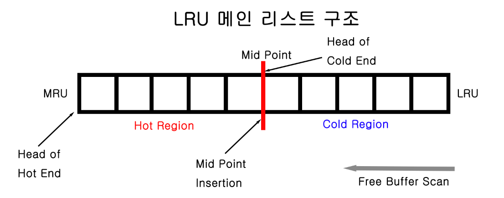
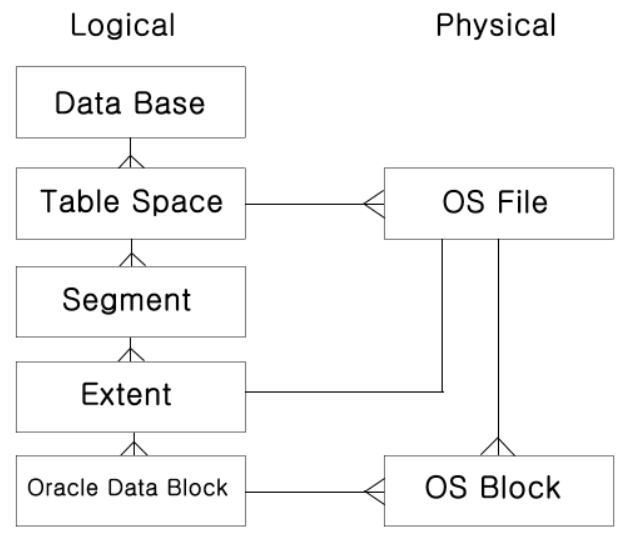

# 오라클 구조

### Oracle Server

* 오라클 서버는 오라클이 개발하고 유지하는 데이터베이스 관리 시스템(DBMS)으로, 기업의 데이터를 효율적으로 저장, 관리, 검색, 분석 및 처리하기 위해 사용됩니다. 이 소프트웨어는 오라클 엔진과 데이터베이스로 구성되다
* 서버는 데이터베이스를 호스팅하고 관리하는 컴퓨터를 가리키고, 클라이언트는 서버에 접속하여 데이터베이스를 활용하는 도구이다.

### 주요 특징

1. **높은 성능과 확장성**: 오라클은 대량 데이터 및 다중 사용자 환경에서 우수한 성능과 확장성을 제공한다.
2. **고도로 안정적인 데이터 관리**: 오라클은 트랜잭션 처리, 데이터 무결성, 복구, 백업 등으로 안정적인 데이터 관리를 지원한다.
3. **고급 보안 기능**: 오라클은 데이터 기밀성, 무결성, 가용성을 보장하기 위한 다양한 보안 기능을 제공한다.
4. **다양한 운영 체제 지원**: 오라클은 Linux, Windows, UNIX 등 다양한 운영 체제에서 실행될 수 있다.
5. **고급 기능 및 옵션**: 오라클은 데이터 마이닝, OLAP, 데이터 웨어하우징, 분석, 비즈니스 인텔리전스 도구 등 다양한 기능과 옵션을 제공한다.

### LRU

**LRU 알고리즘**

* 오라클은 메모리에서의 Queuing 알고리즘으로써 LRU(Least Recently Used) 리스트를 사용한다.
* 사용빈도가 높은 버퍼일수록 더 오래 데이터베이스 버퍼 캐시 내에 존재할 수 있도록 관리하는 알고리즘이다.
* 자주 사용하지 않는 버퍼들의 경우에는 임의의 시점에서 데이터 버퍼 캐시 밖으로 나가야 한다.

**LRU 리스트** : 더티 버퍼를 제외한 모든 버퍼를 관리한다.

**Dirty 리스트** : 같은 데이터 블록에 대한 데이터베이스 버퍼 캐시에 저장된 버퍼 이미지와 데이터 파일에 저장되어 있는 물리적인 블록 이미지가 서로 다른 버퍼들을 관리하는 리스트 이다.

<figure><figcaption></figcaption></figure>

**LRU 메인 리스트의 구조**

* LRU 리스트의 메인 리스트는 크게 핫 영역과 콜드 영역으로 나누어진다.
* 자주 사용되는 블록들은 핫 영역에서 머물 가능성이 크고 자주 사용되지 않는 블록들은 콜드 영역에 머물 가능성이 크다.

### 메모리 영역(SGA)

* SGA는 System Global Area의 약자로, 사용자들이 오라클에서 데이터를 읽거나 변경하기 위해 사용하는 공용 메모리 영역을 의미한다.
* 오라클 데이터베이스가 임의의 서버에서 STARTUP 되어질 때 생성되어 SHUTDOWN 되어질 때까지 유지되는 메모리이다.

<figure><figcaption></figcaption></figure>

#### Data buffer cache

* 데이터의 조회와 변경 등의 작업이 발생하는 공간이다.
* 사용자가 찾거나 변경하는 데이터는 반드시 data buffer cache에 존재해야 한다.
  * 만약 데이터가 존재하지 않는다면 디스크에서 읽어와야 한다.
* 자주 사용되는 데이터나 필요한 데이터 등을 미리 data buffer cache에 올려놓고 사용함으로써 성능을 향상시킨다.

#### Redo log buffer

* 트랜잭션에 대한 변경 사항이 발생할 때마다 Redo log buffer에 변경 사항이 기록된다
* 시스템 장애가 발생하면 Redo log buffer에 기록된 변경 사항을 사용하여 DB를 이전 상태로 복수할 수 있다.
* Rodo log buffer에 기록된 변경 사항은 DB의 성능 통계를 생성하는 데 사용될 수 있다.

#### Shared pool

* 하나의 데이터베이스에서 수행되는 모든 쿼리를 처리하기 위한 공유 메모리 영역이다.
* Library cache에는 이미 수행된 쿼리의 실행 계획과 쿼리 문장 등이 저장되어 있어 여러 사용자가 동일한 쿼리를 실행할 때 리소스를 절약할 수 있다.
* Dictionary cache에는 데이터베이스 테이블, 뷰, 사용자 등에 대한 정보가 저장되어 있어, 쿼리의 구문 및 의미 검사에 사용된다.

### 백그라운드 프로세스

**Mandatory backgrouund processes**

1. **DBWn(Database Writer)**
   1. 역할: 디스크에 변경된 데이터를 쓰는 역할을 담당한다.
   2. 작동 원리: 변경된 데이터 블록을 주기적으로 디스크에 기록하여 데이터베이스의 일관성을 보장한다.
2. **LGWR(Log Writer)**
   1. 역할: 로그 버퍼의 내용을 디스크에 쓰는 역할을 한다.
   2. 작동 원리: 트랜잭션의 변경 사항을 로그 버퍼에 기록하고, 주기적으로 이를 디스크에 씁니다. 이를 통해 데이터베이스의 변경 내역을 기록하고, 복구 시에 사용한다.
3. **PMON(Process Monitor)**
   1. 역할: 비정상적으로 종료된 세션을 정리하고 잠긴 리소스를 해제한다.
   2. 작동 원리: 시스템에서 비정상적으로 종료된 세션을 모니터링하고, 해당 세션의 리소스를 해제하여 데이터베이스의 성능과 가용성을 유지한다.
4. **SMON(System Monitor)**
   1. 역할: 데이터베이스의 일관성과 무결성을 유지하기 위해 다양한 작업을 수행한다.
   2. 작동 원리: 데이터베이스의 무결성을 유지하기 위해 트랜잭션 롤백, 오브젝트 잠금 해제 등의 작업을 수행한다.
5. **CKPT(Checkpoint)**
   1. 역할: 데이터베이스의 일관성을 유지하기 위해 체크포인트 정보를 기록하고 모든 더티 버퍼를 디스크에 쓰는 역할을 한다.
   2. 작동 원리: 주기적으로 체크포인트 정보를 기록하여 디스크에 변경 사항을 반영하고, 데이터베이스의 일관성을 유지한다.

**Optional background processes**

1. **ARCn(Archiver)**
   1. 역할: 로그 파일의 아카이빙을 관리하는 역할을 한다.
   2. 작동 원리: 로그 파일을 주기적으로 아카이빙하여 오래된 로그를 보관하고, 공간을 확보한다.
2. **RECO(Recoverer)**
   1. 역할: 분산 데이터베이스에서 비정상적으로 종료된 트랜잭션을 관리하고 복구한다.
   2. 작동 원리: 분산 환경에서 트랜잭션 관리 및 복구를 담당하여 데이터의 일관성을 유지한다.

### 파일영역

1. **파라미터 파일(Parameter File)** : 데이터베이스 인스턴스를 설정하는 데 사용되는 파일로, 데이터베이스의 구성 옵션과 메모리 할당 등의 설정이 담겨 있다.
2. **컨트롤 파일(Control File)**: 데이터베이스 전체의 정보를 담고 있는 파일로, 데이터베이스의 구조, 데이터 파일 및 리두 로그 파일의 위치와 상태 등의 메타데이터가 저장되어 있다.
   * 데이터베이스의 시작과 종료, 복구 작업 등에 필수적으로 사용된다.
3. **데이터 파일(Data File)**: 실제 테이블의 데이터, 인덱스, 뷰 등의 내용이 저장되는 파일이다.
   * 데이터베이스 객체의 내용이 여기에 기록되며, 일반적으로 .dbf 확장자를 가진다.
4. **리두 로그 파일(Redo Log File)**: 데이터베이스의 모든 변경 사항이 기록되는 파일이다.
   * 트랜잭션의 변경 내용이 로그 형식으로 기록되며, 데이터베이스의 일관성과 내구성을 보장하는 데 사용된다.
   * 데이터베이스의 장애 복구와 복구 작업에 중요한 역할을 하다.

### Oracle Logical/ Physical

<figure><figcaption></figcaption></figure>

* 테이블 스페이스 : 물리구조의 데이터 파일을 가지고 있으며, 논리적으로 연관성이 있는 데이터를 묶어주는 역할을 한다.
* 세그먼트 : 테이블, 인덱스를 포함하여 저장공간을 가지는 모든 오브젝트 이다.
* 익스텐트 : 오라클 블록을 논리적으로 인접한 블록으로 관리하는 단위 세그먼트는 저장 구조에 대한 논리적 단위라면, 익스텐트는 물지거으로 저장할 수 있는 공간을 만드는 단위 이다.
* 오라클 블록 : 모든 데이터가 저장되어있는 기본이 되는 I/O단위 블록은 OS 블록을 하나 이상 가진다.
