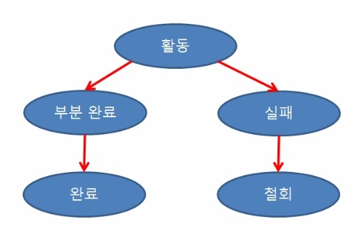
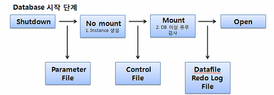

# 오라클이란?

> ### 관계형 데이터베이스

### 관계형 데이터베이스 정의

**관계형 데이터베이스(RDB)** 는 테이블, 행, 열의 정보를 구조화하는 방식이다.

RDB에는 테이블을 조인하여 정보 간 관계 또는 링크를 설정할 수 있는 기능이 있어, 여러 데이터 포인트 간의 관계를 쉽게 이해하고 정보를 얻을 수 있다.

### DBMS 와 RDBMS의 개념

**DBMS 란?**

* DBMS는 DataBase Management System의 약자로 데이터베이스를 관리하는 시스템이다.
* 사용자와 DB사이에서 사용자의 요구에 따라 데이터를 생성해주고 DB를 관리해주는 소프트웨어이다.
* DBMS는 데이터를 계층 또는 탐색 형식으로 저장한다. 파일 시스템을 사용해 저장하며, 따라서 테이블 간에는 아무런 관계가 없다.
* 데이터에 대한 많은 보안을 제공하지 않으며 정규화를 수행할 수 없어 데이터는 높은 중복성을 가질 수 있다.

**RDB(Relational DataBase) 란?**

* RDB는 관계형 데이터 모델에 기초를 둔 데이터 베이스이다.
* 모든 데이터를 2차원의 테이블 형태로 표현한다.

**RDBMS 란?**

* RDB를 생성하고 수정하고 관리할 수 있는 소프트웨어이다.
* RDBMS는 Relation DataBase System의 약자로 관계형 모델을 기반으로 하는 DBMS 유형이다.
* RDBMS의 테이블은 서로 연관되어 있어 일반 DBMS보다 효율적으로 데이터를 저장, 구성 및 관리할 수 있다.
* 정규화를 통해 데이터의 중복석을 최소화하여 트랜잭션을 수행하는 것이 더 쉽다.
* 데이터의 원자성, 일관성, 격리 및 내구성을 유지하며 데이터 무결성을 높인다.

> ### 트랜잭션(Transaction)

### 트랜잭션

**트랜잭션의 정의**

트랜잭션(Transaction)은 데이터베이스의 상태를 변환시키는 하나의 논리적 기능을 수행하기 위한 작업의 단위 또는 한꺼번에 모두 수행되어야 할 일련의 연산들을 의미한다.

**트랜잭션의 특징**

* 트랜잭션은 데이터베이스 시스템에서 병행 제어 및 회복 작업 시 처리되는 작업의 논리적 단위이다.
* 사용자가 시스템에 대한 서비스 요구 시 시스템이 응답하기 위한 상태 변환 과정의 작업단위이다.
* 하나의 트랜잭션은 Commit되거나 Rollback된다.

### 트랜잭션의 성질

|        성질        | 설명                                                                                                                             |
| :--------------: | ------------------------------------------------------------------------------------------------------------------------------ |
|  Atomicity(원자성)  | 
트랜잭션의 연산은 데이터베이스에 모두 반영되든지 아니면 전혀 반영되지 않아야 한다. 트랜잭션 내의 모든 명령은 반드시 완벽히 수행되어야 하며, 어느하나라도 오류가 발생하면 트랜잭션 전부가 취소되어야 한다.
   |
| Consistency(일관성) | 
트랜잭션이 그 실행을 성공적으로 완료하면 언제나 일관성 있는 데이터베이스 상태로 변환한다. 시스템이 가지고 있는 고정요소는 트랜잭션 수행 전과 트랜잭션 수행 완료 후의 상태가 같아야 한다.
            |
|  Isolation(독립성)  | 
둘 이상의 트랜잭션이 동시에 병행 실행되는 경우 어느 하나의 트랜잭션 실행중에 다른 트랜잭션의 연산이 끼어들 수 없다. 수행중인 트랜잭션은 완전히 완료될 때까지 다른 트랜잭션에서 수행 결과를 참조할 수 없다.
 |
|  Durability(지속성) | 성공적으로 완료된 트랜잭션의 결과는 시스템이 고장나더라도 영구적으로 반영되어야 한다.                                                                                |

###

### 트랜잭션 연산 및 상태

**Commit 연산**

* Commit 연산은 한개의 논리적 단위(특랜잭션)에 대한 작업이 성공적으로 끝났고 데이터베이스가 다시 일관된 상태에 있을 때, 이 트랜잭션이 행한 갱신 연산이 완료된 것을 트랜잭션 관리자에게 알려주는 연산이다.

**Rollback 연산**

* Rollback 연산은 하나의 트랜잭션 처리가 비정상적으로 종료되어 데이터베이스의 일관성을 깨뜨렸을 때, 이 트랜잭션의 일부가 정상적으로 처리되었더라도 트랜잭션의 원자성을 구현하기 위해 이 트랜잭션이 행한 모든 연산을 취소(Undo)하는 연산이다.
* Rollback시에는 해당 트랜잭션을 재시작하거나 폐기한다.

**트랜잭션의 상태**

<figure><figcaption></figcaption></figure>

* 활동(Active) : 트랜잭션이 실행중인 상태
* 실패(Failed) : 트랜잭션 실행에 오류가 발생하여 중단된 상태
* 철회(Aborted) : 트랜잭션이 비정상적으로 종료되어 Rollback 연산을 수행한 상태
* 부분 완료(Partially Committed) : 트랜잭션의 마지막 연산까지 실행했지만, Commit 연산이 실행되기 직전의 상태
* 완료(Committed) : 트랜잭션이 성공적으로 종료되어 Commit 연산을 실행한 후의 상태

> ## SQL(Structured Query Language)

### SQL 이란?

* SQL은 관계형 데이터베이스 관리 시스템(RDBMS)의 데이터를 관리 및 처리하기 위해 설계된 특수 목적의 프로그래밍 언어이다.
* 데이터베이스에서 자료 검색과 관리, 스키마 생성, 수정, 삭제, 데이터 베이스 객체 접근 조정 관리를 위해 고안되었다.
* 데이터베이스 관련 프로그램들이 SQL을 표준으로 채택하고 있다.

### SQL의 언어적 특성

* SQL은 대소문자를 구분하지 않지만 서버 환경이나 DBMS 종류에 따라 데이터베이스 또는 필드명에 대해 대소문자를 구분하기도 한다.
* SQL 명령은 반드시 세미콜론(;)으로 끝나야 한다.
* 고유값은 따옴표('')로 감싸준다.
* SQL에서 객체를 나타낼 때는 백틱(\`\`)으로 감싸준다.
* 주석은 일종의 도움말로, 주석으로 처리된 문장은 프로그램에서 동작하지 않는다.
  * ex) 한줄 : --을 붙여서 사용, 여러줄 : /\*\*/로 감싸준다.

### SQL 명령어

**DDL(Data Definition Language, 데이터 정의 언어)**

데이터베이스 스키마와 설명을 처리하도록 정의하는 언어이며, 데이터베이스나 테이블 생성/변경/삭제 등의 작업이 포함된다.

DDL은 명령어를 입력하는 순간 작업이 \*\*즉시 반영(Auto Commit)\*\*되기 때문에 사용할 때 주의해야 한다.

|    명령어   |        설명        |
| :------: | :--------------: |
|  CREATE  |   테이블을 생성하는 역할   |
|   ALTER  | 테이블의 구조를 수정하는 역할 |
|   DROP   |   테이블을 삭제하는 역할   |
|  RENAME  | 테이블의 이름을 변경하는 역할 |
| TRUNCATE |   테이블을 초기화하는 역할  |

**DML(Data Manipulation Language, 데이터 조작 언어)**

데이터 검색, 삽입, 변경, 삭제 수행을 조작하는 언어이며, 실질적으로 저장된 데이터를 관리하고 처리할 때 사용한다.

DDL과 달리 DML은 적는 \*\*즉시 반영(Auto Commit) \*\*이 되지 않는다. 즉 DML에 의한 데이터 변동은 영구적인 변경이 아니기 때문에 **ROLLBACK**으로 다시 되돌릴 수 있다.

DML은 **Target 테이블**을 **메모리 버퍼** 위에 올려두고 변경을 수행하기 떄문에, 실시간으로 반영되지 않고 **COMMIT** 명령어를 통해 **Transaction**을 종료해야 변경 사항이 테이블에 반영된다.

|   명령어  |            설명            |
| :----: | :----------------------: |
| SELECT |   데이터베이스에서 데이터를 검색하는 역할  |
| INSERT |     테이블에 데이터를 추가하는 역할    |
| UPDATE | 테이블 내에 존재하는 데이터를 수정하는 역할 |
| DELETE |    테이블에서 데이터를 삭제하는 역할    |

**DCL(Data Control Language, 데이터 제어 언어)**

사용자 관리 및 사용자별로 릴레이션 또는 데이터를 관리하고 접근하는 권한을 다루기 위한 언어이다.

불법적인 사용자로부터 데이터를 보호하기 위한 데이터 보안의 역할을 수행한다.

데이터의 정확성을 위한 무결성을 유지하기도 하며, 시스템 장애에 대비한 회복과 병행수행을 제어한다.

|    명령어   |            설명           |
| :------: | :---------------------: |
|   GRANT  |    권한을 정의할때 사용하는 명령어    |
|  REVOKE  |    권한을 삭제할때 사용하는 명령어    |
|  COMMIT  | 모든 작업을 정상적으로 처리하겠다는 명령어 |
| ROLLBACK |  모든 작업을 다시 돌려 놓겠다는 명령어  |

**TCL(Transaction Control Language, 트랜잭션 제어 언어)**

데이터를 제어하는 언어가 아닌 **트랜잭션**을 제어할때 사용한다. 논리적인 작업 단위를 묶어 DML에 의해 조작된 결과를 **트랜잭션** 별로 제어한다.

|    명령어    |                     설명                    |
| :-------: | :---------------------------------------: |
|   COMMIT  |          모든 작업을 정상적으로 처리하겠다는 명령어          |
|  ROLLBACK |           모든 작업을 다시 돌려 놓겠다는 명령어           |
| SAVEPOINT | COMMIT 전에 특정 시점까지만 반영하거나 ROLLBACK하겠다는 명령어 |

> ### Oracle Admin

### Startup 과정

1. **Shutdown**
   * 데이터베이스 및 인스턴스 서비스가 모두 종료되어 있는 상태이다.
2. **Startup Nomount**
   * parameter file 이 필요하다.
   * parameter 파일을 근거로 데이터베이스 인스턴스가 구성되는단계이다.
3. **Startup Momunt**
   * 데이터베이스에서 인스턴스와 DB가 맞춰지는 단계이다.
   * DB mount 단계에서는 데이터파일이나 redo log파일등이 실제 물리적으로 파일이 사용되는 상태는 아니다, 데이터파일, redo log파일의 유무를 확인하지 않는다.
   * 물리적인 파일의 이름 및 상태를 점검하기 위해서 controlfile을 읽어서 점검한다.
4. **Database Open**
   * 실제 데이터베이스 서비스를 제공하기 때문에 Datafile, Redo-log파일이 필요하다.
   * Datafile, Redo-log파일을 사용하기 위해서 물리적으로 오픈한다.
   * Database Open단계에서는 오라클을 실제 서비스 하는 서버가 데이터베이스의 일관성 검사 후 필요에 따라서 인스턴스를 복구도 진행한다.

<figure><figcaption></figcaption></figure>

### Startup

* **FORCE**
  * 오라클 DB가 실행되어 있는 상태에서 다시 재실행할때 사용
* **RESTRICT**
  * DBA 권한을 가진 사용자만 접속하여 사용
* **PFILE**
  * Oracle에서 기본으로 제공되는 파라미터 파일인 INIT\[SID].ORA 파일이 아닌 관리자가 생성한 파라미터 파일을 사용하여 오라클 서버를 실행할때 사용

### Shutdown

* **NORMAL**
  * 데이터베이스를 일반적인 방식으로 종료한다.
  * 현재 진행 중인 트랜잭션을 모두 완료한 후 데이터베이스를 닫는다.
  * 모든 클라이언트 세션은 종료된다.
* **TRANSACTIONAL**
  * 트랜잭션 관리를 강화하여 데이터 손실을 최소화하는 데 사용된다.
  * 데이터베이스는 최소한의 트랜잭션만을 허용하여 닫는다.
  * 현재 실행 중인 트랜잭션을 환료하고 이후의 새로운 트랜잭션을 차단한다.
* **IMMEDIATE**
  * 현재 실행 중인 트랜잭션을 롤백하고 즉시 데이터베이스를 닫는다.
  * 새로운 트랜잭션은 차단된다.
  * 데이터베이스를 빠르게 닫을 때 사용된다.
* **ABORT**
  * 가장 강력한 종료 옵션 중 하나로, 즉시 데이터베이스를 종료하고 모든 트랜잭션을 롤백한다.
  * 데이터베이스에 심각한 문제가 발생했을 때 사용된다.
  * 트랜잭션 롤백으로 인한 데이터 손실이 발생할 수 있으므로 주의가 필요하다.
