# 게시판 생성

### 게시판 만들고 새 글 작성하기: Create

**폼 데이터(form data)**

* 태그에 실려 서버로 전송되는 데이터 이다

<figure><figcaption></figcaption></figure>

**DTO(Data Transfer Object)**

* 태그에 실어 보낸 데이터는 서버의 컨트롤러가 객체에 담아 받는다
* 이 객체를 DTO(Data Transfer Object)라고 한다

<figure>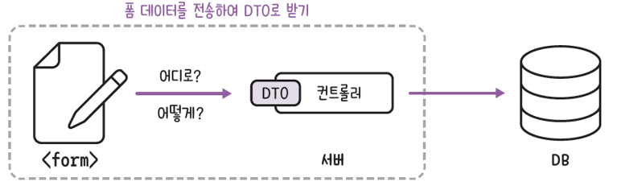<figcaption></figcaption></figure>

**폼 데이터를 DTO로 받기**

1. 입력 폼 만들기

* templates > articles 디렉터리 생성 > new.mustache 작성

```html
{{>layouts/header}}
<form class="container" action="/article/create" method="post">
    <div class="mb-3">
        <label class="form-label">제목</label>
        <input type="text" class="form-control" name="title">
    </div>
    <div class="mb-3">
        <label class="form-label">내용</label>
        <textarea class="form-control" rows="3" name="content"></textarea>
    </div>
    <button type="submit" class="btn btn-primary">Submit</button>
</form>
{{>latouts/footer}}
```

2. 컨트롤러 만들기

* controller > ArticleController.java 작성

```java
@Controller
public class ArticleController {

    @GetMapping("/article/new")
    public String newArticleForm() {
        return "articles/new";
    }
}
```

3. DTO 만들기

* com.example.firstproject > dto 패키지 작성 > ArticleForm.java 작성
* toString() 메서드 : 폼 데이터 잘 받았는지 확인 용도

```java
public class ArticleForm {
    private String title; // 제목을 받을 필드
    private String content; // 내용을 받을 필드

    public ArticleForm(String title, String content) { // 생성자
        this.title = title;
        this.content = content;
    }

    @Override
    public String toString() {
        return "ArticleForm{" +
                "title='" + title + '\'' +
                ", content='" + content + '\'' +
                '}';
    }
}
```

4. 폼 데이터 DTO에 담기

* dto 클래스 이름이 ArticleForm 이므로 ArticleForm 타입의 form 객체를 매개변수로 선언
* DTO 필드명과 동일한 이름을 NAME 속성 값으로 써주면 입력 폼에서 작성한 두 데이터가 DTO의 해당 필드와 연결 된다.

```java
    @PostMapping("/article/create")
    public String createArticle(ArticleForm form) {
        System.out.println(form.toString());
        return "";
    }
```

5. 결과 확인

* localhost:8080/article/new

<figure>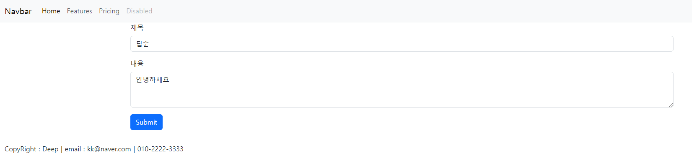<figcaption></figcaption></figure>

* ArticleForm{title:"딥준",content="안녕하세요"} 확인

<figure>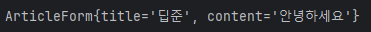<figcaption></figcaption></figure>

### DTO를 데이터베이스에 저장하기

**데이터베이스**

* 데이터를 관리하는 창고
* 모든 데이터를 행과 열로 구성된 테이블에 저장
* 사용 언어 : SQL

**DBMS**

* 데이터베이스를 운영하고 관리하는 소프트웨어 이다
  * 계층형, 망형, 관계형 DBMS 중 대부분의 DBMS가 테이블로 구성된 관계형 DBMS(RDMBS)형태로 사용된다.
* MySQL, 오라클, MariaDB, H2 DB

<figure>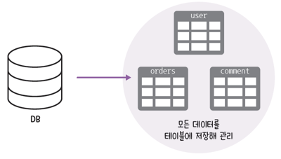<figcaption></figcaption></figure>

**H2 DB**

* 자바로 작성된 RDBMS 이다
* 인메모리형 관계형 DB이다
* 데이터를 애플리케이션 자체 내부에 저장한다
* 앱을 재실행하면 데이터 초기화 된다
* 간편하게 사용하기 좋아 개발 시 테스트 용도로 많이 사용 된다
* 실제 서비스에는 사용하지 않는다

**ORM(Object-Relational Mapping)**

* 자바의 객체와 데이터베이스를 연결하는 프로그래밍 기법 이다-
* DB 값을 객체처럼 사용할 수 있어 SQL 없이 자바로 데이터베이스를 조작할 수 있다
  * 자바 언어로 DB에 명령을 내리는 도구
* ORM 여러 종류 중 자바에서는 JPA를 표준으로 사용한다

<figure>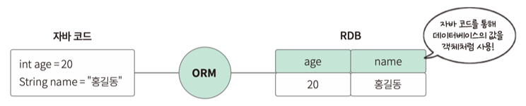<figcaption></figcaption></figure>

**JPA(Java Persistence API)**

* 자바에서 관계형 데이터베이스를 사용하는 방식을 **정의한 인터페이스** 이다
* 자바 객체와 DB를 연결해 데이터를 관리 한다
* 실제 사용을 위해서는 추가로 ORM 프레임워크를 선택해야 한다
  * 하이버네이트

<figure><figcaption></figcaption></figure>

**ORM 프레임워크 하이버네이트(hibernate)**

* JPA 인터페이스를 구현한 구현체 이다
* 구현체마다 회사 이름이나 프레임워크 이름이 다르다
  * 그 중 가장 유명한 것이 Hibernate 이다
* 내부적으로 JDBC API을 사용 한다
* 목표 : 자바 객체를 통해 DB 종류에 상관 없이 DB를 자유롭게 사용하는 것

<figure>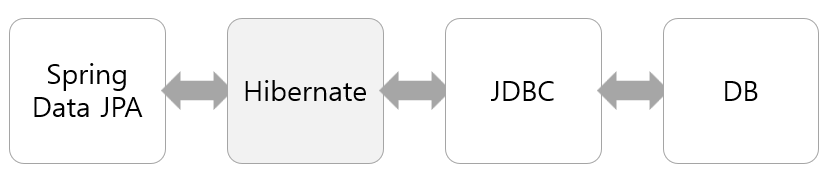<figcaption></figcaption></figure>

**JPA의 핵심 도구**

* 엔티티(entity)와 리파지터리(repository)가 있다
* 엔티티(entity)
  * 자바 객체를 DB가 이해할 수 있게 만드는 것이다
  * 이를 기반으로 테이블이 만들어진다
* 리파지터리(repository)
  * 엔티티가 DB 속 테이블에 저장 및 관리될 수 있게 하는 인터페이스 이다

**실습**

**DTO를 엔티티로 변환하기**

* form 객체의 toEntity() 메서드를 호출해서 그 반환 값을 Art1icle 타입의 article 엔티티에 저장한다

```java
@PostMapping("/article/create")
    public String createArticle(ArticleForm form) {
        System.out.println(form.toString());

        // 1. DTO를 엔티티로 변환
        Article article = form.toEntity(); // Article 클래스와 toEntity() 메서드 작성이 필요하다

        return "";
    }
```

* com.example.firstproject > entity 패키지 생성 > Article 클래스 작성 한다

```java
@Entity
public class Article {
    @Id
    @GeneratedValue
    private Long id;

    @Column
    private String title;

    @Column
    private String content;

    public Article() {}

    public Article(Long id, String title, String content) {
        this.id = id;
        this.title = title;
        this.content = content;
    }
}
```

1. @Entity
   * 엔티티 클래스임을 선언하기 위해 JPA에서 제공하는 어노테이션 이다
   * 이 클래스를 기반으로 DB에 테이블이 생성된다
   * 테이블 이름은 클래스 이름과 동일하게 지정된다(Article)
   * 별도의 테이블 이름을 주고 싶으면 @Table(name="테이블명")으로 지정한다
2. @Id

* Primary Key(기본키) 선언 어노테이션 이다
* @GeneratedValue 자동생성되는 번호
  * @GeneratedValue(strategy = GenerationType.IDENTITY) 키생성 전략 이다
  * MySQL이나 MariaDB의 'auto increment' 로 처리된다

※ @GeneratedValue(strategy = GenerationType.**키생성전략**)

| 생성 전략         | 설명                                                                       |
| ------------- | ------------------------------------------------------------------------ |
| AUTO(default) | JPA구현체(스프링부트에서는 Hibernate)가 생성방식을 결정                                     |
| IDENTITY      | <p>사용하는 데이터베이스가 키 생성 결정<br>MYSQL 이나 MariaDB의 경우 auto increment 방식 이용</p> |
| SEQUENCE      | <p>데이터베이스의 sequence를 이용해 키 생성<br>@TableGenerator와 같이 사용</p>              |
| TABLE         | <p>키 생성 테이블을 생성해서 키 생성<br>@TableGenerator와 함께 사용</p>                     |

3. @Column
   * 해당 필드가 db 테이블의 각 열(column)과 연결 한다
   * nullablem, name, length 등 다양한 속성으로 필요한 정보 제공이 가능 하다
   * ex) @Column(length=200, nullable=false)
   * columnDefination 속성으로 기본값 지정 가능
   * ex) @Column(columnDefinition="varchar(255) default 'yes'")
4. @Transient

* 데이터베이스 테이블에는 컬럼으로 생성되지 않는 필드이다

\


* ArticleForm 클래스에 toEntity() 메서드 추가
  * DTO인 form 객체를 엔티티 객체로 변환하는 역할을 한다
  * DTO 클래스인 ArticleForm 클래스에 toEnttity() 메서드 추가 작성한다
  * 폼 데이터를 담은 DTO 객체를 엔티티로 반환한다

```java
public Article toEntity() {
        return new Article(null, title, content);
}
```

**리파지터리로 엔티티를 DB에 저장하기**

1. 리파지터리 만들기
   * JPA에서 제공하는 리파지터리 인터페이스(CrudRepository\<T,ID>)를 활용해서 생성한다
   * com.example.firstproject > repository 패키지 생성 > ArticleRepository 클래스 작성 한다(단, interface 선택!!)

```java
@Repository
public interface ArticleRepository extends CrudRepository<Article, Long> {
}
```

* CrudRepository\<T,ID> 의 제네릭 요소 T, ID 지정
  * T : 관리 대상 엔티티의 클래스 타입 지정
  * ID : 관리 대장 엔티티의 기본키 타입 지정

※ 리파지터리

* JPA에서 제공하는 리파지터리 인터페이스를 활용해 만들 수 있다
  * JPA의 구현체인 Hibernate를 이용하기 위한 여러 API 제공한다
* JpaRepository 나 CrudRepository를 상속 받아 사용 한다
  * DB에 CRUD 기본 동작을 추가 코드로 구현할 필요 없이 CruidRepository에서 상속받아 사용할 수 있다
* 단순한 CRUD 작업만 한다면 : CrudRepository 상속
* CRUD 작업 + 페이지 처리 + 정렬 : JpaRepository 상속

<figure>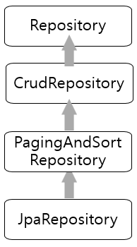<figcaption></figcaption></figure>

* JpaRepository 메서드(CrrudRepository 코드 위 ctrl 클릭하여 세부 코드 확인이 가능 하다)

| 작업                   | 메서드                                     |
| -------------------- | --------------------------------------- |
| insert 작업(생성 Create) | save(엔티티 객체)                            |
| select 작업(조회 Read)   | findById(키 타입), getOne(키 타입), findAll() |
| update 작업            | save(엔티티 객체)                            |
| delete 작업            | deleteById(키 타입), delete(엔티티 객체)        |

2. 리파지터리 객체 주입 및 엔티티 DB 저장

```java
@Controller
public class ArticleController {
    @Autowired // 스프링부트가 미리 생성해 놓은 리파지터리 객체 주입(DI)
    private ArticleRepository articleRepository; // articleRepository 객체 선언

    @GetMapping("/article/new")
    public String newArticleForm() {
        return "articles/new";
    }

    @PostMapping("/article/create")
    public String createArticle(ArticleForm form) {
        System.out.println(form.toString());

        // 1. DTO를 엔티티로 변환
        Article article = form.toEntity(); // Article 클래스와 toEntity() 메서드 작성이 필요하다

        // 2. 리파지터리로 엔티티를 DB에 저장
        Article saved = articleRepository.save(article); // article 엔티티를 저장해 saved 객체에 반환

        return "";
    }
}
```

* 의존성 주입(DI, dependency Injection)이란?
  * 외부에서 만들어진 객체를 필요한 곳으로 가져오는 기법이다
  * 스프링 부트에서는 **@Autowired** 어노테이션으로 의존성 주입

3. 데이터 저장 확인하기

```java
@PostMapping("/article/create")
    public String createArticle(ArticleForm form) {
        System.out.println(form.toString());

        // 1. DTO를 엔티티로 변환
        Article article = form.toEntity(); // Article 클래스와 toEntity() 메서드 작성이 필요하다
        System.out.println(article.toString());

        // 2. 리파지터리로 엔티티를 DB에 저장
        Article saved = articleRepository.save(article); // article 엔티티를 저장해 saved 객체에 반환
        System.out.println(saved.toString());

        return "";
    }
```

### CRUD(Create Read Update Delete)를 위한 SQL 문법

* INSERT 문: 데이터 생성(삽입)
* SELECT 문: 데이터 조회
* UPDATE 문: 데이터 수정
* DELETE 문: 데이터 삭제

<figure>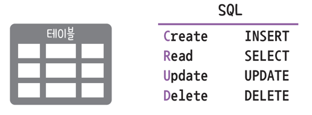<figcaption></figcaption></figure>

**H2 DB 접속**

* src > main > resources > application.properties 파일
* H2 DB에 웹 콘솔로 접근할 수 있도록 허용 설정 한다

```
spring.h2.console.enabled=true // 입력
```

* 서버 재시작 -> localhost:8080/h2-console 접속

&#x20;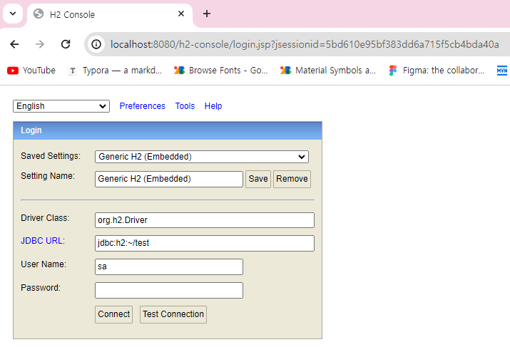

<figure>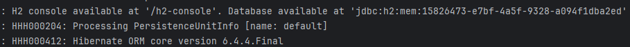<figcaption></figcaption></figure>

* jdbc:h2:mem:15826473-e7bf-4a5f-9328-a094f1dba2ed 해당 부분을 복사해서 JDBC URL에 붙여넣은 후 연결하면 접속 된다

<figure>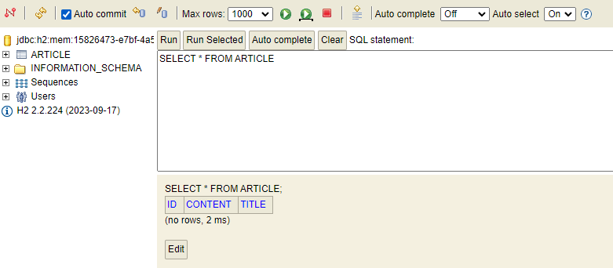<figcaption></figcaption></figure>

### 롬복

**롬복(lombok) 이란?**

* 코드를 간소화해 주는 라이브러리
* 필수 코드 간편하게 작성 + 로깅(logging)
* 코드 반복 최소화
  * getter(), setter(), constructor(), toString() 필수 멧거드 반복 간소화
* 로깅(logging)
  * 프로그램의 수행 과정을 기록으로 남기는 것

**롬복으로 코드 리팩터링(refactoring)**

* 코드의 기느에는 변함이 없이 코드의 구조 또는 성능을 개선하는 작업

1. 롬복 설치방법
   * build.gradle 에 롬복 추가 코드입력

```
dependencies {
	compileOnly 'org.projectlombok:lombok'
	annotationProcessor 'org.projectlombok:lombok'
	implementation 'org.springframework.boot:spring-boot-starter-data-jpa’
           (중략)
}
```

* 입력 후 오른쪽 상단 새로고침(코끼리 모양, Load Gradle Change) 아이콘 클릭
* 다운로드 완료 후 -> 오른쪽 \[Gradle] 탭 확인

<figure><figcaption></figcaption></figure>

2. DTO 리팩터링하기
   * dto > ArticleForm.java 생성자 삭제하여 리팩터링
   * @AllArgsConstructor: 클래스 안쪽의 모든 필드를 매개변수로 하는 생성자를 만드는 어노테이션

```java
@AllArgsConstructor  // 모든 필드 매개변수 생성자 자동 만듬
public class ArticleForm {
    private String title; // 제목을 받을 필드
    private String content; // 내용을 받을 필드

    // -------------------------------------------------
    public ArticleForm(String title, String content) {
        this.title = title;
        this.content = content;   // 생성자 전체 삭제
    }
    // ------------------------------------------------- 삭젝

```

* ArticleForm

```java
@AllArgsConstructor // 모든 필드 매개변수 생성자 자동 만듬
@ToString // toString() 메서드를 사용한 것과 똑같은 효과를 내는 어노테이션
public class ArticleForm {
    private String title;
    private String content;

    public Article toEntity() {
        return new Article(null, title, content);
    }
}
```

* Article

```java
@Entity
@AllArgsConstructor // 모든 필드 매개변수 생성자 자동 만듬
@NoArgsConstructor // 기본 생성자를 자동 만듬
@ToString // toString() 메서드를 사용한 것과 똑같은 효과를 내는 어노테이션
public class Article {
    @Id
    @GeneratedValue
    private Long id;

    @Column
    private String title;

    @Column
    private String content;
}
```

3. 컨트롤러에 로그 남기기
   * controller > ArticleController.java 로그 남기기
   * println() 문으로 데이터 검증하면 문제점
     * 데이터 바로 출력해 볼 수 있지만 기록에 남지 않아 나중에 찾아볼 수 없음
     * 서버의 서능에 악영향
   * @Slf4j(Simple Logging Facade for Java) 어노테이션
     * 로깅할 때 사용하는 어노테이션
     * 로그를 찍을 때는 log.info() 문 사용

```java
@Controller
@Slf4j
public class ArticleController {
    @Autowired // 스프링부트가 미리 생성해 놓은 리파지터리 객체 주입(DI)
    private ArticleRepository articleRepository; // articleRepository 객체 선언

    @GetMapping("/article/new")
    public String newArticleForm() {
        return "articles/new";
    }

    @PostMapping("/article/create")
    public String createArticle(ArticleForm form) {
        System.out.println(form.toString());

        // 1. DTO를 엔티티로 변환
        Article article = form.toEntity(); // Article 클래스와 toEntity() 메서드 작성이 필요하다
//        System.out.println(article.toString()); // DTO가 엔티티 변환 확인
        log.info(article.toString()); // 로깅 코드 추가
        // 2. 리파지터리로 엔티티를 DB에 저장
        Article saved = articleRepository.save(article); // article 엔티티를 저장해 saved 객체에 반환
//        System.out.println(saved.toString()); // article이 DB에 저장 확인
        log.info(saved.toString());
        return "";
    }
}
```

* 결과

<figure>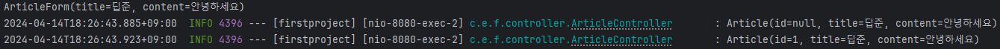<figcaption></figcaption></figure>
