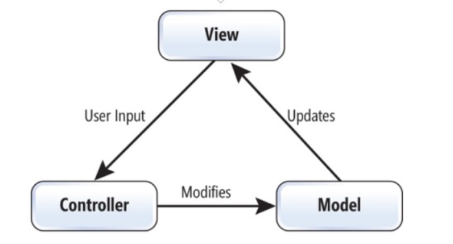
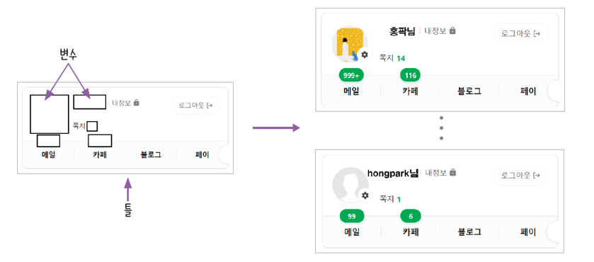
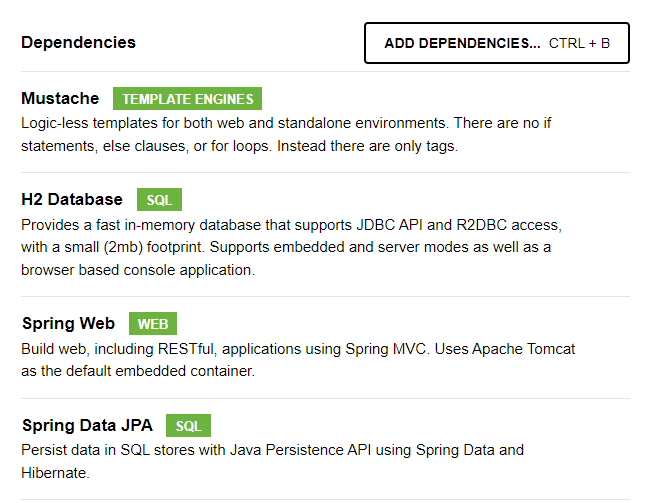
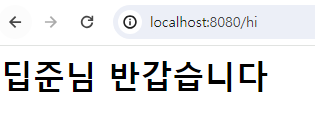
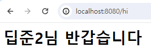
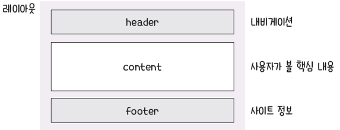
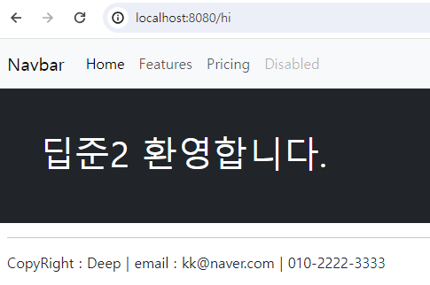

# 스프링부트란?

### 스프링 부트란

#### - 스프링 프레임워크

* 대규모의 엔터프라이즈 애플리케이션시 개발환경을 제공해서 기능 개발에만 집중할 수 있도록 한다
* 서버 성능, 안전성, 보안을 매우 높은 수준으로 제공하는 도구이다
* 설정이 복잡 등 단점 -> 스프링 부트 출시

#### - 스프링 부트

* 스프링 프레임워크를 개선한 것(개발 환경 설정 간소화, 웹 애플리케이션 서버<톰캣, 제티, 언더토우 등> 내장 등) 이다
* 자바 웹 프로그램을 더욱 쉽고 빠르게 만들기 위해 개발된 도구이다
* 원하는 기능을 찾아 조립하기만 하면 편리하게 자바 웹 프로그램을 만들 수 있다

|                | 스프링                                           | 스프링 부트                    |
| -------------- | --------------------------------------------- | ------------------------- |
| 목적             | 엔터프라이즈 애플리케이션 개발을 더 쉽게 만들기                    | 스프링의 개발을 더 빠르고 쉽게 하기      |
| 설정 파일          | 개발자가 수동으로 구성                                  | 자동 구성                     |
| XML            | 일부 파일은 XML로 직접 생성하고 관리                        | 사용하지 않음                   |
| 인메모리 데이터베이스 지원 | 지원하지 않음                                       | 인메모리 데이터베이스 자동 설정 지원      |
| 서버             | <p>프로젝트를 띄우는 서버(예 : 톰캣, 제티)를 별도로<br>수동 설정</p> | 내장형 서버를 제공해 별도의 설정이 필요 없음 |

XML : (Extensible Markup Language)이라는 마크업 언어는 기계 및 사람이 읽을 수 있는 방식으로 텍스트 서식을 지정하기 위한 일련의 지침을 설정합니다. XML은 데이터를 저장하는 데 널리 사용되는 형식이며 인터넷에서 정보를 교환하는 데 널리 사용됩니다.

### build system

#### build system이란?

* 소스 코드를 이용해서 실행 가능한 애플리케이션을 생성하는 과정을 자동화하는 프로그램이다
* 의존성 내려받기, 코드 패키징, 컴파일, 테스트 실행 등 포함한다
* 예전에는 maven을 많이 사용, 요즘은 gradle 사용하는 추세이다.
  * 단, 현장의 운용 시스템은 maven이 많다.

#### gradle 특징

* 메이븐에 비해 가독성이 좋고 설정이 간단하다
* 자바, 코틀린, 그루비 등 다양한 언어를 지원한다
* 원하는 대로 빌드 스크립트를 작성할 수 있다
* 빌드와 테스트 속도가 메이븐에 비해 더 빠르다

### 웹 서비스의 동작 원리 이해

#### 클라이언트-서버 구조

* 클라이언트 : 서비스를 사용하는 프로그램 또는 컴퓨터
* 서버 : 서비스를 제공하는 프로그램 또는 컴퓨터

#### localhost:8080/hello.html의 의미

* localhost: '내 컴퓨터'의 주소인 127.0.0.1을 고유하게 지칭한 것이다
* 8080: 스프링 부트가 동작하는 기본 포트번호 이다
* hello.html 서버에 요청하는 파일이다

웹 브라우저에서 localhost:8080/hello.html로 접속하면 내 컴퓨터의 8080번에서 수행되고 있는 서버에 hello.html파일을 요청한다는 의미 한다

* src > main > resources > static > hello.html

```hello.html
<h1>Hello World!</h1>
```

* 서버 시작 후 웹 브라우저(localhost:8080/hello.html) 접속

### MVC 패턴

#### MVC 패턴 이란?

<figure><figcaption></figcaption></figure>

> \*MVC(모델-뷰-컨트롤러)는 사용자 인터페이스, 데이터 및 논리 제어를 구현하는데 널리 사용되는 소프트웨어 디자인 패턴이다. \*
>
> _소프트웨어의 비즈니스 로직과 화면을 구분하는데 중점을 두고 있으며, 이러한 `관심사 분리` 는 더나은 업무의 분리와 향상된 관리를 제공한다._

#### MVC 패턴(Model-View-Controller Pattern)

* 웹 페이지를 화면에 보여 준다(View)
* 클라이언트의 요청을 받아 처리한다(Controller)
* 데이터를 관리하는(Model) 역할을 나누는 기법

#### 뷰 템플릿

<figure><figcaption></figcaption></figure>

* 웹 페이지(View)를 하나의 틀(Template)로 만들고 여기에 변수를 삽입해 서로 다른 페이지로 보여 주는 기술 이다

**머스테치**

* 뷰 템플릿을 만드는 도구 즉, 뷰 템플릿 엔진 의미 한다.
* 템플릿 엔진 종류
  * Thymeleaf, JSP

**Thymeleaf와 jsp의 차이점**

* Thymeleaf는 HTML, XML, JavaScript, CSS 및 일반 텍스트를 처리 할 수 있는 웹 및 독립형 환경에서 사용할수 있는 Java 템플릿 엔진이다.
* JSP는 서블릿으로 변환되어 실행 되어집니다. JSP 내에서 자바 코드를 사용할 수도 있고 Thymeleaf는 자바코드를 사용할 수 없고, jsp에서 처럼 커스텀 태그와 같은 기능도 없다.

**해당 글에서 머스테치를 사용한다.**

#### MVC 패턴을 활용해 뷰 템플릿 페이지 만들기

1. 뷰 템플릿 페이지 만들기
2. 스프링 부트 프로젝트 사용 도구
   1. Mustache
      * Springboot 에서 공식으로 지원하는 템플릿 엔진, 수 많은 언어를 지원하는 가장 심플한 템플릿 엔진 Java에서 사용될 때는 서버 템플릿 엔진으로, Javascript에서 사용될 때는 클라이언트 템플릿 엔진으로 사용가능 하다
   2. H2 Database
      * H2DB는 자바 기반의 오픈소스 관계형 데이터베이스 관리 시스템(RDBMS)이다.
   3. Spring Web
      * Spring Web을 이용하면 웹을 더 편리하고 빠르게 만들 수 있으며 다양한 기능과 도구를 제공하여 개발자의 부담을 덜어주는 도구이다.
   4. Spring Data JPA
      * **JPA란** Java Persistence API의 약자이며 **자바의 ORM을 위한 표준 기술**로 Hibernate, Spring JPA, EcliplseLink 등 과 같은 구현체가 있고 이것의 표준 인터페이스가 JPA 이다.
3. 컨트롤러 만들고 실행하기
4. 모델 추가하기

<figure><figcaption></figcaption></figure>

* 뷰 템플릿 페이지에 변수를 삽입할 때는 머스테치 문법 사용
* 형식

```mustache
{{변수명}}
```

* 모델에서 변수를 등록할 때는 addAttribute() 메서드 사용
* 형식

```
model.addAttribute("변수명", 변숫값) // 변숫값을 "변수명"이라는 이름으로 추가
```

**뷰페이지 만들기**

* src > main > resources > templates > {머스테치 이름} 파일 생성 한다
  * 이 위치에 mustache 파일 저장하면 스프링 부트에서 자동 로딩한다

```html
<body>
	<h1>딥준님 반갑습니다</h1>
</body>
```

**컨트롤러 만들기**

* src > main > java > com.example.{프로젝트 이름} 에 controller 패키지 추가 후 {컨트롤러 이름} 클래스 생성 한다

```java
@Controller // 컨트롤러 선언 어노테이션
public class FirstController(컨트롤러 이름) {
    @GetMapping("/hi") // hi GET 요청이 오면 hello() 메서드 실행
    public String hello() {
        return "greetings" // greetings.mustache 파일 반환
    }
}
```

* 서버 실행 localhost:8080/hi 에 접속 한다

<figure><figcaption></figcaption></figure>

**※** 실행 결과 한글 깨짐 현상 발생시

* src > main > resources > application.properties 에 코드를 추가 한다

```
server.servlet.encoding.force=true
```

* 코드를 추가한 결과

<figure><figcaption></figcaption></figure>

**어노테이션(annotation)**

* 소스 코드에 추가해 사용하는 메타 데이터의 일종
* 컴파일 및 실행 과정에서 코드를 어떻게 처리해야 할지 알려주는 추가정보
* @ 기호를 붙여 사용

**모델 추가하기**

```java
@GetMapping("/hi")
public String hello(Model model) { // 모델 객체 가져오기
    model.addAttribute("username", "딥준"); // 모델 변수 등록
    return "greetings";
}
```

```html
<body>
    {{username}}님 반갑습니다.
</body>
```

<figure><figcaption></figcaption></figure>

#### 뷰 템플릿 페이지에 레이아웃 적용하기

**레이아웃(layout)**

* 화면에 요소를 배치하는 일을 한다

<figure><figcaption></figcaption></figure>

**헤더-푸터 레이아웃(header-footer layout)**

* 헤더 : 사이트 안내를 위한 네비게이션 배치 한다
* 푸터 : 사이트 정보 등 배치 한다
* 헤더와 푸터 사이 : 사용자가 볼 핵심 내용(컨텐츠) 배치 한다

<figure><figcaption></figcaption></figure>

**/hi 페이지에 헤더-푸터 레이아웃 적용하기**

* 부트스트랩 을 사용하여 레이아웃 디자인 적용한다
* greetings.mustache 파일 내용 전체 삭제 후 내용 변경한다

```html
<div class="bg-dark text-white p-5">
    <h1>{{username}} 환영합니다.</h1>
</div>
```

* src > main > resources > templates > layouts > header.mustache 생성 한다
  * 부트스트랩을 이용해서 적당한 Navbar을 선택후 적용

```html
<nav class="navbar navbar-expand-lg navbar-light bg-light">
  <div class="container-fluid">
    <a class="navbar-brand" href="#">Navbar</a>
    <button class="navbar-toggler" type="button" data-bs-toggle="collapse" data-bs-target="#navbarNav" aria-controls="navbarNav" aria-expanded="false" aria-label="Toggle navigation">
      <span class="navbar-toggler-icon"></span>
    </button>
    <div class="collapse navbar-collapse" id="navbarNav">
      <ul class="navbar-nav">
        <li class="nav-item">
          <a class="nav-link active" aria-current="page" href="#">Home</a>
        </li>
        <li class="nav-item">
          <a class="nav-link" href="#">Features</a>
        </li>
        <li class="nav-item">
          <a class="nav-link" href="#">Pricing</a>
        </li>
        <li class="nav-item">
          <a class="nav-link disabled" href="#" tabindex="-1" aria-disabled="true">Disabled</a>
        </li>
      </ul>
    </div>
  </div>
</nav>
```

* src > main > resources > templates > layouts > footer.mustache 생성 한다

```html
<div class="mb-5 container-fluid">
    <hr>
    <p>CopyRight : Deep | email : kk@naver.com | 010-2222-3333</p>
</div>
```

* greetings.mustache 수정 한다

```java
<Link href="부트스트랩"> // Include via CDN

{{>layouts/header}} // 헤더 템플릿 삽입
<div class="bg-dark text-white p-5">
    <h1>{{username}} 환영합니다.</h1>
</div>
{{>layouts/footer}} // footer 템플릿 삽입
```

* 적용 후 실행화면

<figure><figcaption></figcaption></figure>
